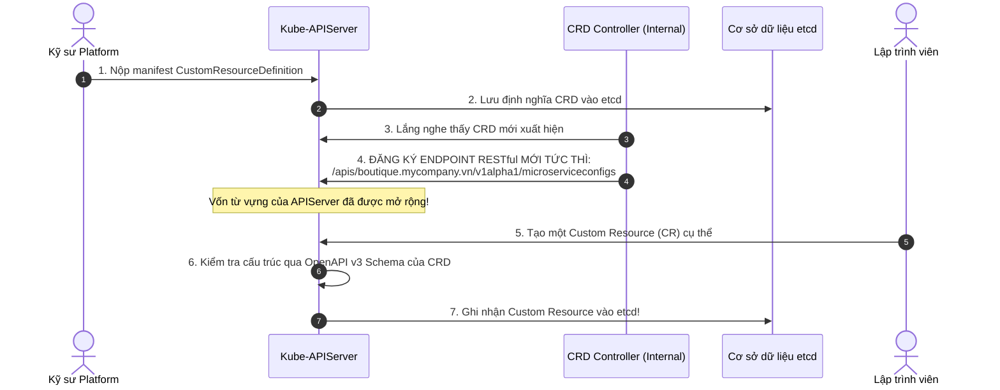
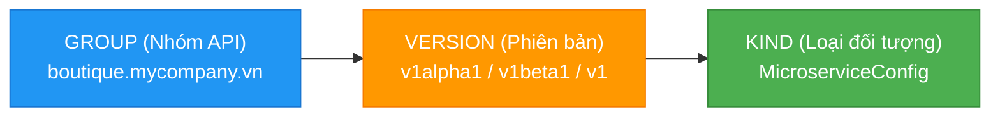

# Bài 52: Tự định nghĩa tài nguyên với Custom Resource Definitions (CRD)

## 1. Thông tin bài học
* **Tên bài:** Bài 52: Tự định nghĩa tài nguyên với Custom Resource Definitions (CRD)
* **Mục tiêu học:** Thấu hiểu triết lý mở rộng API mang tính cách mạng của Kubernetes (**Declarative API Extension**); phân biệt bản chất giữa **Custom Resource Definition (CRD)** (khuôn mẫu định nghĩa) và **Custom Resource (CR)** (bản thể dữ liệu); so sánh chuyên sâu trường hợp sử dụng giữa CRD và ConfigMap; giải phẫu chi tiết cấu trúc manifest `apiextensions.k8s.io/v1` bao gồm Group, Version, Kind, Scope và bộ quy chuẩn lược đồ **OpenAPI v3 Validation Schema**; làm chủ các tính năng nâng cao: **Subresource `/status`** (tách biệt mong muốn và trạng thái thực tế), **Subresource `/scale`**, và **AdditionalPrinterColumns** (tùy biến giao diện `kubectl get`); thực hành tự tay xây dựng một CRD mang tên `MicroserviceConfig` cho Google Online Boutique, kiểm chứng cơ chế Schema Validation chặn đứng dữ liệu sai ngay tại cửa ngõ API Server.
* **Thời lượng ước tính:** 180 phút (90 phút lý thuyết thiết kế API, 90 phút thực hành và kiểm thử)
* **Kiến thức cần có trước:** Bài 05 (Kiến trúc Control Plane), Bài 12 (ConfigMap), Bài 50 (Kube-APIServer Internals & Schema Validation), Bài 51 (Kyverno & Admission Webhook).
* **Liên quan kỳ thi:** Senior Platform Engineer / Certified Kubernetes Application Developer (CKAD) nâng cao / Kubernetes Operator Developer (Nền móng bắt buộc để bước sang Bài 53: Lập trình Operator).

---

## 2. Bảng thuật ngữ

| Thuật ngữ | Giải thích đơn giản | Ví dụ / Ẩn dụ đời thường |
| :--- | :--- | :--- |
| **Custom Resource Definition (CRD)** | Một tài nguyên đặc biệt trong Kubernetes cho phép bạn đăng ký thêm các loại đối tượng mới vào vốn từ vựng của Kube-APIServer mà không cần sửa mã nguồn Kubernetes. | Bản đăng ký biểu mẫu mới tại phường: Bạn tạo ra một mẫu đơn mới mang tên "Đơn xin nuôi thú cưng" và nộp để Ủy ban đóng dấu phê duyệt làm mẫu chuẩn. |
| **Custom Resource (CR)** | Một đối tượng cụ thể được người dùng tạo ra dựa trên khuôn mẫu đã định nghĩa trong CRD. | Tờ đơn thực tế mà bạn tự tay điền thông tin: "Tôi là Nguyễn Văn A xin nuôi 1 chú chó Husky". |
| **OpenAPI v3 Schema** | Ngôn ngữ mô tả cấu trúc dữ liệu chuẩn mực quốc tế, quy định rõ trường nào là bắt buộc, kiểu dữ liệu là số hay chuỗi, giới hạn độ dài hoặc biểu thức chính quy (Regex). | Khung điền thông tin có quy định sẵn: Ô "Số CMND" chỉ được nhập đúng 12 chữ số, ô "Email" phải có ký tự `@`. |
| **Group / Version / Kind (GVK)** | Tọa độ 3 chiều duy nhất định danh một loại tài nguyên trong Kubernetes (ví dụ: `apps/v1/Deployment` hoặc `boutique.mycompany.vn/v1alpha1/MicroserviceConfig`). | Họ tên đầy đủ kèm quê quán: Để phân biệt "Nguyễn Văn A ở Hà Nội" với "Nguyễn Văn A ở Đà Nẵng". |
| **Status Subresource (`/status`)** | Điểm truy cập phụ (Subresource) tách biệt hoàn toàn phần dữ liệu báo cáo trạng thái (`status`) khỏi phần dữ liệu cấu hình mong muốn (`spec`). | Đồng hồ đo tốc độ trên xe: Lái xe chỉ được đạp chân ga (`spec`), không được lấy tay vặn kim đồng hồ tốc độ (`status`). |
| **AdditionalPrinterColumns** | Khai báo trong CRD hướng dẫn lệnh `kubectl get` trích xuất các trường dữ liệu quan trọng để hiển thị thành các cột đẹp mắt trên terminal. | Bảng tóm tắt thông tin trên thẻ căn cước: Chỉ in ra Họ tên, Ngày sinh, Quê quán thay vì in toàn bộ tiểu sử dài dòng. |

---

## 3. Bức tranh lớn: Vấn đề thực tế và ẩn dụ đời thường

### Nhắc lại bài trước
Ở Bài 51, chúng ta đã tiếp cận Kyverno và thấy rằng Kyverno mang đến những tài nguyên kỳ diệu như `ClusterPolicy` hay `PolicyReport`. Trong các bài trước đó, chúng ta cũng từng bắt gặp `Application` trong ArgoCD (Bài 45), `ServiceMonitor` trong Prometheus (Bài 38). Một câu hỏi lớn được đặt ra: **Tại sao một cụm Kubernetes cài đặt mặc định ban đầu chỉ biết những từ ngữ cơ bản như `Pod`, `Service`, `Deployment`, nhưng bỗng nhiên lại có thể hiểu và chấp nhận những danh từ hoàn toàn mới mẻ đó?** Bí mật nằm ở chỗ: Tất cả các công cụ vĩ đại trên đều sử dụng **Custom Resource Definitions (CRD)**!

### Tại sao cần cái này ở production? (Vấn đề thực tế)

Hãy tưởng tượng bạn đang xây dựng một nền tảng nội bộ (Internal Developer Platform - IDP) phục vụ hàng trăm lập trình viên microservices:

1. **Sự bất lực của ConfigMap:**
   Lập trình viên muốn cấu hình một microservice: cần bao nhiêu CPU, bật những tính năng nào, kết nối đến database nào.  
   Trước đây, người ta thường nhét tất cả vào một ConfigMap (Bài 12) dưới dạng một file JSON hoặc YAML thô (dạng text trần).  
   * **Không có kiểm duyệt cú pháp (No Validation):** Nếu lập trình viên gõ nhầm số cổng `port: "tám-mươi"` thay vì số nguyên `80`, ConfigMap vẫn vui vẻ chấp nhận lưu vào etcd! Chỉ đến khi ứng dụng khởi động và crash thì bạn mới biết.
   * **Không có phân quyền riêng biệt (RBAC Flaw):** Bạn không thể phân quyền: "Nhóm A chỉ được sửa cấu hình thanh toán, không được sửa cấu hình giỏ hàng" nếu tất cả dùng chung quyền sửa ConfigMap.
   * **Trải nghiệm lập trình viên nghèo nàn:** Lập trình viên không thể gõ `kubectl get microservices` để xem danh sách dịch vụ đang chạy với các cột hiển thị tùy biến.

2. **Khát vọng "Kubernetes-Hóa" nghiệp vụ doanh nghiệp:**
   Tại sao chúng ta phải dựng các hệ thống quản trị cồng kềnh bên ngoài khi mà Kubernetes đã có sẵn:
   * Một hệ thống lưu trữ bền vững phân tán tuyệt vời (etcd).
   * Một cơ chế xác thực và phân quyền đỉnh cao (RBAC).
   * Cơ chế kiểm soát đồng thời chống ghi đè dữ liệu (OCC `resourceVersion` - Bài 50).
   * Bộ công cụ dòng lệnh tiêu chuẩn thế giới (`kubectl`).  
   **Bằng cách tạo ra CRD, bạn biến Kubernetes thành cơ sở dữ liệu và trung tâm điều hành cho chính các đối tượng nghiệp vụ của công ty bạn!**

### Ẩn dụ đời thường: Cuốn Từ Điển Bách Khoa và Trang Bổ Sung

Hãy tưởng tượng Kubernetes như **Cuốn Từ Điển Tiếng Việt Bách Khoa Toàn Thư**:

* **Các tài nguyên gốc (Built-in Resources):**  
  Đây là những từ ngữ cơ bản xuất xưởng từ nhà in: "Bàn", "Ghế", "Nhà", "Cửa" (tương ứng với `Pod`, `Node`, `Service`, `Deployment`). Bất kỳ ai mở từ điển ra cũng hiểu ngay những từ này nghĩa là gì.
* **Tình huống thực tế:**  
  Xã hội hiện đại sinh ra những khái niệm mới: "Xe điện tự lái", "Trí tuệ nhân tạo", "Thẻ thanh toán sinh trắc học". Cuốn từ điển cũ không có những từ này.
* **Cách làm nghiệp dư (ConfigMap):**  
  Bạn lấy một tờ giấy trắng viết nguệch ngoạc mấy chữ rồi kẹp bừa vào giữa cuốn sách. Tờ giấy không có số trang, không được kiểm duyệt chính tả, ai đi qua cũng có thể tẩy xóa bôi bẩn.
* **Cách làm đỉnh cao (Custom Resource Definition - CRD):**  
  Bạn gửi một **Bản đề xuất bổ sung từ vựng (CRD)** lên Viện Ngôn ngữ học (Kube-APIServer). Bản đề xuất ghi rõ:
  * Từ mới: **"Xe điện" (Kind: ElectricVehicle)**.
  * Định nghĩa ngữ pháp: Phải có thuộc tính "Dung lượng pin" (kiểu số nguyên từ 1 đến 100 kWh), phải có "Biển số xe" (kiểu chuỗi ký tự theo định dạng chuẩn).
  * Viện Ngôn ngữ học đóng dấu chấp thuận và in thêm trang bổ sung này vào cuốn Từ điển chính thức.
  * Kể từ giây phút đó, **từ "Xe điện" chính thức trở thành từ vựng hợp pháp của quốc gia!** Bất kỳ công dân nào gõ lệnh tra cứu "Xe điện" (`kubectl get electricvehicles`), cuốn từ điển đều hiểu và kiểm duyệt ngữ pháp một cách hoàn hảo!

---

## 4. Giải thích khái niệm theo từng bước

### Vòng đời của một CRD bên trong Kube-APIServer

Điều gì thực sự xảy ra đằng sau hậu trường khi bạn chạy lệnh `kubectl apply -f my-crd.yaml`?



---

### Mổ xẻ Tọa độ GVK (Group - Version - Kind)

Mỗi tài nguyên trong Kubernetes được định vị chính xác bởi bộ ba GVK:



1. **Group (Nhóm API):** Thường được đặt theo định dạng tên miền đảo ngược của công ty bạn (ví dụ: `boutique.mycompany.vn`, `monitoring.coreos.com`). Các tài nguyên cốt lõi ban đầu (như Pod, Service) thuộc nhóm `core` (rỗng `""`), Deployment thuộc nhóm `apps`.
2. **Version (Phiên bản API):**
   * `v1alpha1`, `v1alpha2`: Phiên bản thử nghiệm sơ khai, cấu hình có thể thay đổi mà không tương thích ngược.
   * `v1beta1`: Phiên bản hoàn thiện tính năng, chuẩn bị lên chính thức.
   * `v1`: Phiên bản ổn định tuyệt đối (General Availability - GA), cam kết tương thích ngược dài hạn.
3. **Kind (Loại tài nguyên):** Tên định danh của loại đối tượng, luôn viết hoa chữ cái đầu theo chuẩn CamelCase (ví dụ: `MicroserviceConfig`).

---

### Sức Mạnh Cốt Lõi: Lược Đồ Xác Thực OpenAPI v3 Schema

Đây chính là "trái tim" biến CRD thành một công cụ bảo vệ dữ liệu đắc lực. Thay vì để người dùng điền bừa bãi, bạn sử dụng cú pháp **OpenAPI v3 Schema** bên trong khối `spec.versions[*].schema.openAPIV3Schema`:

```yaml
schema:
  openAPIV3Schema:
    type: object
    required: ["spec"]
    properties:
      spec:
        type: object
        required: ["team", "replicas", "version"]
        properties:
          team:
            type: string
            description: "Tên đội ngũ sở hữu microservice"
          replicas:
            type: integer
            minimum: 1
            maximum: 10
            description: "Số lượng Pod mong muốn (từ 1 đến 10)"
          version:
            type: string
            pattern: '^v[0-9]+\.[0-9]+\.[0-9]+$'
            description: "Phiên bản mã nguồn theo chuẩn SemVer (ví dụ: v1.0.4)"
```

> [!IMPORTANT]
> Khi lập trình viên gửi một manifest lên, Kube-APIServer tự động mang schema này ra đối soát:
> * Nếu nhập `replicas: 15` $\rightarrow$ Bị từ chối ngay vì vượt quá `maximum: 10`!
> * Nếu nhập `version: "latest"` $\rightarrow$ Bị từ chối ngay vì không khớp Regex `pattern`!
> * Nếu thiếu trường `team` $\rightarrow$ Bị từ chối ngay vì nằm trong danh sách `required`!  
> Toàn bộ quá trình kiểm tra diễn ra ở tầng API Server (trước khi lưu etcd), trả về lỗi **HTTP 422 Unprocessable Entity** cực kỳ chi tiết!

---

### Hai Tính Năng Nâng Cao: Subresource `/status` và `AdditionalPrinterColumns`

#### 1. Tại sao bắt buộc phải có Subresource `/status`?
Mặc định nếu không bật subresource, một lệnh sửa đối tượng sẽ cho phép người dùng sửa cả `spec` lẫn `status`.  
Khi bạn khai báo:
```yaml
subresources:
  status: {}
```
Kubernetes sẽ tự động tách đôi đối tượng:
* **Endpoint `/apis/.../microserviceconfigs/frontend`:** Dành cho người dùng và CI/CD. Chỉ được phép sửa trường `spec`. Mọi thay đổi vào trường `status` ở endpoint này sẽ bị APIServer **lờ đi và không lưu lại**!
* **Endpoint `/apis/.../microserviceconfigs/frontend/status`:** Dành riêng cho Controller / Operator (Bài 53). Chỉ được phép sửa trường `status` để báo cáo tình trạng thực tế.  
Việc này bảo vệ tính toàn vẹn của dữ liệu và ngăn chặn xung đột OCC `resourceVersion` (Bài 50).

#### 2. Trang trí Terminal với `AdditionalPrinterColumns`:
Mặc định khi gõ `kubectl get <cr>`, Kubernetes chỉ in ra 2 cột vô hồn: `NAME` và `AGE`. Bằng cách thêm khai báo cột, bạn biến nó thành một bảng dashboard mini:

```yaml
additionalPrinterColumns:
  - name: Team
    type: string
    jsonPath: .spec.team
  - name: Replicas
    type: integer
    jsonPath: .spec.replicas
  - name: Version
    type: string
    jsonPath: .spec.version
  - name: Status
    type: string
    jsonPath: .status.phase
```

---

## 5. Thực hành (Lab)

* **Môi trường:** Cụm Kind hiện có (`1 control-plane + 1 worker`).
* **Mức RAM ước tính:** ~0 MB (CRD là tài nguyên định nghĩa siêu nhẹ, được lưu trực tiếp vào etcd, không tốn thêm RAM).

Trong bài lab này, chúng ta sẽ tự tay thiết kế và đăng ký một CRD mang tên **`MicroserviceConfig`** cho Google Online Boutique, kiểm chứng khả năng bắt lỗi dữ liệu tự động của Kube-APIServer!

---

### Bước 1: Khai báo CustomResourceDefinition Hoàn Chỉnh

Tạo file `microservice-crd.yaml` chứa toàn bộ schema OpenAPI v3 và các cột hiển thị tùy biến:

```powershell
@'
apiVersion: apiextensions.k8s.io/v1
kind: CustomResourceDefinition
metadata:
  name: microserviceconfigs.boutique.mycompany.vn
spec:
  group: boutique.mycompany.vn
  names:
    kind: MicroserviceConfig
    listKind: MicroserviceConfigList
    plural: microserviceconfigs
    singular: microserviceconfig
    shortNames:
      - msc
  scope: Namespaced
  versions:
    - name: v1alpha1
      served: true
      storage: true
      subresources:
        status: {}
      additionalPrinterColumns:
        - name: Team
          type: string
          jsonPath: .spec.team
        - name: Replicas
          type: integer
          jsonPath: .spec.replicas
        - name: Version
          type: string
          jsonPath: .spec.version
        - name: Phase
          type: string
          jsonPath: .status.phase
      schema:
        openAPIV3Schema:
          type: object
          properties:
            spec:
              type: object
              required:
                - team
                - replicas
                - version
              properties:
                team:
                  type: string
                replicas:
                  type: integer
                  minimum: 1
                  maximum: 10
                version:
                  type: string
                  pattern: '^v[0-9]+\.[0-9]+\.[0-9]+$'
                features:
                  type: array
                  items:
                    type: string
            status:
              type: object
              properties:
                phase:
                  type: string
                readyReplicas:
                  type: integer
'@ | Set-Content -Encoding UTF8 microservice-crd.yaml

# Đăng ký CRD vào cụm Kubernetes
kubectl apply -f microservice-crd.yaml
```

---

### Bước 2: Kiểm chứng CRD Đã Được Đăng ký Thành Công

Kiểm tra xem từ điển của Kube-APIServer đã nạp từ vựng mới hay chưa:

```powershell
kubectl get crd microserviceconfigs.boutique.mycompany.vn
```

**Kết quả mong đợi:**
```text
NAME                                         CREATED AT
microserviceconfigs.boutique.mycompany.vn   2026-10-09T07:42:15Z
```

Kiểm tra API endpoint mới được sinh ra:

```powershell
kubectl api-resources | Select-String "microserviceconfig"
```

**Kết quả mong đợi:**
```text
microserviceconfigs   msc   boutique.mycompany.vn/v1alpha1   true   MicroserviceConfig
```
Lệnh `kubectl` đã nhận diện được cả tên viết tắt **`msc`**!

---

### Bước 3: Tạo một Custom Resource Chuẩn Mực Hợp Lệ

Bây giờ, chúng ta đóng vai lập trình viên tạo cấu hình cho dịch vụ `frontend`:

```powershell
@'
apiVersion: boutique.mycompany.vn/v1alpha1
kind: MicroserviceConfig
metadata:
  name: frontend-config
  namespace: default
spec:
  team: checkout-squad
  replicas: 3
  version: "v1.2.0"
  features:
    - "currency-converter"
    - "cart-recommendation"
'@ | Set-Content -Encoding UTF8 frontend-valid.yaml

kubectl apply -f frontend-valid.yaml
```

**Kết quả mong đợi:**
```text
microserviceconfig.boutique.mycompany.vn/frontend-config created
```

Xem danh sách tài nguyên bằng tên viết tắt `msc`:

```powershell
kubectl get msc
```

**Kết quả mong đợi:**
```text
NAME              TEAM             REPLICAS   VERSION   PHASE
frontend-config   checkout-squad   3          v1.2.0    
```
Bảng hiển thị các cột tùy biến `TEAM`, `REPLICAS`, `VERSION` xuất hiện tuyệt đẹp trên terminal!

---

### Bước 4: Thử nghiệm Cơ chế Bảo vệ: Cố tình Tạo Resource Sai Quy Chuẩn

Bây giờ, chúng ta thử tạo một manifest vi phạm cả 2 quy tắc:
1. `replicas: 99` (vượt quá mức tối đa là 10).
2. `version: "beta-release"` (vi phạm định dạng regex SemVer `^v[0-9]+\.[0-9]+\.[0-9]+$`).

```powershell
@'
apiVersion: boutique.mycompany.vn/v1alpha1
kind: MicroserviceConfig
metadata:
  name: invalid-config
  namespace: default
spec:
  team: rogue-team
  replicas: 99
  version: "beta-release"
'@ | Set-Content -Encoding UTF8 invalid-cr.yaml

kubectl apply -f invalid-cr.yaml
```

---

### Bước 5: Kết quả mong đợi (Quan sát Lỗi Schema Validation)

Kube-APIServer chặn đứng request ngay lập tức và in ra thông báo lỗi chi tiết:

```text
The MicroserviceConfig "invalid-config" is invalid: 
* spec.replicas: Invalid value: 99: spec.replicas in body should be less than or equal to 10
* spec.version: Invalid value: "beta-release": spec.version in body should match '^v[0-9]+\.[0-9]+\.[0-9]+$'
```
Không một dòng dữ liệu rác nào có cơ hội lọt vào cơ sở dữ liệu etcd!

---

### Bước 6: Thử nghiệm Cập nhật Status Subresource

Để cập nhật trường `status` của tài nguyên, chúng ta gửi một request HTTP PATCH thông qua endpoint phụ `/status`:

```powershell
kubectl patch msc frontend-config --subresource=status --type=merge -p '{"status":{"phase":"Healthy","readyReplicas":3}}'
```

Kiểm tra lại bằng `kubectl get msc`:

```powershell
kubectl get msc
```

**Kết quả mong đợi:**
```text
NAME              TEAM             REPLICAS   VERSION   PHASE
frontend-config   checkout-squad   3          v1.2.0    Healthy
```
Cột `PHASE` lập tức hiển thị giá trị `Healthy`!

---

### Bước 7: Dọn dẹp tài nguyên (Cleanup)

```powershell
# Xóa Custom Resource và CRD
kubectl delete msc frontend-config --ignore-not-found=true
kubectl delete crd microserviceconfigs.boutique.mycompany.vn

# Xóa các file manifest tạm
Remove-Item -Force microservice-crd.yaml, frontend-valid.yaml, invalid-cr.yaml -ErrorAction SilentlyContinue
```

Kiểm tra lại để đảm bảo vốn từ vựng đã được hoàn trả nguyên trạng:

```powershell
kubectl get crd | Select-String "boutique"
```

---

## 6. Lỗi thường gặp và cách debug

### Lỗi 1: Lỗi `CustomResourceDefinition.apiextensions.k8s.io is invalid: metadata.name: must be spec.names.plural + "." + spec.group`
* **Dấu hiệu:** Chạy `kubectl apply -f crd.yaml` bị báo lỗi cú pháp tên metadata.
* **Nguyên nhân:** Quy tắc bất di bất dịch của Kubernetes: Tên của CRD tại trường `metadata.name` **BẮT BUỘC PHẢI BẰNG** `<spec.names.plural>.<spec.group>`. Ví dụ: nếu plural là `microserviceconfigs` và group là `boutique.mycompany.vn`, thì `metadata.name` bắt buộc phải là `microserviceconfigs.boutique.mycompany.vn`.
* **Cách sửa:** Kiểm tra và khớp chính xác 2 trường này trong manifest.

---

### Lỗi 2: Xóa CRD làm "Bốc hơi" toàn bộ dữ liệu Custom Resources (Cascade Delete)
* **Dấu hiệu:** Một kỹ sư chạy lệnh `kubectl delete crd my-crd`. Ngay lập tức toàn bộ 500 Custom Resources do khách hàng tạo trước đó đều bị xóa sổ không một dấu vết!
* **Nguyên nhân cốt lõi:** Khi một CRD bị xóa, Kube-APIServer tự động kích hoạt cơ chế xóa tầng bậc (Cascade Deletion) quét sạch toàn bộ các đối tượng con thuộc loại đó trong etcd.
* **Cách phòng chống chuẩn Senior:**
  1. Luôn sao lưu snapshot etcd (Bài 46) trước khi thao tác với CRD.
  2. Bật Finalizer trên CRD để ngăn việc xóa nhầm:
     ```yaml
     metadata:
       finalizers:
         - customresourcecleanup.apiextensions.k8s.io
     ```

---

### Lỗi 3: Không thể cập nhật trường `status` khi không bật Subresource
* **Dấu hiệu:** Bạn viết code Controller gửi lệnh update trường `status`, lệnh báo thành công nhưng khi `kubectl get` xem lại thì trường `status` vẫn rỗng.
* **Nguyên nhân:** Trong định nghĩa CRD quên không bật khối `subresources.status: {}`. Khi không có subresource, APIServer không đối xử `status` như một trạng thái độc lập.
* **Cách sửa:** Khai báo `subresources: { status: {} }` dưới phiên bản tương ứng trong CRD.

---

## 7. Góc nhìn Senior

### 1. Sự đánh đổi (Trade-offs)

| Giải pháp lưu trữ | Ưu điểm | Đánh đổi / Thách thức |
| :--- | :--- | :--- |
| **Custom Resource Definition (CRD)** | Tận dụng 100% hệ sinh thái K8s (RBAC, kubectl, watch API, etcd); kiểm duyệt dữ liệu mạnh mẽ bằng OpenAPI v3. | **Gia tăng gánh nặng cho etcd:** Nếu tạo hàng trăm nghìn Custom Resources với tần suất ghi lớn, etcd có thể bị phình to và chậm chạp. Giới hạn khuyến nghị < 50,000 CRs. |
| **ConfigMap thông thường** | Siêu nhẹ, không cần quyền cluster-admin để đăng ký schema; tạo và xóa tức thì. | **Hoàn toàn không có Validation:** Dữ liệu chỉ là text thô; không thể phân quyền RBAC chi tiết cho từng loại cấu hình; trải nghiệm CLI nghèo nàn. |
| **Aggregated API Server (Tự viết API Server mở rộng riêng)** | Lưu trữ dữ liệu ra cơ sở dữ liệu riêng (PostgreSQL, DynamoDB), không làm phiền etcd; tùy biến logic lưu trữ vô hạn. | **Độ phức tạp cực đại:** Phải tự viết server Go, tự lo chứng chỉ TLS mTLS, tự triển khai thuật toán đồng thuận; chi phí bảo trì gấp 10 lần CRD. |

---

### 2. Best practices tại production

1. **Chiến lược Nâng cấp Đa Phiên bản (API Versioning & Conversion Webhook):**  
   Trong sản xuất, bạn không thể xóa trường cũ đột ngột. Khi muốn nâng cấp từ `v1alpha1` lên `v1beta1` rồi `v1`:
   * Luôn đặt duy nhất **1 phiên bản làm `storage: true`** (phiên bản được lưu vào etcd).
   * Các phiên bản còn lại đặt `served: true` (cho phép client gọi).
   * Sử dụng **Conversion Webhook**: Viết một webhook nhỏ tự động chuyển đổi dữ liệu qua lại giữa các phiên bản khi người dùng gọi API cũ.

2. **Nguyên tắc "Đơn Mục Đích" (Single Responsibility for CRDs):**  
   Đừng cố nhét toàn bộ thế giới vào một CRD khổng lồ! Hãy chia nhỏ thành các tài nguyên có ranh giới rõ ràng:
   * Ví dụ: Thay vì một CRD `AllInOneApp`, hãy chia thành: `MicroserviceConfig` (cấu hình logic), `DatabaseBinding` (kết nối cơ sở dữ liệu), `TrafficPolicy` (định tuyến mạng).

3. **Luôn cung cấp `shortNames` thân thiện:**  
   Các kỹ sư vận hành gõ phím hàng nghìn lần mỗi ngày. Đừng bắt họ gõ `kubectl get microserviceconfigurations.boutique.mycompany.vn`! Hãy luôn khai báo `shortNames: ["msc"]` để nâng cao năng suất làm việc của đội ngũ.

---

### 3. Câu hỏi phỏng vấn Senior

* **Câu hỏi:** *"Khi thiết kế một hệ thống quản lý hạ tầng nội bộ trên Kubernetes, trong trường hợp nào bạn sẽ lựa chọn giải pháp Custom Resource Definition (CRD), và trong trường hợp nào bạn sẽ quyết định xây dựng một Aggregated API Server độc lập?"*
* **Gợi ý trả lời chuẩn:**
  1. **Khi nào chọn Custom Resource Definition (Chiếm 95% trường hợp):**
     * **Số lượng tài nguyên vừa và nhỏ:** Dưới vài chục ngàn đối tượng.
     * **Tài nguyên mang tính khai báo tĩnh hoặc cấu hình:** Dữ liệu thay đổi với tần suất vừa phải (vài lần mỗi phút hoặc mỗi giờ).
     * **Cần tốc độ phát triển nhanh:** Đội ngũ muốn có ngay hệ sinh thái RBAC, Audit Logging, Schema Validation và `kubectl` mà không phải viết và bảo trì một dòng code máy chủ nào.
  2. **Khi nào bắt buộc phải dùng Aggregated API Server (Chiếm 5% trường hợp đặc thù):**
     * **Dữ liệu có tần suất đọc/ghi cực lớn (High Churn / High Throughput):** Ví dụ như hệ thống thu thập số liệu metrics thời gian thực (như `metrics-server` quản lý tài nguyên `metrics.k8s.io`). Dữ liệu này nếu ghi vào etcd sẽ làm etcd nổ tung trong vài phút! Aggregated API Server lưu trữ trực tiếp trên bộ nhớ RAM.
     * **Dữ liệu cần lưu trữ trên cơ sở dữ liệu quan hệ ngoài:** Khi dữ liệu nghiệp vụ đã nằm sẵn trong một cụm PostgreSQL hoặc Oracle hàng trăm Gigabyte của doanh nghiệp, và bạn chỉ muốn tạo một "lớp vỏ bọc" (wrapper) để người dùng có thể dùng lệnh `kubectl` truy vấn vào dữ liệu đó.

---

## 8. Tóm tắt bài học

* 📌 **1. CRD mở rộng vốn từ vựng của Kubernetes:** Cho phép định nghĩa các loại tài nguyên mới mang nghiệp vụ riêng mà không cần can thiệp vào mã nguồn gốc của Kubernetes.
* 📌 **2. Phân biệt CRD và CR:** CRD là bản vẽ khuôn mẫu (Metadata schema), còn CR là bản thể dữ liệu thực tế do người dùng tạo ra dựa trên khuôn mẫu đó.
* 📌 **3. OpenAPI v3 Schema là chốt chặn an toàn:** Kiểm duyệt kiểu dữ liệu, trường bắt buộc, giá trị min/max và biểu thức Regex ngay tại Kube-APIServer, ngăn chặn 100% dữ liệu rác lọt vào etcd.
* 📌 **4. Subresource `/status` bảo vệ dữ liệu trạng thái:** Tách biệt ranh giới giữa `spec` (mong muốn của người dùng) và `status` (báo cáo của hệ thống), ngăn chặn ghi đè chéo.
* 📌 **5. Xóa CRD là xóa tầng bậc (Cascade Delete):** Cực kỳ cẩn trọng khi thao tác xóa CRD trên production vì nó sẽ xóa sạch toàn bộ các Custom Resources con đang tồn tại.

---

## 9. Bài tập tự làm

* 🟢 **Mức Dễ:** Viết một CRD mang tên `DatabaseClaim` thuộc group `database.internal.io/v1` (namespaced) với 2 trường bắt buộc: `engine` (chỉ chấp nhận một trong 2 giá trị: `mysql` hoặc `postgres` - gợi ý: dùng enum) và `storageSizeGb` (số nguyên tối thiểu là 10, tối đa là 1000).
* 🟡 **Mức Vừa:** Thêm khai báo `additionalPrinterColumns` vào CRD `DatabaseClaim` ở trên để hiển thị cột ENGINE và STORAGE khi gõ `kubectl get dbclaim`. Tạo một resource mẫu và kiểm chứng kết quả hiển thị.
* 🔴 **Mức Khó:** Nghiên cứu tính năng **Defaulting** trong OpenAPI v3 Schema: Cấu hình CRD sao cho nếu người dùng tạo resource mà không khai báo trường `spec.replicas`, Kube-APIServer sẽ tự động điền giá trị mặc định là `1` vào manifest trước khi lưu vào etcd.

---

## 10. Câu hỏi tự kiểm tra

1. Sự khác biệt căn bản giữa một Custom Resource Definition (CRD) và một Custom Resource (CR) là gì?
2. Tại sao chúng ta không nên lưu trữ các cấu hình phức tạp của ứng dụng vào ConfigMap mà nên chuyển sang dùng CRD?
3. Ba thành phần trong tọa độ GVK là gì và vai trò của từng thành phần?
4. Subresource `/status` trong CRD mang lại lợi ích gì trong việc phân quyền và bảo vệ dữ liệu?
5. Nếu bạn xóa một CRD khỏi cụm bằng lệnh `kubectl delete crd <name>`, điều gì sẽ xảy ra với toàn bộ các Custom Resources đã được tạo trước đó thuộc loại này?
6. Tính năng `additionalPrinterColumns` trong CRD giải quyết bài toán trải nghiệm người dùng nào khi sử dụng công cụ `kubectl`?

<details>
<summary>👉 Bấm vào đây để xem đáp án câu hỏi tự kiểm tra</summary>

* **Câu 1:** CRD là bản định nghĩa khuôn mẫu (chứa cấu trúc dữ liệu, schema, quy tắc kiểm duyệt), còn CR là đối tượng dữ liệu cụ thể do người dùng tạo ra dựa trên khuôn mẫu đó.
* **Câu 2:** Vì ConfigMap chỉ lưu dữ liệu dạng văn bản thô không có cơ chế tự động kiểm duyệt kiểu dữ liệu (Schema Validation), không thể phân quyền RBAC riêng biệt cho từng loại cấu hình, và không cung cấp trải nghiệm dòng lệnh chuyên nghiệp với các cột hiển thị tùy biến.
* **Câu 3:** GVK gồm: Group (Nhóm API - phân vùng tên miền tổ chức), Version (Phiên bản API - phản ánh độ trưởng thành v1alpha1, v1beta1, v1), và Kind (Loại tài nguyên - tên đối tượng viết hoa CamelCase).
* **Câu 4:** Tách biệt điểm truy cập giữa `spec` và `status`. Cho phép cấp quyền RBAC riêng (người dùng chỉ được sửa spec, Controller mới được sửa status), đồng thời ngăn ngừa xung đột phiên bản `resourceVersion` khi Controller cập nhật tiến độ công việc.
* **Câu 5:** Toàn bộ các Custom Resources con thuộc CRD đó sẽ bị **xóa sạch hoàn toàn ngay lập tức** khỏi etcd theo cơ chế Cascade Deletion.
* **Câu 6:** Giúp tùy biến các cột thông tin quan trọng hiển thị trên terminal khi người dùng gõ lệnh `kubectl get`, thay vì chỉ hiển thị hai cột mặc định là NAME và AGE.
</details>

---

## 11. Tài liệu đọc thêm và bài tiếp theo

### Tài liệu tham khảo
* [Tài liệu chính thức Kubernetes: Extend the Kubernetes API with CustomResourceDefinitions](https://kubernetes.io/docs/tasks/extend-kubernetes/custom-resources/custom-resource-definitions/)
* [Tài liệu chính thức Kubernetes: OpenAPI v3 Schema Validation](https://kubernetes.io/docs/tasks/extend-kubernetes/custom-resources/custom-resource-definitions/#validation)
* [Tài liệu chính thức Kubernetes: Subresources (/status and /scale)](https://kubernetes.io/docs/tasks/extend-kubernetes/custom-resources/custom-resource-definitions/#subresources)
* [Quy chuẩn thiết kế Kubernetes API (API Conventions)](https://github.com/kubernetes/community/blob/master/contributors/devel/sig-architecture/api-conventions.md)

### Bài tiếp theo
👉 **Bài 53: Lập trình Kubernetes Operator với Golang & Kubebuilder**

---

## PHỤ LỤC: ĐÁP ÁN GỢI Ý BÀI TẬP TỰ LÀM (MỤC 9)

### Đáp án Mức Dễ
CRD `DatabaseClaim` với enum và giới hạn số:
```yaml
apiVersion: apiextensions.k8s.io/v1
kind: CustomResourceDefinition
metadata:
  name: databaseclaims.database.internal.io
spec:
  group: database.internal.io
  names:
    kind: DatabaseClaim
    plural: databaseclaims
    singular: databaseclaim
    shortNames: ["dbclaim"]
  scope: Namespaced
  versions:
    - name: v1
      served: true
      storage: true
      schema:
        openAPIV3Schema:
          type: object
          properties:
            spec:
              type: object
              required: ["engine", "storageSizeGb"]
              properties:
                engine:
                  type: string
                  enum: ["mysql", "postgres"] # Chỉ cho phép 1 trong 2 giá trị này
                storageSizeGb:
                  type: integer
                  minimum: 10
                  maximum: 1000
```

---

### Đáp án Mức Vừa
Bổ sung `additionalPrinterColumns` vào CRD trên:
```yaml
      additionalPrinterColumns:
        - name: Engine
          type: string
          jsonPath: .spec.engine
        - name: Storage
          type: string
          jsonPath: .spec.storageSizeGb
```
Khi gõ `kubectl get dbclaim`, kết quả hiển thị:
```text
NAME         ENGINE     STORAGE   AGE
my-app-db    postgres   50        2m
```

---

### Đáp án Mức Khó
Tính năng gán giá trị mặc định (Defaulting) trong OpenAPI v3:
```yaml
            properties:
              spec:
                type: object
                properties:
                  replicas:
                    type: integer
                    default: 1   # <-- Giá trị mặc định được APIServer tự động điền nếu người dùng bỏ trống!
                    minimum: 1
                    maximum: 10
```
Khi bạn tạo một Custom Resource mà không hề khai báo dòng `replicas`, Kube-APIServer sẽ tự động bổ sung `replicas: 1` vào đối tượng trước khi ghi nhận vào etcd!

