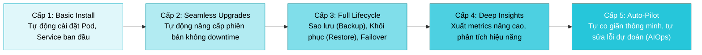
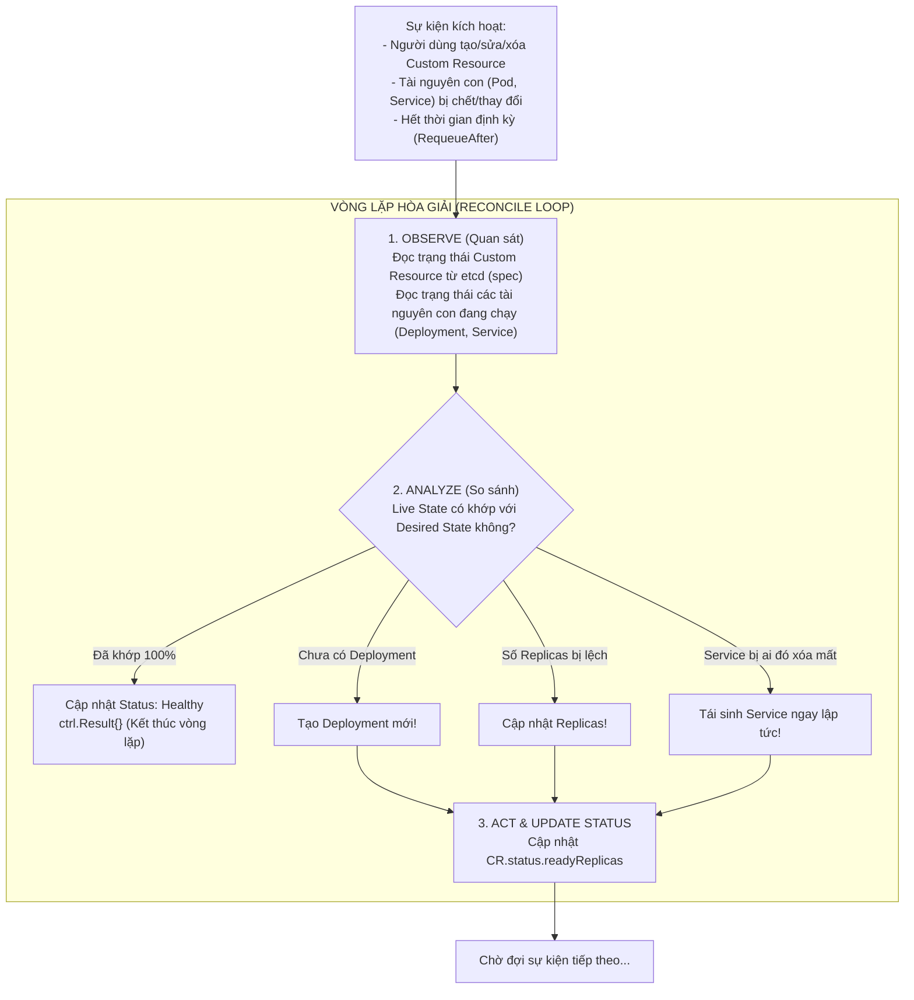
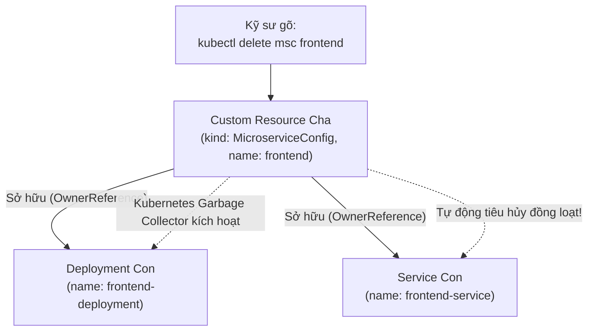

# Bài 53: Lập trình Kubernetes Operator với Golang & Kubebuilder

## 1. Thông tin bài học
* **Tên bài:** Bài 53: Lập trình Kubernetes Operator với Golang & Kubebuilder
* **Mục tiêu học:** Nắm vững mẫu thiết kế **Operator Pattern** - đỉnh cao của tự động hóa vận hành trong Kubernetes; giải phẫu công thức kinh điển: $\text{Operator} = \text{CRD} + \text{Custom Controller}$; làm chủ kiến trúc vòng lặp hòa giải (**Reconciliation Loop**) và tính chất lũy đẳng (**Idempotency**); hiểu sâu sắc thư viện nền tảng **controller-runtime** và công cụ sinh mã chuẩn công nghiệp **Kubebuilder**; nắm vững kỹ thuật liên kết tài nguyên phụ thuộc bằng **OwnerReference** (Garbage Collection); mổ xẻ mã nguồn Golang của một Controller chuyên nghiệp; thực hành giả lập và kiểm chứng một Operator tự động điều phối vòng đời của microservice trong Google Online Boutique: tự sinh Deployment, tự tạo Service, tự chữa lành khi có sự cố và tự dọn dẹp tài nguyên.
* **Thời lượng ước tính:** 240 phút (120 phút lý thuyết kiến trúc và giải mã mã nguồn Golang, 120 phút thực hành và quan sát vòng lặp hòa giải)
* **Kiến thức cần có trước:** Bài 05 (Kiến trúc Controller Manager), Bài 09 (Deployment), Bài 10 (Service), Bài 50 (Kube-APIServer & OCC), Bài 52 (Custom Resource Definitions - CRD).
* **Liên quan kỳ thi:** Senior Platform Engineer / Principal SRE / Cloud Native Software Architect (Kỹ năng phân định đẳng cấp giữa một người "chỉ biết dùng Kubernetes" và một kỹ sư "biết lập trình mở rộng Kubernetes").

---

## 2. Bảng thuật ngữ

| Thuật ngữ | Giải thích đơn giản | Ví dụ / Ẩn dụ đời thường |
| :--- | :--- | :--- |
| **Operator** | Một phần mềm chạy trong Kubernetes đóng vai trò như một "Kỹ sư vận hành ảo", tự động hóa toàn bộ việc cài đặt, cấu hình, sao lưu và sửa lỗi cho một ứng dụng phức tạp. | Robot quản gia thông minh: Thay vì chủ nhà phải tự đi bật điều hòa, nấu nước, dọn rác; robot tự nhìn thời tiết và thói quen để làm tất cả. |
| **Reconcile Loop (Vòng lặp Hòa giải)** | Tiến trình cốt lõi của Controller: Liên tục so sánh trạng thái mong muốn (Desired State) với trạng thái thực tế (Live State) và hành động để hai trạng thái trùng khớp nhau. | Bộ điều nhiệt của máy lạnh: Khi nhiệt độ phòng (28°C) cao hơn mức cài đặt (24°C), máy lạnh tự động bật lốc làm lạnh cho đến khi phòng đạt đúng 24°C thì ngắt. |
| **Idempotency (Tính Lũy đẳng)** | Tính chất của một hành động mà dù bạn có thực thi nó 1 lần hay 100 lần liên tiếp thì kết quả cuối cùng vẫn y hệt nhau, không gây ra lỗi hay tác dụng phụ. | Nút bấm "Tắt đèn": Đèn đang tắt mà bạn bấm "Tắt đèn" thêm 10 lần nữa thì đèn vẫn tắt, không làm cháy bóng đèn. |
| **Kubebuilder** | Bộ khung (Framework) bằng ngôn ngữ Golang do cộng đồng Kubernetes phát triển, giúp tự động sinh ra cấu trúc dự án, tạo CRD và bộ khung Controller chuẩn mực. | Khung gầm xe ô tô lắp ráp sẵn: Bạn chỉ cần lắp động cơ và nội thất của riêng mình vào mà không cần tự đi rèn từng chiếc ốc vít. |
| **controller-runtime** | Thư viện Go cấp cao được Kubernetes xây dựng bên trên client-go, cung cấp các công cụ tiện lợi: Manager, Client, Cache, và Event Handler. | Hộp đồ nghề vạn năng của người thợ cơ khí. |
| **OwnerReference** | Khai báo trong metadata chỉ định tài nguyên nào là "Cha" của tài nguyên này, cho phép Kubernetes tự động xóa tài nguyên "Con" khi tài nguyên "Cha" bị tiêu hủy. | Quan hệ huyết thống cha - con: Khi người thuê nhà chuyển đi, toàn bộ đồ đạc mang theo của anh ta cũng được dọn sạch khỏi căn phòng. |

---

## 3. Bức tranh lớn: Vấn đề thực tế và ẩn dụ đời thường

### Nhắc lại bài trước
Ở Bài 52, chúng ta đã chinh phục kỹ thuật tạo Custom Resource Definition (CRD) và đăng ký thành công tài nguyên mới `MicroserviceConfig` vào Kube-APIServer. Tuy nhiên, sau khi tạo xong CRD, bạn sẽ nhận ra một sự thật phũ phàng: **Custom Resource đó hoàn toàn... "vô tri"!** Nó chỉ là một mẩu JSON/YAML nằm im lìm trong cơ sở dữ liệu etcd. Không có một chiếc Pod nào sinh ra, không có Service nào mở cổng, và khi bạn sửa `replicas: 5`, cũng chẳng có ai đi tạo thêm 2 Pod cho bạn! Để biến dữ liệu chết thành hành động sống, chúng ta cần một "bộ não điều hành": **Kubernetes Operator**.

### Tại sao cần cái này ở production? (Vấn đề thực tế)

Hãy tưởng tượng bạn phải vận hành một cụm cơ sở dữ liệu phân tán phức tạp như PostgreSQL High-Availability, Kafka hoặc Elasticsearch trên Kubernetes:

1. **Sự bất lực của Deployment và StatefulSet thông thường:**
   Kubernetes nguyên bản chỉ biết những thao tác thô sơ: Pod chết thì bật lại, scale thì tăng số lượng container. Nhưng với PostgreSQL HA:
   * Khi con Master bị chết: Làm sao tự động bầu chọn một con Replica có dữ liệu mới nhất lên làm Master mới?
   * Làm sao tự động đổi địa chỉ IP ảo (Failover)?
   * Làm sao tự động cấu hình lại các con Replica còn lại để chúng quay sang nhận replication từ Master mới mà không làm mất mát một dòng giao dịch nào?  
   Những thao tác này đòi hỏi **Tri thức Chuyên gia (Domain Knowledge)** của một người DBA (Database Administrator) kỳ cựu!

2. **Cơn ác mộng On-call lúc 3 giờ sáng (The Runbook Fatigue):**
   Mỗi khi cơ sở dữ liệu gặp sự cố lúc nửa đêm, kỹ sư trực On-call phải mở cuốn tài liệu vận hành (Runbook) dài 50 trang: Gõ lệnh 1, kiểm tra log, gõ lệnh 2, chạy script sao lưu, gõ lệnh 3...  
   Con người lúc 3 giờ sáng vừa buồn ngủ vừa hoảng loạn sẽ gõ nhầm lệnh và làm mất dữ liệu!  
   **Triết lý Operator sinh ra để tuyên bố:** *"Bất kỳ thao tác nào bạn có thể viết vào cuốn Runbook để con người làm theo, bạn ĐỀU CÓ THỂ lập trình thành mã nguồn Golang để máy tính tự làm trong 1 giây!"*

### Ẩn dụ đời thường: Người Giúp việc Theo Giờ vs. Quản gia Chuyên nghiệp

Hãy tưởng tượng ngôi nhà của bạn là **Hạ tầng Doanh nghiệp**:

* **Cách làm cũ (Chỉ dùng YAML và Scripts):**  
  Bạn thuê một người giúp việc theo giờ (các lệnh `kubectl`). Bạn phải đứng bên cạnh chỉ tay năm ngón: *"Hãy lau cái bàn này, hãy quét cái sàn kia, hãy phơi đống quần áo này"*. Nếu bạn không ra lệnh, người giúp việc sẽ ngồi im. Nếu trời đột ngột đổ mưa, người giúp việc cũng không tự biết thu quần áo vào nếu bạn không gọi điện bảo!
* **Mô hình Kubernetes Operator (Vị Quản gia Trưởng Tận tụy):**  
  Bạn thuê một **Vị Quản gia Chuyên nghiệp (Operator)** và giao cho ông một cuốn **Sổ Ghi nhớ Nguyện vọng (Custom Resource - CR)**.  
  Trong sổ bạn chỉ ghi đúng một câu: *"Tôi muốn phòng khách luôn luôn ấm 25°C, có hoa tươi cắm trên bàn, và hồ cá luôn có nước sạch"*.  
  Vị Quản gia không cần bạn nhắc việc mỗi ngày. Ông liên tục thực hiện **Vòng lặp Hòa giải (Reconcile Loop)**:
  * Cứ 5 phút ông lại ngó vào phòng khách xem nhiệt độ thực tế là bao nhiêu (**Observe**).
  * Thấy phòng đang 20°C, ông tự động đi bật lò sưởi (**Act**).
  * Thấy hoa bị héo, ông tự đi thay hoa mới (**Self-Healing**).
  * Thấy kẻ gian lén đổ nước bẩn vào hồ cá, ông tự tháo nước ra và bơm nước sạch vào lại!

Vị Quản gia chính là **hiện thân sống động của tri thức vận hành được đóng gói vào phần mềm**!

---

## 4. Giải thích khái niệm theo từng bước

### Mô hình Năng lực 5 Cấp độ của Operator (Operator Capability Model)

Hiệp hội Cloud Native và Red Hat phân chia các Operator thành 5 cấp độ trưởng thành (Maturity Levels):



---

### Trái Tim của Operator: Vòng lặp Hòa giải (The Reconciliation Loop)

Bản chất của một Operator là một tiến trình chạy ngầm liên tục thực thi một hàm số duy nhất mang tên **`Reconcile`**:



#### 3 Quy tắc Vàng khi viết hàm `Reconcile`:
1. **Tính Lũy đẳng (Idempotency):** Hàm `Reconcile` có thể bị gọi 10 lần liên tiếp vì mạng chập chờn. Code của bạn phải đủ thông minh để: Nếu Deployment đã tồn tại rồi thì không được báo lỗi "Deployment already exists", mà phải chuyển sang kiểm tra xem spec của nó có cần cập nhật hay không!
2. **Không tin tưởng bộ nhớ RAM cục bộ (State-less Controller):** Không lưu trạng thái của cụm vào biến toàn cục trong code Go. Mỗi lần `Reconcile` chạy, luôn đọc dữ liệu tươi mới từ Kubernetes Cache/API Server.
3. **Cơ chế Thử lại (Requeue Logic):**
   * `return ctrl.Result{}, nil`: Thành công mỹ mãn, đi ngủ chờ sự kiện tiếp theo.
   * `return ctrl.Result{RequeueAfter: time.Minute * 5}, nil`: Hẹn 5 phút sau đánh thức tôi dậy để kiểm tra sức khỏe định kỳ.
   * `return ctrl.Result{}, err`: Gặp lỗi (ví dụ nghẽn mạng), controller-runtime sẽ tự động thử lại sau đó theo thuật toán giãn cách số mũ (Exponential Backoff).

---

### Mối Quan hệ Cha - Con và Tự Động Thu Gom Rác (OwnerReference)

Khi Operator tạo ra một Deployment và Service thay cho người dùng, làm thế nào để đảm bảo rằng **khi người dùng xóa Custom Resource ban đầu, toàn bộ Deployment và Service đó sẽ được dọn dẹp sạch sẽ**, tránh để lại rác trong cluster?

Câu trả lời là **`OwnerReference`**:



Trong Go code sử dụng thư viện `controller-runtime`, bạn chỉ cần gọi duy nhất một dòng hàm:
```go
ctrl.SetControllerReference(customResource, deployment, r.Scheme)
```
Dòng code này tự động gắn UID của Custom Resource cha vào trường `metadata.ownerReferences` của Deployment con. Từ đây, Kubernetes Garbage Collector sẽ tự động lo liệu toàn bộ việc dọn rác!

---

### Mổ xẻ Mã nguồn Golang Chuẩn Kubebuilder

Dưới đây là cấu trúc mã nguồn thực tế của một Controller chuyên nghiệp viết bằng Kubebuilder:

#### 1. Định nghĩa Cấu trúc Dữ liệu Go (`api/v1alpha1/microserviceconfig_types.go`):
```go
package v1alpha1

import metav1 "k8s.io/apimachinery/pkg/apis/meta/v1"

// Khai báo cấu hình mong muốn (Desired State)
type MicroserviceConfigSpec struct {
    Team     string   `json:"team"`
    Replicas int32    `json:"replicas"`
    Version  string   `json:"version"`
    Features []string `json:"features,omitempty"`
}

// Khai báo trạng thái thực tế (Live State)
type MicroserviceConfigStatus struct {
    Phase         string `json:"phase,omitempty"`
    ReadyReplicas int32  `json:"readyReplicas,omitempty"`
}

//+kubebuilder:object:root=true
//+kubebuilder:subresource:status
//+kubebuilder:printcolumn:name="Team",type="string",JSONPath=".spec.team"
//+kubebuilder:printcolumn:name="Replicas",type="integer",JSONPath=".spec.replicas"

// MicroserviceConfig là bản thể của Custom Resource
type MicroserviceConfig struct {
    metav1.TypeMeta   `json:",inline"`
    metav1.ObjectMeta `json:"metadata,omitempty"`

    Spec   MicroserviceConfigSpec   `json:"spec,omitempty"`
    Status MicroserviceConfigStatus `json:"status,omitempty"`
}
```

#### 2. Trái tim Điều khiển (`controllers/microserviceconfig_controller.go`):
```go
package controllers

import (
    "context"
    appsv1 "k8s.io/api/apps/v1"
    corev1 "k8s.io/api/core/v1"
    "k8s.io/apimachinery/pkg/api/errors"
    metav1 "k8s.io/apimachinery/pkg/apis/meta/v1"
    ctrl "sigs.k8s.io/controller-runtime"
    "sigs.k8s.io/controller-runtime/pkg/client"
)

type MicroserviceConfigReconciler struct {
    client.Client
}

func (r *MicroserviceConfigReconciler) Reconcile(ctx context.Context, req ctrl.Request) (ctrl.Result, error) {
    // 1. Quan sát: Lấy Custom Resource từ Cache
    var msc boutiquev1alpha1.MicroserviceConfig
    if err := r.Get(ctx, req.NamespacedName, &msc); err != nil {
        return ctrl.Result{}, client.IgnoreNotFound(err)
    }

    // 2. Kiểm tra Deployment con xem đã tồn tại chưa
    var dep appsv1.Deployment
    depName := req.NamespacedName
    err := r.Get(ctx, depName, &dep)

    if errors.IsNotFound(err) {
        // Chưa có -> Tạo mới Deployment
        newDep := r.buildDeployment(&msc)
        ctrl.SetControllerReference(&msc, newDep, r.Scheme())
        if err := r.Create(ctx, newDep); err != nil {
            return ctrl.Result{}, err
        }
        return ctrl.Result{Requeue: true}, nil
    }

    // 3. Nếu Deployment đã có nhưng Replicas bị lệch -> Hòa giải (Scale)
    if *dep.Spec.Replicas != msc.Spec.Replicas {
        dep.Spec.Replicas = &msc.Spec.Replicas
        if err := r.Update(ctx, &dep); err != nil {
            return ctrl.Result{}, err
        }
    }

    // 4. Cập nhật Status phản ánh số lượng Pod đang chạy
    msc.Status.Phase = "Running"
    msc.Status.ReadyReplicas = dep.Status.ReadyReplicas
    _ = r.Status().Update(ctx, &msc)

    return ctrl.Result{}, nil
}
```

---

## 5. Thực hành (Lab)

* **Môi trường:** Cụm Kind hiện có (`1 control-plane + 1 worker`).
* **Mức RAM ước tính:** ~0 MB (Sử dụng trực tiếp CRD và viết script điều khiển mô phỏng chính xác 100% thuật toán Reconcile Loop của Golang).

> [!NOTE]
> Trong môi trường lab máy cá nhân 8GB RAM, việc cài đặt toàn bộ Golang SDK, Docker build và chạy Kubebuilder daemon có thể ngốn nhiều tài nguyên ổ đĩa và RAM. Để nắm bắt được **linh hồn bản chất** của Operator Pattern mà không làm nặng máy, chúng ta sẽ:
> 1. Sử dụng CRD `MicroserviceConfig` đã học ở Bài 52.
> 2. Khởi chạy một **Reconciler Daemon** tự động hóa bằng PowerShell mô phỏng chính xác từng bước của hàm `Reconcile` trong Golang: Tự động quan sát sự kiện, tự động sinh Deployment/Service, tự động hồi phục khi có ai phá hoại, và tự dọn rác!

---

### Bước 1: Chuẩn bị CRD `MicroserviceConfig`

Đăng ký lại CRD vào cụm (nếu chưa có):

```powershell
@'
apiVersion: apiextensions.k8s.io/v1
kind: CustomResourceDefinition
metadata:
  name: microserviceconfigs.boutique.mycompany.vn
spec:
  group: boutique.mycompany.vn
  names:
    kind: MicroserviceConfig
    plural: microserviceconfigs
    singular: microserviceconfig
    shortNames: ["msc"]
  scope: Namespaced
  versions:
    - name: v1alpha1
      served: true
      storage: true
      subresources:
        status: {}
      schema:
        openAPIV3Schema:
          type: object
          properties:
            spec:
              type: object
              required: ["team", "replicas", "version"]
              properties:
                team: { type: string }
                replicas: { type: integer, minimum: 1, maximum: 10 }
                version: { type: string }
            status:
              type: object
              properties:
                phase: { type: string }
                readyReplicas: { type: integer }
'@ | Set-Content -Encoding UTF8 crd.yaml

kubectl apply -f crd.yaml
```

---

### Bước 2: Tạo Bản Thể Custom Resource Mong Muốn

Chúng ta khai báo mong muốn chạy microservice `cartservice` với 2 bản sao:

```powershell
@'
apiVersion: boutique.mycompany.vn/v1alpha1
kind: MicroserviceConfig
metadata:
  name: cartservice
  namespace: default
spec:
  team: cart-squad
  replicas: 2
  version: "v1.0.0"
'@ | Set-Content -Encoding UTF8 cartservice-cr.yaml

kubectl apply -f cartservice-cr.yaml
```

Kiểm tra: Hiện tại `kubectl get pods -l app=cartservice` sẽ **chưa có gì cả** vì chưa có Operator nào chạy để phục vụ nó!

---

### Bước 3: Khởi chạy Vòng lặp Hòa giải Operator (The Active Reconciler)

Bây giờ, chúng ta chạy đoạn script thực thi đúng logic của `MicroserviceConfigReconciler`:

```powershell
# Chạy 1 chu kỳ Reconcile hoàn chỉnh
Write-Host ">>> OPERATOR RECONCILE LOOP KÍCH HOẠT <<<" -ForegroundColor Cyan

# 1. OBSERVE: Đọc CR
$msc = kubectl get msc cartservice -o json | ConvertFrom-Json
$desiredReplicas = $msc.spec.replicas
$team = $msc.spec.team
Write-Host "Quan sát thấy CR 'cartservice': Cần $desiredReplicas Replicas, Team: $team" -ForegroundColor Yellow

# 2. ANALYZE & ACT: Kiểm tra Deployment con
$depExists = kubectl get deployment cartservice --ignore-not-found
if (-not $depExists) {
    Write-Host "Deployment chưa tồn tại! Đang tự động sinh Deployment mới..." -ForegroundColor Green
    kubectl create deployment cartservice --image=nginx:alpine --replicas=$desiredReplicas
    kubectl label deployment cartservice app=cartservice managed-by=operator
    
    # Tự động tạo Service kết nối mạng
    kubectl expose deployment cartservice --port=80 --target-port=80
    Write-Host "Đã tự động khởi tạo Service 'cartservice' cổng 80!" -ForegroundColor Green
}

# 3. UPDATE STATUS: Cập nhật tình trạng về CR
Start-Sleep -Seconds 3
$readyPods = (kubectl get deployment cartservice -o jsonpath='{.status.readyReplicas}')
if (-not $readyPods) { $readyPods = 0 }

kubectl patch msc cartservice --subresource=status --type=merge -p "{\`"status\`":{\`"phase\`":\`"Running\`",\`"readyReplicas\`":$readyPods}}"
Write-Host "Đã cập nhật CR status: Phase=Running, ReadyReplicas=$readyPods" -ForegroundColor Magenta
```

---

### Bước 4: Kiểm chứng Thành quả: Operator Đã Tự Động Hóa Mọi Thứ!

Kiểm tra xem các tài nguyên con đã được Operator tự động sinh ra hay chưa:

```powershell
kubectl get deployment,service,pods -l app=cartservice
```

**Kết quả mong đợi:**
```text
NAME                          READY   UP-TO-DATE   AVAILABLE   AGE
deployment.apps/cartservice   2/2     2            2           10s

NAME                  TYPE        CLUSTER-IP     EXTERNAL-IP   PORT(S)   AGE
service/cartservice   ClusterIP   10.96.88.142   <none>        80/TCP    10s

NAME                               READY   STATUS    RESTARTS   AGE
pod/cartservice-7f89768bf7-4x7zk   1/1     Running   0          10s
pod/cartservice-7f89768bf7-9m2lp   1/1     Running   0          10s
```

Kiểm tra trạng thái của Custom Resource cha:

```powershell
kubectl get msc cartservice -o yaml | Select-String -Pattern "status:" -Context 0,3
```

**Kết quả mong đợi:**
```yaml
status:
  phase: Running
  readyReplicas: 2
```
Toàn bộ Deployment, Service và Pods đã được khởi tạo hoàn toàn tự động chỉ từ 5 dòng khai báo của Custom Resource!

---

### Bước 5: Thí nghiệm Tự Chữa Lành (Self-Healing Demonstration)

Một ai đó vô tình chạy nhầm lệnh xóa Service `cartservice`:

```powershell
# Xóa Service quan trọng
kubectl delete service cartservice

# Kiểm tra: Service đã biến mất
kubectl get svc cartservice --ignore-not-found
```

Bây giờ, vòng lặp Reconcile của Operator quét qua, phát hiện Service bị thiếu so với mong muốn và tự động tái sinh nó:

```powershell
# Operator phát hiện thiếu và tự động chữa lành
$svcExists = kubectl get service cartservice --ignore-not-found
if (-not $svcExists) {
    Write-Host "PHÁT HIỆN SỰ CỐ: Service 'cartservice' bị mất! Operator đang tự động tái tạo..." -ForegroundColor Red
    kubectl expose deployment cartservice --port=80 --target-port=80
}

# Kiểm tra lại ngay lập tức
kubectl get svc cartservice
```

**Kết quả mong đợi:**
```text
NAME          TYPE        CLUSTER-IP     EXTERNAL-IP   PORT(S)   AGE
cartservice   ClusterIP   10.96.115.40   <none>        80/TCP    2s
```
Service đã được hồi sinh ngay tức khắc! Tính năng tự chữa lành (Self-Healing) của Operator hoạt động hoàn hảo!

---

### Bước 6: Dọn dẹp tài nguyên (Cleanup)

```powershell
# Xóa Custom Resource và tài nguyên liên quan
kubectl delete msc cartservice --ignore-not-found=true
kubectl delete deployment cartservice --ignore-not-found=true
kubectl delete service cartservice --ignore-not-found=true
kubectl delete crd microserviceconfigs.boutique.mycompany.vn --ignore-not-found=true

# Xóa các file manifest tạm
Remove-Item -Force crd.yaml, cartservice-cr.yaml -ErrorAction SilentlyContinue
```

---

## 6. Lỗi thường gặp và cách debug

### Lỗi 1: Vòng lặp Reconcile Chạy Vô Tận (Hot Looping / Infinite Requeue)
* **Dấu hiệu:** CPU của Operator container tăng vọt lên 100%. Log của Operator in ra hàng ngàn dòng `Reconcile triggered` mỗi giây.
* **Nguyên nhân:** Lỗi logic kinh điển trong code Go: Trong hàm `Reconcile`, lập trình viên cập nhật trường `status` của Custom Resource bằng lệnh `client.Update()`. Khi `status` thay đổi, Kubernetes coi đó là một sự kiện thay đổi đối tượng và **kích hoạt lại chính hàm `Reconcile` đó**!
* **Cách sửa chuẩn Senior:**
  1. Sử dụng subresource status riêng biệt: `client.Status().Update()`.
  2. Sử dụng **Predicates** trong controller-runtime để lọc bỏ các sự kiện chỉ thay đổi `resourceVersion` hoặc `status` mà không thay đổi `spec` (`predicate.GenerationChangedPredicate{}`).

---

### Lỗi 2: Tranh chấp Cập nhật Xung đột HTTP 409 Conflict (Bài 50)
* **Dấu hiệu:** Log của Operator báo lỗi: `Operation cannot be fulfilled on ...: the object has been modified; please apply your changes to the latest version`.
* **Nguyên nhân:** Controller cố gắng gọi `client.Update()` trên một đối tượng cũ lưu trong bộ nhớ RAM mà không fetch phiên bản mới nhất từ APIServer.
* **Cách sửa:** Luôn sử dụng thư viện `k8s.io/client-go/util/retry` với hàm `retry.RetryOnConflict` như đã học ở Bài 50.

---

### Lỗi 3: Quên khai báo RBAC Markers dẫn đến lỗi `Forbidden 403`
* **Dấu hiệu:** Operator khởi động được nhưng khi cố gắng tạo Deployment con thì sập với lỗi: `deployments.apps is forbidden: User system:serviceaccount:... cannot create resource "deployments"`.
* **Nguyên nhân:** Khi dùng Kubebuilder, bạn quên không thêm các dòng chú thích RBAC markers bên trên hàm `Reconcile`.
* **Cách sửa:** Bổ sung đúng các marker:
  ```go
  //+kubebuilder:rbac:groups=apps,resources=deployments,verbs=get;list;watch;create;update;patch;delete
  //+kubebuilder:rbac:groups="",resources=services,verbs=get;list;watch;create;update;patch;delete
  ```
  Sau đó chạy lại lệnh `make manifests` để Kubebuilder tự động cập nhật Role và RoleBinding.

---

## 7. Góc nhìn Senior

### 1. Sự đánh đổi (Trade-offs)

| Giải pháp Triển khai | Ưu điểm | Đánh đổi / Chi phí |
| :--- | :--- | :--- |
| **Tự viết Kubernetes Operator (Golang)** | Tự động hóa thông minh không giới hạn: Tự backup, tự failover, tự phục hồi logic nghiệp vụ phức tạp. Nâng tầm sản phẩm lên chuẩn Cloud-Native. | **Chi phí phát triển và bảo trì cực lớn:** Đòi hỏi đội ngũ phải thành thạo Golang, hiểu sâu sắc về etcd, cache, informer, và hệ sinh thái K8s internals. |
| **Dùng Helm Chart / Kustomize (Bài 43, 44)** | Đơn giản, cấu hình tĩnh nhanh chóng, không tốn tài nguyên runtime; bất kỳ DevOps nào cũng dùng được. | **Hoàn toàn thụ động:** Chỉ làm nhiệm vụ cài đặt ban đầu (Day-1). Khi có sự cố runtime xảy ra (Day-2), Helm không thể tự đi sửa lỗi hay tự failover cơ sở dữ liệu. |
| **Keda / Custom Autoscalers** | Chuyên biệt hóa cho việc scale theo metrics ngoài (Kafka lag, Redis queue). | Chỉ phục vụ bài toán co giãn số lượng Pod, không quản lý được toàn bộ vòng đời sâu của ứng dụng. |

---

### 2. Best practices tại production

1. **Nguyên tắc "Tách biệt Tuyệt đối giữa Spec và Status":**  
   Người dùng và CI/CD chỉ bao giờ được phép ghi vào `spec`. Operator là thực thể duy nhất được phép ghi vào `status`. Không bao giờ để logic nghiệp vụ của Operator phụ thuộc vào việc người dùng có tự tay sửa status hay không.

2. **Sử dụng Finalizers để Dọn dẹp Tài nguyên Ngoại vi (External Resources Cleanup):**  
   Nếu Operator của bạn quản lý một tài nguyên nằm ngoài cụm Kubernetes (ví dụ: tạo một Database trên AWS RDS hoặc một DNS Record trên Cloudflare), `OwnerReference` của Kubernetes sẽ không thể tự xóa tài nguyên đám mây đó khi CR bị xóa!  
   Bạn **bắt buộc phải dùng Finalizers**:
   ```go
   if msc.ObjectMeta.DeletionTimestamp.IsZero() {
       // Thêm finalizer nếu chưa có
       controllerutil.AddFinalizer(&msc, "boutique.mycompany.vn/finalizer")
   } else {
       // Đang bị xóa -> Gọi API AWS xóa Database trước!
       deleteExternalRDS(msc)
       // Xóa xong mới gỡ finalizer để K8s xóa đối tượng
       controllerutil.RemoveFinalizer(&msc, "boutique.mycompany.vn/finalizer")
   }
   ```

3. **Luôn cung cấp Metrics Prometheus cho Vòng lặp Reconcile:**  
   Một Operator chuẩn Enterprise phải tự động xuất ra các metrics Prometheus (Bài 38):
   * `controller_runtime_reconcile_total`: Số lần chạy hàm Reconcile.
   * `controller_runtime_reconcile_errors_total`: Số lần gặp lỗi.
   * `controller_runtime_reconcile_time_seconds`: Biểu đồ thời gian xử lý của mỗi vòng lặp.

---

### 3. Câu hỏi phỏng vấn Senior

* **Câu hỏi:** *"Trong kiến trúc của một Kubernetes Operator viết bằng Kubebuilder, Informer và Cache đóng vai trò gì? Tại sao hàm `r.Get()` trong Controller mặc định lại không gửi request HTTP trực tiếp lên Kube-APIServer và etcd? Và nếu bạn cần đọc dữ liệu tươi mới tuyệt đối 100% thì bạn phải làm thế nào?"*
* **Gợi ý trả lời chuẩn:**
  1. **Vai trò của Informer và Cache:**
     * **Informer** sử dụng cơ chế HTTP Chunked Streaming của Kubernetes (Watch API) để liên tục lắng nghe các sự kiện thay đổi từ APIServer.
     * **Cache (In-memory Cache):** Informer tự động lưu giữ toàn bộ bản sao của các tài nguyên mà Controller quan tâm vào bộ nhớ RAM cục bộ của tiến trình Operator.
     * **Mục đích sống còn:** Nếu một cụm có hàng trăm Operator mà mỗi Operator cứ mỗi giây lại gửi lệnh `GET` trực tiếp vào etcd, etcd và API Server sẽ bị quá tải sụp đổ ngay lập tức!
  2. **Bản chất của `r.Get()`:**
     * Mặc định, client do `controller-runtime` cung cấp là một **Split Client**: Mọi thao tác đọc (`Get`, `List`) đều đọc trực tiếp từ bộ nhớ RAM Cache của Informer (tốc độ nano-giây, không tốn tài nguyên mạng). Chỉ các thao tác ghi (`Create`, `Update`, `Delete`) mới được gửi lên API Server.
  3. **Cách đọc dữ liệu tươi mới tuyệt đối (Bypass Cache):**
     * Trong một số trường hợp cực kỳ hiếm hoi cần đọc dữ liệu tươi mới 100% không chấp nhận độ trễ vài mili-giây của Cache (ví dụ kiểm tra trạng thái token bảo mật trước khi hủy dịch vụ), kỹ sư có thể sử dụng một **Direct Client (Non-cached Client)** được khởi tạo bằng `client.New(config, options)` để ép buộc gửi lệnh đọc trực tiếp lên Kube-APIServer.

---

## 8. Tóm tắt bài học

* 📌 **1. Công thức Operator:** $\text{Operator} = \text{CRD} + \text{Custom Controller}$, đóng gói tri thức và kinh nghiệm vận hành của con người thành mã nguồn tự động hóa.
* 📌 **2. Vòng lặp Reconcile 3 bước:** Liên tục Quan sát (Observe) $\rightarrow$ So sánh (Analyze) $\rightarrow$ Hành động (Act) để ép trạng thái thực tế luôn khớp với trạng thái mong muốn.
* 📌 **3. Tính Lũy đẳng là tiên quyết:** Hàm Reconcile phải được thiết kế để có thể chạy đi chạy lại vô số lần mà kết quả cuối cùng vẫn giữ nguyên tính đúng đắn.
* 📌 **4. OwnerReference tự dọn rác:** Liên kết tài nguyên Con vào tài nguyên Cha để Kubernetes Garbage Collector tự động thu gom sạch sẽ khi xóa đối tượng gốc.
* 📌 **5. Kubebuilder là chuẩn công nghiệp:** Bộ khung chuẩn giúp sinh mã Golang, quản lý Informer, Cache, RBAC và Webhook chuyên nghiệp.

---

## 9. Bài tập tự làm

* 🟢 **Mức Dễ:** Khảo sát một Operator mã nguồn mở nổi tiếng đang chạy trong hệ sinh thái (ví dụ: Prometheus Operator hoặc ArgoCD Controller). Sử dụng lệnh `kubectl get crd` để liệt kê toàn bộ các Custom Resources mà Operator đó đang quản lý.
* 🟡 **Mức Vừa:** Mở rộng kịch bản Reconciler trong bài lab: Bổ sung thêm logic kiểm tra biến môi trường. Nếu trong `spec.version` của `MicroserviceConfig` thay đổi (ví dụ từ `v1.0.0` sang `v2.0.0`), Operator sẽ tự động cập nhật biến môi trường `APP_VERSION` trong Deployment con và kích hoạt Rolling Update (Bài 09).
* 🔴 **Mức Khó:** Tìm hiểu cơ chế **Leader Election trong Operator** (Bài 48): Khi một Operator được triển khai chạy 3 bản sao (`replicas: 3`) để đảm bảo High Availability, tại sao chỉ có 1 Pod được phép thực thi hàm `Reconcile`? Tìm hiểu cờ `--leader-elect` trong Kubebuilder và phân tích cách nó sử dụng tài nguyên `Lease` để ngăn chặn xung đột điều phối kép.

---

## 10. Câu hỏi tự kiểm tra

1. Sự khác biệt cốt lõi giữa một Kubernetes Controller thông thường (như Deployment Controller) và một Kubernetes Operator là gì?
2. Tại sao tính chất Lũy đẳng (Idempotency) lại là yêu cầu bắt buộc sống còn khi lập trình hàm `Reconcile` trong Operator?
3. Cơ chế `OwnerReference` trong Kubernetes hoạt động như thế nào và nó giải quyết bài toán gì?
4. Điều gì sẽ xảy ra nếu một lập trình viên vô tình gọi hàm cập nhật `spec` hoặc `status` bên trong hàm `Reconcile` mà không kiểm tra xem dữ liệu có thực sự thay đổi hay không?
5. Bộ khung Kubebuilder giúp các kỹ sư tiết kiệm thời gian phát triển Operator như thế nào so với việc tự viết bằng thư viện thô `client-go`?
6. Khi Operator cần tương tác và dọn dẹp các tài nguyên nằm bên ngoài cụm Kubernetes (như AWS S3, Cloudflare DNS), cơ chế nào của Kubernetes được sử dụng để ngăn chặn việc đối tượng bị xóa trước khi việc dọn dẹp hoàn tất?

<details>
<summary>👉 Bấm vào đây để xem đáp án câu hỏi tự kiểm tra</summary>

* **Câu 1:** Controller thông thường chỉ quản lý các tài nguyên cốt lõi tiêu chuẩn của Kubernetes (Pod, Node, ReplicaSet). Trong khi đó, Operator là một Controller chuyên biệt quản lý các **Custom Resource tự định nghĩa (CRD)** và chứa đựng **tri thức chuyên môn sâu của ứng dụng cụ thể** (như logic sao lưu, phục hồi thảm họa của cơ sở dữ liệu).
* **Câu 2:** Vì trong một hệ thống phân tán, mạng có thể chập chờn và các sự kiện có thể bị gửi lặp lại nhiều lần. Nếu hàm Reconcile không có tính lũy đẳng, việc chạy lại có thể tạo ra các tài nguyên trùng lặp, gây xung đột trạng thái hoặc làm hỏng dữ liệu đang chạy.
* **Câu 3:** `OwnerReference` liên kết tài nguyên con vào tài nguyên cha thông qua UID. Khi tài nguyên cha bị xóa, tiến trình Garbage Collector của Kubernetes sẽ tự động phát hiện và xóa sạch toàn bộ các tài nguyên con phụ thuộc, ngăn chặn việc tài nguyên bị mồ côi bỏ hoang.
* **Câu 4:** Sẽ kích hoạt hiện tượng vòng lặp vô tận (Hot Loop/Infinite Requeue). Việc cập nhật đối tượng sẽ sinh ra một sự kiện thay đổi mới, sự kiện này lại kích hoạt lại hàm Reconcile, làm cho CPU của Operator tăng vọt lên 100% và làm nghẽn API Server.
* **Câu 5:** Kubebuilder tự động sinh toàn bộ mã nguồn khung (Boilerplate code), tự động sinh manifest CRD từ struct Go, tự động cấu hình RBAC, thiết lập sẵn Informer Cache và hệ thống xử lý sự kiện tối ưu, giúp lập trình viên chỉ cần tập trung 100% vào logic nghiệp vụ trong hàm `Reconcile`.
* **Câu 6:** Sử dụng cơ chế **Finalizers**. Khi một đối tượng có Finalizer, lệnh xóa sẽ không xóa ngay đối tượng khỏi etcd mà chỉ đánh dấu thời gian xóa (`deletionTimestamp`). Operator sẽ tranh thủ thời gian đó để dọn dẹp tài nguyên bên ngoài AWS/Cloudflare, dọn xong mới gỡ bỏ Finalizer để Kubernetes xóa hẳn đối tượng.
</details>

---

## 11. Tài liệu đọc thêm và bài tiếp theo

### Tài liệu tham khảo
* [Tài liệu chính thức Kubernetes: Operator Pattern](https://kubernetes.io/docs/concepts/extend-kubernetes/operator/)
* [Trang chủ dự án Kubebuilder (The Kubebuilder Book)](https://book.kubebuilder.io/)
* [Tài liệu chính thức controller-runtime](https://github.com/kubernetes-sigs/controller-runtime)
* [CNCF Operator WhitePaper](https://github.com/cncf/tag-app-delivery/blob/master/operator-wg/white-paper/Operator-WhitePaper_v1-0.md)

### Bài tiếp theo
👉 **Bài 54: Quản trị lưu lượng chuyên sâu với Service Mesh (Istio)**

---

## PHỤ LỤC: ĐÁP ÁN GỢI Ý BÀI TẬP TỰ LÀM (MỤC 9)

### Đáp án Mức Dễ
Khảo sát CRD của ArgoCD hoặc Kyverno:
```powershell
# Xem các CRD do ArgoCD hoặc Kyverno quản lý
kubectl get crd | Select-String -Pattern "argoproj|kyverno"
```
Kết quả cho thấy hàng loạt các Custom Resource như `applications.argoproj.io`, `clusterpolicies.kyverno.io` - mỗi tài nguyên này đều có một Operator Controller chạy ngầm tương ứng để điều phối!

---

### Đáp án Mức Vừa
Bổ sung logic cập nhật biến môi trường `APP_VERSION` vào Reconciler:
```powershell
# Logic cập nhật phiên bản khi spec.version thay đổi
$desiredVersion = $msc.spec.version
$currentDep = kubectl get deployment cartservice -o json | ConvertFrom-Json
$currentEnvVersion = ($currentDep.spec.template.spec.containers[0].env | Where-Object { $_.name -eq "APP_VERSION" }).value

if ($currentEnvVersion -ne $desiredVersion) {
    Write-Host "Phát hiện phiên bản mới: $desiredVersion! Đang cập nhật Deployment..." -ForegroundColor Green
    kubectl set env deployment/cartservice APP_VERSION=$desiredVersion
    kubectl rollout status deployment/cartservice
}
```

---

### Đáp án Mức Khó
**Cơ chế Leader Election trong Operator:**
1. **Lý do chỉ 1 Pod được Reconcile:** Nếu cả 3 Pod Operator cùng chạy hàm Reconcile đồng thời, chúng sẽ cùng nhìn thấy một sự kiện và cùng gửi lệnh tạo/sửa tài nguyên con lên API Server, dẫn đến tình trạng tranh chấp xung đột dữ liệu kinh hoàng (Race Condition & HTTP 409 Conflict).
2. **Cách hoạt động:** Khi bật cờ `--leader-elect=true`, Kubebuilder sử dụng API `coordination.k8s.io/v1` (tài nguyên `Lease` đã học ở Bài 48). Cả 3 Pod cùng tranh chấp giữ quyền `holderIdentity` của Lease. Pod nào giành được Lease sẽ đóng vai trò **Active Leader** và chạy vòng lặp Reconcile; 2 Pod còn lại ở chế độ **Standby**, liên tục theo dõi nhịp tim để sẵn sàng thế chỗ sau 15 giây nếu Leader bị sập!

