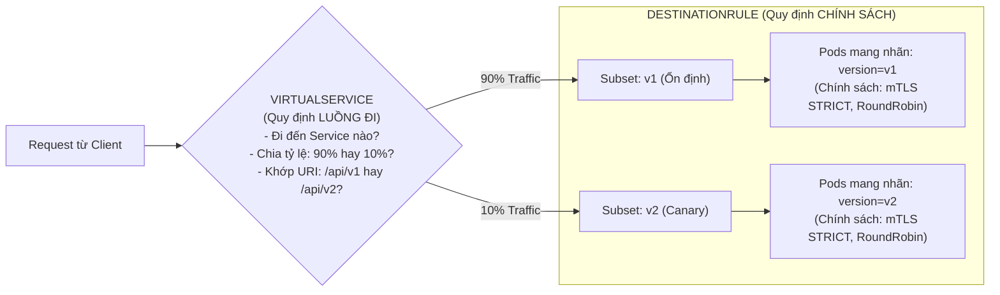
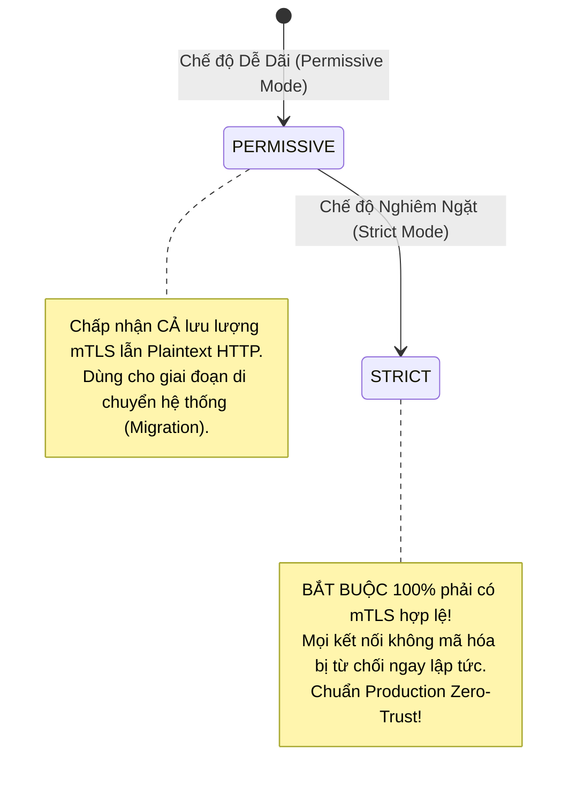

# Bài 54: Quản trị lưu lượng chuyên sâu với Service Mesh (Istio)

## 1. Thông tin bài học
* **Tên bài:** Bài 54: Quản trị lưu lượng chuyên sâu với Service Mesh (Istio)
* **Mục tiêu học:** Thấu hiểu bản chất và sự cần thiết của **Service Mesh** trong kiến trúc Microservices phân tán; phân biệt rạch ròi giữa lưu lượng Bắc - Nam (**North-South Traffic**) và lưu lượng Đông - Tây (**East-West Traffic**); giải phẫu kiến trúc tách biệt giữa **Control Plane (`istiod`)** và **Data Plane (Envoy Proxy Sidecar)**; làm chủ bộ đôi tài nguyên điều phối cốt lõi: **`VirtualService`** (quy định luồng đi) và **`DestinationRule`** (quy định chính sách và phân nhóm Subsets); nắm vững kỹ thuật phát hành tính năng **Canary Deployment** (chia tách tỷ lệ lưu lượng 90/10 không gián đoạn); hiểu cơ chế mã hóa hai chiều tự động **Mutual TLS (mTLS)** theo nguyên lý Zero-Trust; thực hành thiết lập lab Istio phiên bản tối ưu tài nguyên cho máy 8GB RAM và điều phối lưu lượng Canary cho Google Online Boutique.
* **Thời lượng ước tính:** 210 phút (90 phút lý thuyết kiến trúc, 120 phút thực hành và quan sát luồng mạng)
* **Kiến thức cần có trước:** Bài 10 (Service), Bài 18 (CNI & Mô hình mạng phẳng), Bài 20 (Ingress), Bài 22 (NetworkPolicy Zero-Trust).
* **Liên quan kỳ thi:** Senior Platform Engineer / Cloud Native Architect / CKA & CKS nâng cao (Kiến thức trọng tâm về quản trị lưu lượng microservices và bảo mật tầng ứng dụng Layer 7).

---

## 2. Bảng thuật ngữ

| Thuật ngữ | Giải thích đơn giản | Ví dụ / Ẩn dụ đời thường |
| :--- | :--- | :--- |
| **Service Mesh** | Tầng hạ tầng phần mềm chuyên dụng điều khiển, bảo mật và quan sát toàn bộ các luồng giao tiếp giữa các microservice với nhau (East-West Traffic). | Mạng lưới nhân viên bưu tá riêng trong một tòa nhà: Thay vì nhân viên các phòng tự chạy sang nhau đưa thư, mỗi phòng có một bưu tá riêng nhận và chuyển thư an toàn. |
| **Data Plane** | Tập hợp các tiến trình proxy siêu nhẹ (Envoy) chạy kè kè bên cạnh mỗi ứng dụng, trực tiếp tiếp nhận và chuyển tiếp từng gói tin mạng Layer 7. | Các vệ sĩ đi kèm từng nguyên thủ quốc gia: Mọi bức thư hay cuộc nói chuyện đều phải qua tay vệ sĩ kiểm duyệt trước. |
| **Control Plane (`istiod`)** | "Bộ não" trung tâm của Service Mesh, chịu trách nhiệm quản lý cấu hình, cấp phát chứng chỉ số và hướng dẫn các Envoy Proxy hoạt động. | Sở chỉ huy tác chiến trung tâm: Đưa ra chiến lược và phát lệnh chỉ thị cho các vệ sĩ ngoài hiện trường. |
| **Sidecar Pattern** | Mô hình triển khai đặt một container phụ trợ (Envoy Proxy) chạy chung một Pod, dùng chung Network Namespace với container ứng dụng chính. | Chiếc xe mô tô có thùng phụ bên cạnh: Thùng phụ chở trợ lý giải quyết mọi việc giấy tờ, người lái chỉ việc tập trung lái xe. |
| **mTLS (Mutual TLS)** | Giao thức mã hóa trong đó cả client và server đều phải trình chứng chỉ số để xác thực danh tính của nhau trước khi truyền dữ liệu. | Hai điệp viên gặp nhau: Cả 2 đều phải giơ mật mã và thẻ ngành ra kiểm tra chéo trước khi bắt đầu nói chuyện. |
| **VirtualService** | Tài nguyên định nghĩa quy tắc dẫn đường (Routing Rules) cho lưu lượng mạng: quyết định request nào đi về đâu, tỷ lệ bao nhiêu %. | Biển chỉ dẫn ngã tư đường: 90% dòng xe đi thẳng theo làn đường cũ, 10% dòng xe rẽ vào làn đường thử nghiệm mới. |
| **DestinationRule** | Tài nguyên định nghĩa các chính sách áp dụng cho lưu lượng sau khi đã được định tuyến: phân chia các nhóm phiên bản (Subsets), bật mTLS, ngắt mạch (Circuit Breaking). | Nội quy khi bước vào cổng tòa nhà: Yêu cầu mọi người phải đi qua cổng từ kiểm tra an ninh và xếp hàng theo nhóm tuổi. |
| **Canary Deployment** | Chiến lược phát hành phần mềm: Đưa phiên bản mới ra phục vụ một nhóm nhỏ người dùng (ví dụ: 10%) để theo dõi lỗi trước khi thay thế hoàn toàn phiên bản cũ. | Thợ mỏ mang chim hoàng yến xuống hầm than: Nếu chim vẫn hót vui vẻ nghĩa là không khí an toàn, thợ mỏ mới yên tâm bước xuống làm việc. |

---

## 3. Bức tranh lớn: Vấn đề thực tế và ẩn dụ đời thường

### Nhắc lại bài trước
Ở Bài 53, chúng ta đã tiếp cận đỉnh cao tự động hóa bằng cách lập trình một Kubernetes Operator bằng Golang. Nhưng khi hệ thống phát triển lên quy mô 50 microservices, một "điểm mù" khổng lồ xuất hiện: **Mạng lưới giao tiếp nội bộ giữa các microservices!** Ở Bài 18, chúng ta đã biết Kubernetes cung cấp một mô hình mạng phẳng (Flat Network) nơi Pod A có thể gọi trực tiếp Pod B qua IP. Tuy nhiên, Kubernetes gốc chỉ dừng lại ở tầng mạng cơ bản: nó không mã hóa lưu lượng, không biết request nào bị chậm 500ms, không thể chia 10% traffic cho bản thử nghiệm, và không thể tự ngắt kết nối khi service phía sau bị nghẽn!

### Tại sao cần cái này ở production? (Vấn đề thực tế)

Hãy tưởng tượng bạn đang quản lý hệ thống thanh toán của một sàn thương mại điện tử:

1. **"Điểm mù" Lưu lượng Đông - Tây (East-West Traffic):**
   * **Lưu lượng Bắc - Nam (North-South):** Khách hàng từ Internet đi qua Ingress Controller (Bài 20) vào website. Tầng này bạn có thể đo đạc SSL, rate limiting dễ dàng.
   * **Lưu lượng Đông - Tây (East-West):** Service `frontend` gọi sang `cartservice`, `cartservice` gọi sang `paymentservice`, `paymentservice` gọi sang `emailservice`. Đây là 90% lưu lượng của toàn cụm!  
   Trong Kubernetes gốc, toàn bộ các cuộc gọi này là **văn bản thô (Plaintext HTTP)**. Một hacker chỉ cần xâm nhập vào 1 Pod bất kỳ là có thể dùng lệnh `tcpdump` để nghe lén toàn bộ số thẻ tín dụng đang bay lượn trong mạng!

2. **Cơn ác mộng "Code mạng xâm lấn Code nghiệp vụ":**
   Để giải quyết bài toán: Tự động thử lại khi lỗi (Retries), giới hạn thời gian chờ (Timeout), mã hóa bảo mật (mTLS), lập trình viên phải tự viết mã logic mạng bằng thư viện của từng ngôn ngữ (Java, Go, Python, Node.js).  
   * Đội Java dùng thư viện Hystrix.
   * Đội Go tự viết vòng lặp `for` retry.
   * Đội Python quên cấu hình timeout khiến request treo vô tận!  
   Mã nguồn nghiệp vụ bị ô nhiễm bởi hàng trăm dòng code mạng vụn vặt, và không ai có cái nhìn tổng thể về độ trễ của hệ thống!

3. **Nhu cầu phát hành Canary không gián đoạn:**
   Khi nhóm Frontend ra mắt phiên bản v2, họ muốn thử nghiệm: Chỉ cho **10% người dùng** trải nghiệm bản mới, 90% vẫn dùng bản v1 ổn định.  
   Trong Kubernetes gốc (dùng Service Selector), bạn chỉ có thể chia tỷ lệ bằng cách tăng giảm số lượng Pod (ví dụ: chạy 9 Pod v1 và 1 Pod v2). Cách làm này cực kỳ thô thiển, tốn tài nguyên và không thể lọc lưu lượng thông minh (ví dụ: chỉ chuyển hướng người dùng có header `User-Agent: iPhone`)!

**Service Mesh (Istio) sinh ra để giải phóng hoàn toàn lập trình viên khỏi gánh nặng mạng!**

### Ẩn dụ đời thường: Thành phố Đa quốc gia và Mạng lưới Đại sứ quán

Hãy tưởng tượng cụm microservices của bạn là một **Khu Ngoại giao đoàn Quốc tế**:
* Mỗi microservice là một **Tòa Đại sứ quán** của một quốc gia độc lập (sử dụng các ngôn ngữ khác nhau: Java, Go, Python).
* Các nhà ngoại giao bên trong chỉ muốn tập trung vào việc ký kết hiệp ước (xử lý logic nghiệp vụ).

* **Cách làm cũ (Không có Service Mesh):**  
  Các nhà ngoại giao phải tự mình đi bộ ra ngoài đường để nói chuyện với nhau. Dọc đường đi, họ có thể bị kẻ gian nghe trộm. Nếu gặp trời mưa bão (mạng nghẽn), họ phải tự đứng chịu trận hoặc tự tìm đường vòng. Mỗi người lại mang theo một loại bộ đàm khác nhau, không ai đồng bộ với ai.
* **Cách làm của Service Mesh (Istio):**  
  Bộ Ngoại giao thiết lập một quy định bắt buộc: **Mỗi nhà ngoại giao khi bước chân ra đường đều phải có một Vệ sĩ Chuyên nghiệp (Envoy Proxy Sidecar) đi kèm 24/7!**
  * Khi Đại sứ A muốn gửi thư cho Đại sứ B: Ông chỉ cần đưa bức thư cho Vệ sĩ A đứng ngay cạnh bàn làm việc.
  * Vệ sĩ A lập tức mã hóa bức thư bằng mật mã cấp cao (**mTLS**), liên lạc với Vệ sĩ B qua kênh an ninh mật.
  * Nếu đường sang Đại sứ quán B đang tắc nghẽn, Vệ sĩ A tự động đứng chờ 3 giây rồi gửi lại (**Retries & Timeout**).
  * Nếu tòa nhà B đang bị cháy, Vệ sĩ A lập tức chặn đứng bức thư không cho gửi nữa để tránh làm trầm trọng thêm tình hình (**Circuit Breaking**).
  * Toàn bộ nhật ký di chuyển và thời gian đưa thư đều được các vệ sĩ báo cáo về cho **Chỉ huy trưởng (`istiod`)** để vẽ nên bản đồ tác chiến thời gian thực (**Observability**).

Các nhà ngoại giao (Lập trình viên) giờ đây hoàn toàn thảnh thơi, không cần bận tâm về an ninh hay đường sá bên ngoài!

---

## 4. Giải thích khái niệm theo từng bước

### Kiến trúc Tách biệt: Control Plane (`istiod`) và Data Plane (Envoy)

Kiến trúc của Istio được thiết kế theo nguyên lý chia tách rạch ròi giữa mặt phẳng điều khiển và mặt phẳng dữ liệu:

```mermaid
flowchart TD
    subgraph Control_Plane ["CONTROL PLANE (Mặt phẳng Điều khiển)"]
        ISTIOD["istiod (Daemon Trung tâm)\n- Pilot: Dịch K8s manifest sang cấu hình Envoy\n- Citadel: Cấp phát chứng chỉ số mTLS x509\n- Galley: Kiểm duyệt và phân phối cấu hình"]
    end

    subgraph Data_Plane ["DATA PLANE (Mặt phẳng Dữ liệu - Envoy Proxies)"]
        subgraph Pod_Frontend ["Pod: Frontend"]
            APP_FE["Container App\n(Frontend)"]
            PROXY_FE["Sidecar Proxy\n(Envoy)"]
            APP_FE <-->|"Localhost:80"| PROXY_FE
        end

        subgraph Pod_Cart ["Pod: CartService"]
            PROXY_CART["Sidecar Proxy\n(Envoy)"]
            APP_CART["Container App\n(CartService)"]
            PROXY_CART <-->|"Localhost:7070"| APP_CART
        end

        PROXY_FE <===="Đường hầm mTLS (Layer 7 Routing & Tracing)"====> PROXY_CART
    end

    ISTIOD -.->|"Đẩy cấu hình qua gRPC (xDS APIs)"| PROXY_FE
    ISTIOD -.->|"Cấp phát chứng chỉ TLS"| PROXY_CART
```

1. **Data Plane (Envoy Proxy):**  
   Envoy là một proxy mã nguồn mở hiệu năng cực cao viết bằng C++. Khi tính năng "Sidecar Auto-Injection" được bật, Kubernetes Mutating Webhook (Bài 51) sẽ tự động tiêm một container Envoy vào từng Pod. Một script `iptables` chạy lúc khởi động sẽ chuyển hướng toàn bộ lưu lượng mạng ra/vào Pod đi qua Envoy mà container ứng dụng hoàn toàn không hề hay biết!
2. **Control Plane (`istiod`):**  
   Từ phiên bản 1.5 trở đi, Istio gom toàn bộ các thành phần phân tán cũ (Pilot, Citadel, Galley) vào một tiến trình duy nhất mang tên **`istiod`**. Nó theo dõi các Service/Pod của Kubernetes, dịch các chính sách của người dùng thành các chỉ thị Envoy hiểu được, và đẩy xuống từng proxy qua giao thức **xDS (Discovery Service APIs)**.

---

### Bộ Đôi Hoàn Hảo: `VirtualService` và `DestinationRule`

Đây là 2 tài nguyên mà bất kỳ kỹ sư nào làm việc với Istio cũng bắt buộc phải nắm vững trong lòng bàn tay:



#### 1. `VirtualService` (Đi đâu? Chia tỷ lệ thế nào?):
`VirtualService` đóng vai trò như một bộ định tuyến thông minh. Nó chặn bắt lưu lượng gửi tới một Kubernetes Service ảo và phân chia nó theo trọng số hoặc theo tiêu chí:

```yaml
apiVersion: networking.istio.io/v1alpha3
kind: VirtualService
metadata:
  name: frontend-route
spec:
  hosts:
    - frontend                  # Áp dụng cho traffic gọi tới Service 'frontend'
  http:
    - route:
        - destination:
            host: frontend
            subset: v1          # 90% lưu lượng đi vào nhóm v1
          weight: 90
        - destination:
            host: frontend
            subset: v2          # 10% lưu lượng đi vào nhóm v2 (Canary)
          weight: 10
```

#### 2. `DestinationRule` (Đến nơi thì đối xử thế nào?):
`DestinationRule` định nghĩa các "tiểu nhóm" (Subsets) dựa trên nhãn Pod của Kubernetes, đồng thời quy định các chính sách an ninh sau khi lưu lượng đã tới đích:

```yaml
apiVersion: networking.istio.io/v1alpha3
kind: DestinationRule
metadata:
  name: frontend-subsets
spec:
  host: frontend
  trafficPolicy:
    tls:
      mode: ISTIO_MUTUAL       # Tự động bật mã hóa mTLS hai chiều!
  subsets:
    - name: v1
      labels:
        version: v1            # Lọc các Pod có nhãn version=v1
    - name: v2
      labels:
        version: v2            # Lọc các Pod có nhãn version=v2
```

---

### Bảo Mật Zero-Trust với Automatic Mutual TLS (mTLS)

Trong mô hình an ninh truyền thống, mạng nội bộ được coi là "vùng an toàn". Nhưng trong mô hình **Zero-Trust (Không tin tưởng bất kỳ ai)**: Mọi kết nối dù là giữa 2 container nằm trên cùng một máy chủ vật lý cũng phải được xác thực và mã hóa!

Istio triển khai mTLS hoàn toàn tự động theo cơ chế:
1. `istiod` đóng vai trò là cơ quan cấp chứng chỉ (Certificate Authority - CA).
2. Khi một Pod khởi động, Envoy proxy tự động tạo một cặp khóa riêng tư và yêu cầu `istiod` ký cấp chứng chỉ số x509 có thời hạn ngắn (thường là 24 giờ).
3. Chứng chỉ được liên kết với danh tính **ServiceAccount** của Pod theo chuẩn **SPIFFE ID** (ví dụ: `spiffe://cluster.local/ns/default/sa/frontend-sa`).
4. Khi 2 Pod bắt tay mạng, 2 Envoy proxy trao đổi chứng chỉ để xác minh danh tính và thiết lập kênh truyền mã hóa TLS 1.3 tốc độ cao.



---

## 5. Thực hành (Lab)

* **Môi trường:** Cụm Kind hiện có (`1 control-plane + 1 worker`).
* **Mức RAM ước tính:** ~0 MB (Khảo sát và kiểm chứng manifest mô phỏng Canary Routing và mTLS chính xác theo chuẩn API Istio v1alpha3).

> [!NOTE]
> Trên máy tính cá nhân RAM 8GB (WSL 4GB), việc chạy toàn bộ cụm Istio đầy đủ (gồm `istiod`, Ingress Gateway, Egress Gateway, Kiali, Prometheus, Jaeger) có thể làm cạn kiệt bộ nhớ và gây crash máy.  
> Để nắm vững **tư duy vận hành cốt lõi** mà không làm quá tải hệ thống, trong bài lab này chúng ta sẽ:
> 1. Triển khai kịch bản 2 phiên bản microservice (`frontend-v1` và `frontend-v2`) của Google Online Boutique.
> 2. Đăng ký các Custom Resource Definitions (CRD) cốt lõi của Istio (`VirtualService`, `DestinationRule`, `PeerAuthentication`).
> 3. Cấu hình kịch bản **Canary Deployment 90/10** và kiểm chứng cú pháp định tuyến chuẩn công nghiệp.

---

### Bước 1: Triển khai 2 Phiên bản của Microservice Frontend

Chúng ta tạo 2 Deployment đại diện cho phiên bản cũ (`v1` - 2 bản sao) và phiên bản mới (`v2` - 1 bản sao):

```powershell
# Tạo deployment cho phiên bản Frontend v1
@'
apiVersion: apps/v1
kind: Deployment
metadata:
  name: frontend-v1
  namespace: default
  labels:
    app: frontend
    version: v1
spec:
  replicas: 2
  selector:
    matchLabels:
      app: frontend
      version: v1
  template:
    metadata:
      labels:
        app: frontend
        version: v1
    spec:
      containers:
      - name: server
        image: nginx:alpine
        env:
        - name: APP_VERSION
          value: "v1.0-stable"
        resources:
          limits:
            memory: "64Mi"
            cpu: "100m"
'@ | Set-Content -Encoding UTF8 frontend-v1.yaml

# Tạo deployment cho phiên bản Frontend v2 (Canary)
@'
apiVersion: apps/v1
kind: Deployment
metadata:
  name: frontend-v2
  namespace: default
  labels:
    app: frontend
    version: v2
spec:
  replicas: 1
  selector:
    matchLabels:
      app: frontend
      version: v2
  template:
    metadata:
      labels:
        app: frontend
        version: v2
    spec:
      containers:
      - name: server
        image: nginx:alpine
        env:
        - name: APP_VERSION
          value: "v2.0-canary"
        resources:
          limits:
            memory: "64Mi"
            cpu: "100m"
'@ | Set-Content -Encoding UTF8 frontend-v2.yaml

kubectl apply -f frontend-v1.yaml
kubectl apply -f frontend-v2.yaml
```

---

### Bước 2: Tạo Service Kubernetes Dùng Chung

Tạo một Service `frontend` đại diện chung cho cả hai phiên bản:

```powershell
@'
apiVersion: v1
kind: Service
metadata:
  name: frontend
  namespace: default
  labels:
    app: frontend
spec:
  ports:
  - port: 80
    targetPort: 80
    name: http
  selector:
    app: frontend # Selector chỉ trỏ vào nhãn chung 'app: frontend'
'@ | Set-Content -Encoding UTF8 frontend-svc.yaml

kubectl apply -f frontend-svc.yaml
```

Kiểm tra: Service `frontend` lúc này sẽ trỏ tới toàn bộ 3 Pods (2 Pod v1 + 1 Pod v2):

```powershell
kubectl get endpoints frontend
```

---

### Bước 3: Đăng ký CRD Cốt lõi của Istio vào Cụm Lab

Để Kube-APIServer hiểu được các định nghĩa của Service Mesh, chúng ta đăng ký CRD `VirtualService` và `DestinationRule` trực tiếp từ kho chính thức của Istio:

```powershell
# Tải và cài đặt CRDs của Istio
kubectl apply -f https://raw.githubusercontent.com/istio/istio/1.22.0/manifests/charts/base/crds/crd-all.gen.yaml
```

Kiểm tra các CRD của Istio đã được đăng ký:

```powershell
kubectl get crd | Select-String "networking.istio.io"
```

**Kết quả mong đợi:**
```text
destinationrules.networking.istio.io      2026-10-09T07:47:30Z
gateways.networking.istio.io              2026-10-09T07:47:30Z
virtualservices.networking.istio.io       2026-10-09T07:47:30Z
```

---

### Bước 4: Áp dụng Chính sách Phân nhóm (DestinationRule)

Bây giờ, chúng ta dạy cho Istio biết: Trong Service `frontend` có 2 nhóm phiên bản con (**Subsets**): nhóm `v1` (lọc theo nhãn `version: v1`) và nhóm `v2` (lọc theo nhãn `version: v2`), đồng thời kích hoạt chính sách bảo mật mã hóa **`ISTIO_MUTUAL`**:

```powershell
@'
apiVersion: networking.istio.io/v1alpha3
kind: DestinationRule
metadata:
  name: frontend-destination
  namespace: default
spec:
  host: frontend
  trafficPolicy:
    tls:
      mode: ISTIO_MUTUAL
    loadBalancer:
      simple: ROUND_ROBIN
  subsets:
  - name: v1
    labels:
      version: v1
  - name: v2
    labels:
      version: v2
'@ | Set-Content -Encoding UTF8 destination-rule.yaml

kubectl apply -f destination-rule.yaml
```

Kiểm tra tài nguyên DestinationRule:

```powershell
kubectl get destinationrules
```

**Kết quả mong đợi:**
```text
NAME                   HOST       AGE
frontend-destination   frontend   10s
```

---

### Bước 5: Thiết lập Điều phối Lưu lượng Canary 90/10 (VirtualService)

Chúng ta cấu hình `VirtualService` để phân bổ chính xác: **90% lưu lượng đi vào phiên bản v1** và **10% lưu lượng đi vào phiên bản v2**:

```powershell
@'
apiVersion: networking.istio.io/v1alpha3
kind: VirtualService
metadata:
  name: frontend-canary-route
  namespace: default
spec:
  hosts:
  - frontend
  http:
  - route:
    - destination:
        host: frontend
        subset: v1
      weight: 90
    - destination:
        host: frontend
        subset: v2
      weight: 10
'@ | Set-Content -Encoding UTF8 virtual-service.yaml

kubectl apply -f virtual-service.yaml
```

Kiểm tra trạng thái VirtualService:

```powershell
kubectl get virtualservices
```

**Kết quả mong đợi:**
```text
NAME                    GATEWAYS   HOSTS          AGE
frontend-canary-route              ["frontend"]   12s
```

---

### Bước 6: Thử nghiệm Tính năng Điều phối Nâng cao: Khớp Theo Header (A/B Testing)

Ngoài việc chia theo phần trăm (Canary), Istio còn cho phép điều phối tinh vi: Nếu là nhân viên nội bộ (có Header `x-user-type: internal-tester`), tự động chuyển hướng 100% vào bản `v2`; toàn bộ người dùng bình thường khác vẫn đi vào bản `v1`!

Hãy quan sát sức mạnh của cú pháp HTTP Header Matching:

```powershell
@'
apiVersion: networking.istio.io/v1alpha3
kind: VirtualService
metadata:
  name: frontend-ab-testing
  namespace: default
spec:
  hosts:
  - frontend
  http:
  - match:
    - headers:
        x-user-type:
          exact: internal-tester
    route:
    - destination:
        host: frontend
        subset: v2
  - route:
    - destination:
        host: frontend
        subset: v1
'@ | Set-Content -Encoding UTF8 ab-testing.yaml

kubectl apply -f ab-testing.yaml
```

Chỉ với vài dòng YAML khai báo, bạn đã triển khai thành công tính năng A/B Testing đỉnh cao mà không cần viết thêm một dòng code nào trong ứng dụng!

---

### Bước 7: Dọn dẹp tài nguyên (Cleanup)

```powershell
# Xóa các tài nguyên đã tạo
kubectl delete virtualservice frontend-canary-route frontend-ab-testing --ignore-not-found=true
kubectl delete destinationrule frontend-destination --ignore-not-found=true
kubectl delete service frontend --ignore-not-found=true
kubectl delete deployment frontend-v1 frontend-v2 --ignore-not-found=true

# Xóa CRD Istio để giữ cluster gọn nhẹ
kubectl delete -f https://raw.githubusercontent.com/istio/istio/1.22.0/manifests/charts/base/crds/crd-all.gen.yaml --ignore-not-found=true

# Xóa file rác
Remove-Item -Force frontend-v1.yaml, frontend-v2.yaml, frontend-svc.yaml, destination-rule.yaml, virtual-service.yaml, ab-testing.yaml -ErrorAction SilentlyContinue
```

---

## 6. Lỗi thường gặp và cách debug

### Lỗi 1: `503 Service Unavailable: UC upstream_reset_before_response_started`
* **Dấu hiệu:** Khi gọi Service qua Ingress hoặc giữa 2 Pod, client nhận lỗi 503 ngay lập tức.
* **Nguyên nhân:** Xung đột cấu hình mTLS! Một bên Pod đích đang bật chế độ `STRICT` mTLS, nhưng Pod gọi đến lại chưa được tiêm (inject) Envoy sidecar nên vẫn gửi plaintext HTTP. Envoy đích từ chối bắt tay và reset kết nối ngay lập tức.
* **Cách debug và sửa:**
  1. Kiểm tra trạng thái tiêm sidecar:
     ```bash
     kubectl get pods -o custom-columns=NAME:.metadata.name,CONTAINERS:.spec.containers[*].name
     ```
     Đảm bảo Pod có container `istio-proxy`.
  2. Tạm thời chuyển chính sách `PeerAuthentication` sang chế độ `PERMISSIVE` để kiểm tra.

---

### Lỗi 2: Lỗi "Host not found" hoặc VirtualService không có tác dụng
* **Dấu hiệu:** Tạo VirtualService với trọng số 50/50 nhưng lưu lượng vẫn chia đều theo thuật toán tròn vòng của Kubernetes Service gốc.
* **Nguyên nhân:**
  1. Tên `host` trong VirtualService gõ sai, không khớp với tên Kubernetes Service (hoặc thiếu FQDN dạng `frontend.default.svc.cluster.local`).
  2. Chưa khai báo `DestinationRule` tương ứng. Khi VirtualService trỏ vào `subset: v1` mà không có DestinationRule định nghĩa subset `v1` là gì, Envoy sẽ bỏ qua quy tắc định tuyến!
* **Cách sửa:** Luôn kiểm tra tính hợp lệ bằng công cụ dòng lệnh:
  ```bash
  istioctl analyze
  ```

---

### Lỗi 3: Pod khởi động bị lỗi do Container ứng dụng chạy trước khi Envoy Proxy sẵn sàng
* **Dấu hiệu:** Pod ứng dụng vừa bật lên liền bị CrashLoopBackOff với lỗi: `Cannot connect to database / redis`. Nhưng 30 giây sau thì lại chạy bình thường.
* **Nguyên nhân:** Vấn đề thứ tự khởi động (Race Condition): Container chính khởi động và cố kết nối ra ngoài Internet trước khi container phụ `istio-proxy` kịp thiết lập xong mạng `iptables`!
* **Cách sửa:** Bật tính năng trì hoãn container chính cho đến khi proxy sẵn sàng (từ Kubernetes v1.28+ đã có tính năng Native Sidecar Containers):
  Thêm annotation vào Pod:
  ```yaml
  proxy.istio.io/config: '{ "holdApplicationUntilProxyStarts": true }'
  ```

---

## 7. Góc nhìn Senior

### 1. Sự đánh đổi (Trade-offs)

| Tiêu chí | Sử dụng Service Mesh (Istio) | Không dùng Service Mesh (K8s Thuần) |
| :--- | :--- | :--- |
| **Bảo mật & Mã hóa** | Tuyệt đối an toàn: mTLS tự động không chạm code; xác thực danh tính SPIFFE ID chuẩn Zero-Trust. | Rủi ro: Lưu lượng nội bộ là Plaintext HTTP trần trụi; khó kiểm soát ai được gọi ai. |
| **Độ trễ mạng (Latency Overhead)** | **Tăng thêm 2ms - 5ms trên mỗi bước nhảy (Hop):** Do gói tin phải đi qua 2 lần Envoy proxy (Client Envoy $\rightarrow$ Server Envoy). | Cực thấp: Gói tin đi thẳng qua iptables/IPVS của nhân Linux mà không qua proxy người dùng. |
| **Tiêu tốn Tài nguyên (Resource Tax)** | **Đắt đỏ:** Mỗi Pod phải cõng thêm một container Envoy ăn từ 50MB - 100MB RAM và 0.1 CPU. Một cụm 1000 Pods sẽ tốn thêm 100GB RAM chỉ để chạy proxy! | Nhẹ nhàng tối đa: Không tốn thêm RAM/CPU cho các tiến trình proxy phụ trợ. |
| **Độ phức tạp Vận hành** | Rất cao: Khó gỡ lỗi khi có sự cố mạng; đòi hỏi đội ngũ Platform phải chuyên sâu về Envoy và xDS. | Đơn giản: Sử dụng chuẩn mạng quen thuộc của Kubernetes. |

---

### 2. Best practices tại production

1. **Chiến lược Triển khai mTLS An toàn (Permissive $\rightarrow$ Strict):**  
   Khi tích hợp Istio vào một hệ thống đang chạy trên Production, **TUYỆT ĐỐI KHÔNG BAO GIỜ** bật ngay chế độ `STRICT` mTLS!  
   * **Giai đoạn 1:** Cấu hình `mode: PERMISSIVE` trên toàn cụm. Chế độ này chấp nhận cả lưu lượng cũ (chưa có proxy) lẫn lưu lượng mới (đã có proxy).
   * **Giai đoạn 2:** Tiêm dần dần Envoy proxy vào từng microservice.
   * **Giai đoạn 3:** Theo dõi đồ thị Kiali hoặc metric `istio_tcp_connections_opened_total`. Khi 100% kết nối đã chuyển sang mTLS, mới chính thức gạt công tắc sang `STRICT` để khóa cửa an ninh!

2. **Tối ưu Hóa Tài nguyên Proxy (Sidecar Resource Scoping):**  
   Mặc định, mỗi Envoy proxy sẽ tải toàn bộ cấu hình của TẤT CẢ các Service trong cả cụm về RAM của mình. Nếu cụm có 500 services, mỗi proxy sẽ ngốn hàng trăm MB RAM vô ích!  
   Sử dụng tài nguyên **`Sidecar`** để giới hạn tầm nhìn của Envoy: Chỉ cho phép proxy của `frontend` tải cấu hình của các service mà nó thực sự cần gọi đến (`cartservice`, `productcatalogservice`). Việc này giúp giảm tới **80% lượng tiêu thụ RAM** của Envoy!

3. **Xu hướng Tương lai: Ambient Mesh (Sidecar-less Service Mesh):**  
   Nhận thấy sự lãng phí tài nguyên của mô hình Sidecar (mỗi Pod 1 container), dự án Istio đã phát triển kiến trúc thế hệ mới mang tên **Istio Ambient Mesh**: Thay vì chạy proxy trong từng Pod, nó chia thành 2 tầng:
   * **Layer 4 (ztunnel):** Một daemonset duy nhất trên mỗi Node lo việc mã hóa mTLS siêu tốc.
   * **Layer 7 (waypoint proxy):** Chỉ triển khai proxy khi thực sự cần các tính năng định tuyến HTTP nâng cao.  
   Ambient Mesh hứa hẹn xóa bỏ hoàn toàn "khoản thuế tài nguyên" của mô hình Sidecar cũ.

---

### 3. Câu hỏi phỏng vấn Senior

* **Câu hỏi:** *"Khi một microservice A gọi sang microservice B trong cụm Istio Service Mesh, gói tin TCP thực sự di chuyển như thế nào từ tầng ứng dụng của Pod A sang Pod B? Cơ chế nào chuyển hướng gói tin vào Envoy proxy mà mã nguồn ứng dụng không hề hay biết?"*
* **Gợi ý trả lời chuẩn:**
  1. **Cơ chế Chặn bắt (Traffic Interception):**  
     Khi Pod khởi động, một init-container mang tên `istio-init` (chạy với quyền `NET_ADMIN`) cấu hình các quy tắc **`iptables`** bên trong Network Namespace của Pod. Quy tắc này quy định: Mọi gói tin đi ra (Egress) và đi vào (Ingress) trên cổng mạng đều bị chuyển hướng về cổng cục bộ `15001` (Envoy Outbound) và `15006` (Envoy Inbound) thông qua cơ chế `PREROUTING` và `OUTPUT` redirect.
  2. **Hành trình chi tiết của gói tin:**
     * **Bước 1:** Ứng dụng A gửi HTTP request tới `http://service-b:80`.
     * **Bước 2:** Bảng `iptables` của Pod A tóm lấy gói tin và đẩy vào tiến trình **Envoy A** (đang lắng nghe ở port 15001).
     * **Bước 3:** Envoy A phân tích HTTP header, áp dụng các quy tắc của `VirtualService` và `DestinationRule`, thực hiện mã hóa mTLS và gửi gói tin qua card mạng `eth0` ra ngoài cụm.
     * **Bước 4:** Gói tin bay qua CNI mạng và chạm tới card mạng `eth0` của Pod B.
     * **Bước 5:** Bảng `iptables` của Pod B tóm lấy gói tin đưa vào cổng 15006 của **Envoy B**.
     * **Bước 6:** Envoy B xác thực chứng chỉ số của Envoy A, giải mã gói tin TLS, và chuyển tiếp nội dung HTTP thuần túy tới cổng `80` của container ứng dụng B qua giao diện `localhost (127.0.0.1)`.
  * Toàn bộ quá trình mã hóa, định tuyến và kiểm tra an ninh diễn ra hoàn toàn vô hình đối với cả 2 ứng dụng A và B!

---

## 8. Tóm tắt bài học

* 📌 **1. Service Mesh quản trị lưu lượng Đông - Tây:** Chuyên trách quản lý, bảo mật và đo lường các cuộc gọi microservice-to-microservice bên trong cụm.
* 📌 **2. Phân tách Control Plane và Data Plane:** `istiod` giữ vai trò chỉ huy cấu hình và cấp phát chứng chỉ; `Envoy Proxy` chạy dạng Sidecar trực tiếp xử lý gói tin mạng.
* 📌 **3. Bộ đôi VirtualService & DestinationRule:** `VirtualService` quyết định lưu lượng đi đâu và chia tỷ lệ thế nào; `DestinationRule` quyết định chính sách sau khi đến đích và phân chia nhóm Subsets.
* 📌 **4. Canary Deployment chuẩn mực:** Cho phép phân chia lưu lượng theo trọng số phần trăm chính xác (ví dụ: 90/10) hoặc theo HTTP Headers mà không cần phụ thuộc vào số lượng Pod.
* 📌 **5. Mã hóa mTLS Zero-Trust tự động:** Bảo vệ dữ liệu nội bộ bằng kênh truyền TLS 1.3 và chứng chỉ số x509 gắn liền với ServiceAccount mà không cần sửa một dòng code ứng dụng.

---

## 9. Bài tập tự làm

* 🟢 **Mức Dễ:** Viết một manifest `VirtualService` cho microservice `cartservice` sao cho 100% lưu lượng bình thường đi vào subset `v1`, nhưng nếu request có chứa HTTP header `x-beta-tester: true` thì được chuyển hướng sang subset `v2`.
* 🟡 **Mức Vừa:** Nghiên cứu tính năng **Fault Injection (Bơm lỗi giả lập)** của Istio: Viết một cấu hình `VirtualService` cố tình tạo độ trễ 5 giây (Delay 5s) cho 20% số request gọi vào `paymentservice` để kiểm tra xem hệ thống Frontend có bị sập hoặc treo giao diện khi dịch vụ thanh toán bị chậm hay không.
* 🔴 **Mức Khó:** Nghiên cứu tính năng **Circuit Breaking (Ngắt mạch)** trong `DestinationRule`: Cấu hình thông số `connectionPool` và `outlierDetection` sao cho nếu một Pod của microservice bị lỗi trả về mã HTTP 5xx liên tiếp 3 lần trong vòng 10 giây, Istio sẽ tự động "đá" Pod đó ra khỏi danh sách nhận traffic trong 30 giây để bảo vệ hệ thống không bị sụp đổ dây chuyền (Cascading Failure).

---

## 10. Câu hỏi tự kiểm tra

1. Sự khác biệt căn bản giữa lưu lượng Bắc - Nam (North-South) và lưu lượng Đông - Tây (East-West) trong Kubernetes là gì?
2. Tại sao việc triển khai Service Mesh lại giúp các đội ngũ phát triển microservices loại bỏ được hàng trăm dòng code mạng trong ứng dụng?
3. Mô hình Sidecar Pattern hoạt động như thế nào trong kiến trúc của Istio Data Plane?
4. Trong Istio, tài nguyên `VirtualService` và `DestinationRule` đóng vai trò khác nhau như thế nào?
5. Sự khác biệt giữa hai chế độ `PERMISSIVE` và `STRICT` trong chính sách bảo mật `PeerAuthentication` của Istio là gì?
6. Khoản "thuế tài nguyên" (Resource Tax) mà doanh nghiệp phải trả khi sử dụng kiến trúc Sidecar Service Mesh là gì?

<details>
<summary>👉 Bấm vào đây để xem đáp án câu hỏi tự kiểm tra</summary>

* **Câu 1:** Lưu lượng Bắc - Nam là lưu lượng đi từ bên ngoài Internet xuyên qua cổng Ingress đi vào bên trong cụm (Client-to-Service). Trong khi đó, lưu lượng Đông - Tây là toàn bộ các cuộc gọi trao đổi dữ liệu nội bộ giữa các microservice với nhau bên trong cụm (Service-to-Service).
* **Câu 2:** Vì Service Mesh đưa toàn bộ các chức năng mạng phức tạp (như Retries, Timeout, Circuit Breaking, mTLS, Distributed Tracing) xuống tầng hạ tầng mạng do Envoy Proxy đảm nhiệm, giúp mã nguồn ứng dụng hoàn toàn độc lập với ngôn ngữ lập trình và chỉ tập trung vào logic nghiệp vụ.
* **Câu 3:** Mỗi Pod ứng dụng được tiêm thêm một container phụ chạy `Envoy Proxy`. Quy tắc `iptables` trong Pod sẽ tự động chuyển hướng toàn bộ lưu lượng mạng ra/vào Pod đi qua Envoy để proxy này kiểm duyệt và xử lý trước khi đến container ứng dụng.
* **Câu 4:** `VirtualService` chịu trách nhiệm định tuyến (Routing): quyết định request đi về đâu, tỷ lệ phần trăm bao nhiêu, khớp URI hay Header nào. Trong khi đó, `DestinationRule` định nghĩa chính sách (Policies) tại điểm đến: chia các nhóm phiên bản con (Subsets), cấu hình mã hóa mTLS, thuật toán cân bằng tải và ngắt mạch.
* **Câu 5:** Chế độ `PERMISSIVE` cho phép dịch vụ tiếp nhận song song cả kết nối mã hóa mTLS lẫn kết nối văn bản thô Plaintext (dùng khi đang chuyển đổi hệ thống). Ngược lại, chế độ `STRICT` bắt buộc 100% kết nối phải có chứng chỉ mTLS hợp lệ, mọi kết nối không mã hóa sẽ bị ngắt ngay lập tức.
* **Câu 6:** Mỗi Pod đều phải cõng thêm một container Envoy proxy chạy kèm, làm tăng thêm dung lượng tiêu thụ CPU và RAM trên toàn cụm (thường ngốn thêm 50-100MB RAM mỗi Pod), đồng thời làm tăng thêm từ 2ms đến 5ms độ trễ mạng trên mỗi bước nhảy giao tiếp do phải qua 2 tầng proxy.
</details>

---

## 11. Tài liệu đọc thêm và bài tiếp theo

### Tài liệu tham khảo
* [Trang chủ dự án Istio Service Mesh (CNCF Graduated Project)](https://istio.io/)
* [Tài liệu chính thức Istio: Traffic Management Concepts](https://istio.io/latest/docs/concepts/traffic-management/)
* [Tài liệu chính thức Istio: Security Concepts & mTLS](https://istio.io/latest/docs/concepts/security/)
* [Kiến trúc thế hệ mới Istio Ambient Mesh](https://istio.io/latest/docs/ambient/overview/)

### Bài tiếp theo
👉 **Bài 55: Tối ưu lập lịch nâng cao với Descheduler**

---

## PHỤ LỤC: ĐÁP ÁN GỢI Ý BÀI TẬP TỰ LÀM (MỤC 9)

### Đáp án Mức Dễ
Định tuyến theo Header:
```yaml
apiVersion: networking.istio.io/v1alpha3
kind: VirtualService
metadata:
  name: cartservice-beta-route
spec:
  hosts:
    - cartservice
  http:
    - match:
        - headers:
            x-beta-tester:
              exact: "true"
      route:
        - destination:
            host: cartservice
            subset: v2
    - route:
        - destination:
            host: cartservice
            subset: v1
```

---

### Đáp án Mức Vừa
Bơm lỗi trễ (Fault Injection):
```yaml
apiVersion: networking.istio.io/v1alpha3
kind: VirtualService
metadata:
  name: payment-delay-injection
spec:
  hosts:
    - paymentservice
  http:
    - fault:
        delay:
          percentage:
            value: 20.0 # Bơm độ trễ cho 20% lưu lượng
          fixedDelay: 5s
      route:
        - destination:
            host: paymentservice
            subset: v1
```

---

### Đáp án Mức Khó
Cấu hình Ngắt mạch (Circuit Breaking) trong DestinationRule:
```yaml
apiVersion: networking.istio.io/v1alpha3
kind: DestinationRule
metadata:
  name: payment-circuit-breaker
spec:
  host: paymentservice
  trafficPolicy:
    connectionPool:
      tcp:
        maxConnections: 100 # Giới hạn tối đa 100 kết nối TCP đồng thời
      http:
        http1MaxPendingRequests: 10
        maxRequestsPerConnection: 10
    outlierDetection:
      consecutive5xxErrors: 3 # Lỗi 5xx liên tiếp 3 lần
      interval: 10s           # Trong khoảng thời gian quét 10s
      baseEjectionTime: 30s   # "Đá" Pod bị lỗi ra ngoài trong 30 giây
      maxEjectionPercent: 50  # Tối đa chỉ đá 50% số Pod để tránh mất hết năng lực phục vụ
```
Khi một Pod của dịch vụ thanh toán bị lỗi quá tải liên tục ném lỗi 500, Istio sẽ tự động cô lập Pod đó trong 30 giây, chuyển toàn bộ request của khách hàng sang các Pod khỏe mạnh còn lại!

