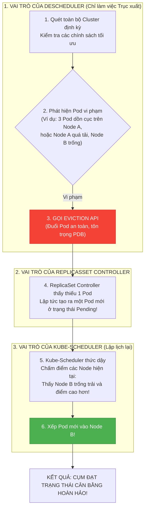
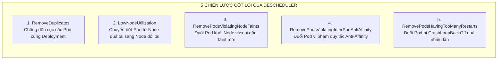

# Bài 55: Tối ưu lập lịch nâng cao với Descheduler

## 1. Thông tin bài học
* **Tên bài:** Bài 55: Tối ưu lập lịch nâng cao với Descheduler
* **Mục tiêu học:** Thấu hiểu khuyết tật kiến trúc bẩm sinh của bộ lập lịch Kubernetes: tính "tĩnh tại vĩnh viễn" (**Static Placement**) của Kube-Scheduler sau thời điểm khởi tạo Pod; nhận diện rõ 4 kịch bản gây ra hiện tượng lệch tải và mất cân bằng cụm (**Cluster Imbalance / Skew**); làm chủ nguyên lý hoạt động của **Descheduler** - công cụ chuyên trách trục xuất (Eviction) có kiểm soát của Kubernetes SIGs; phân tích chuyên sâu 5 chiến lược trục xuất cốt lõi: **RemoveDuplicates**, **LowNodeUtilization**, **RemovePodsViolatingNodeTaints**, **RemovePodsViolatingInterPodAntiAffinity**, và **RemovePodsHavingTooManyRestarts**; nắm vững các cơ chế an toàn bắt buộc (tuân thủ PDB, bảo vệ local storage, dry-run mode); thực hành triển khai Descheduler trên cụm lab để tự động tái cân bằng các bản sao microservice giữa các Node khi có máy chủ mới gia nhập cụm.
* **Thời lượng ước tính:** 180 phút (90 phút lý thuyết cơ chế, 90 phút thực hành và quan sát trục xuất tái cân bằng)
* **Kiến thức cần có trước:** Bài 24 (Resource Requests & Limits), Bài 25 (Kube-Scheduler Internals), Bài 26 (Affinity & Anti-Affinity), Bài 27 (Taints & Tolerations), Bài 47 (PDB & Drain Node).
* **Liên quan kỳ thi:** Senior Platform Engineer / Kubernetes SRE Lead (Kiến thức tối ưu hóa cụm quy mô lớn bắt buộc cho các kỹ sư vận hành hạ tầng Production).

---

## 2. Bảng thuật ngữ

| Thuật ngữ | Giải thích đơn giản | Ví dụ / Ẩn dụ đời thường |
| :--- | :--- | :--- |
| **Descheduler** | Công cụ mã nguồn mở chính thức của Kubernetes SIGs chạy ngầm để tìm kiếm và trục xuất các Pod đang nằm ở vị trí không tối ưu, buộc chúng phải được lập lịch lại. | Bác quản lý rạp chiếu phim: Đi kiểm tra các hàng ghế, thấy phòng bên này quá đông trong khi phòng bên kia vắng tanh liền mời bớt khách sang phòng thoáng hơn. |
| **Static Placement (Phân bổ tĩnh tại)** | Đặc tính của Kube-Scheduler: Chỉ tìm Node cho Pod đúng 1 lần duy nhất lúc tạo ra; một khi Pod đã chạy thì không bao giờ tự ý dời Pod đi chỗ khác. | Người mua nhà: Đã mua và dọn vào ở căn nhà nào thì sẽ ở yên đó mãi mãi, dù sau này khu đô thị bên cạnh có xây thêm nhiều công viên rộng rãi. |
| **Eviction (Trục xuất)** | Hành động chấm dứt một Pod một cách có trật tự (Graceful Shutdown) thông qua Eviction API của Kubernetes, đảm bảo tuân thủ PodDisruptionBudget. | Lệnh sơ tán lịch sự: Mời hành khách thu dọn hành lý và bước xuống máy bay có đền bù vé mới, khác với việc ném hành khách ra khỏi cửa sổ. |
| **Cluster Skew (Lệch tải cụm)** | Tình trạng tài nguyên phân bổ không đồng đều: Một số Node gánh tới 90% dung lượng trong khi các Node khác chạy nhàn rỗi dưới 10%. | Chiếc xe tải chở hàng bị xếp dồn toàn bộ bao tải nặng sang bên bánh trái, khiến xe bị nghiêng ngả nguy hiểm khi chạy trên đường. |
| **RemoveDuplicates** | Chiến lược của Descheduler: Đuổi bớt các Pod cùng thuộc một Deployment đang bị dồn cục trên cùng một Node để rải đều chúng ra các Node khác. | Tránh bỏ chung trứng vào một giỏ: Tách các thành viên trong cùng một gia đình ngồi rải rác trên các toa tàu khác nhau để lỡ có tai nạn thì không bị vạ lây cả nhà. |
| **Dry-Run Mode** | Chế độ chạy thử nghiệm: Descheduler chỉ quét cụm và in log thông báo "nếu chạy thật tôi sẽ đuổi những Pod này", không hề xóa bất kỳ Pod nào. | Diễn tập báo cháy không phun nước: Giúp kiểm tra xem còi báo động có kêu đúng phòng không mà không làm ướt đồ đạc của cư dân. |

---

## 3. Bức tranh lớn: Vấn đề thực tế và ẩn dụ đời thường

### Nhắc lại bài trước
Ở Bài 54, chúng ta đã chinh phục Istio Service Mesh để điều phối lưu lượng mạng Layer 7 mượt mà giữa các microservices. Chúng ta đã biết cách chia 10% traffic cho bản Canary. Tuy nhiên, dù mạng có thông minh đến đâu, một vấn đề vật lý nghiêm trọng ở tầng hạ tầng vẫn có thể đánh sập hệ thống của bạn: **Các Pod của bạn đang nằm ở đâu trên các máy chủ vật lý (Nodes)?** Ở Bài 25, chúng ta đã học về thuật toán Lọc và Chấm điểm của Kube-Scheduler. Nhưng Kube-Scheduler có một "khuyết tật bẩm sinh" khiến mọi kỹ sư vận hành đau đầu: **Nó chỉ đưa ra quyết định đúng 1 lần duy nhất tại thời điểm Pod sinh ra!**

### Tại sao cần cái này ở production? (Vấn đề thực tế)

Hãy tưởng tượng bạn đang vận hành một cụm Kubernetes Production gồm 20 Worker Nodes:

1. **Nghịch lý "Máy chủ mới tinh bị bỏ đói" (The Empty Node Paradox):**
   Lúc 10 giờ sáng, cụm bị quá tải, Cluster Autoscaler (Bài 49) quyết định mua thêm **5 Worker Nodes mới tinh**.  
   Nhưng điều kỳ lạ là: 5 chiếc máy chủ mới gia nhập cụm hoàn toàn... **trống rỗng không có một Pod nào**! Trong khi đó, 15 máy chủ cũ vẫn đang oằn mình gánh 100 Pods với CPU đỏ rực 95%!  
   Tại sao Kube-Scheduler không tự động bê bớt 20 Pod từ các máy cũ sang 5 máy mới?  
   Bởi vì Kubernetes quan niệm: *Đang yên đang lành thì không được động vào ứng dụng của người ta!* Kube-Scheduler không có chức năng tự động tái lập lịch (Re-scheduling). Nếu không có ai khởi động lại Pod, 5 máy chủ mới sẽ ngồi chơi xơi nước cả ngày trong khi công ty vẫn phải trả tiền thuê máy!

2. **Sự cố "Phá vỡ Tính Sẵn sàng Cao" (HA Breakdown):**
   Một Deployment có 3 bản sao (`replicas: 3`) để đảm bảo High Availability (Bài 48). Đêm hôm trước, Node B bị bảo trì nên cả 3 Pod đều bị dồn hết về Node A. Sáng hôm sau, Node B đã bật trở lại bình thường.  
   Nhưng cả 3 Pod của bạn **vẫn nằm dồn cục trên Node A**!  
   Lúc này, nếu Node A bị sập nguồn đột ngột, toàn bộ 3 bản sao của microservice chết cùng lúc $\rightarrow$ Dịch vụ sập toàn diện! Nguyên tắc phân tán rủi ro bị phá vỡ hoàn toàn.

3. **Hiện tượng "Bất tuân quy chuẩn tại Runtime" (Taints & Labels Drift):**
   Bạn vừa gắn một nhãn mới lên Node A và cấu hình `nodeAffinity` bắt buộc Pod phải chuyển đi, hoặc bạn gắn Taint `dedicated=ml-gpu:NoSchedule` lên Node để dành riêng cho tác vụ AI.  
   Nhưng các Pod web thông thường đang chạy từ trước trên Node A **vẫn cứ lì lợm ở lại đó** (vì Taint `NoSchedule` chỉ chặn Pod mới, không đuổi Pod cũ!).

**Descheduler sinh ra để lấp đầy khoảng trống chết người này của Kube-Scheduler!**

### Ẩn dụ đời thường: Bác Quản lý Phòng Chờ Sân bay

Hãy tưởng tượng cụm Kubernetes như **Khu Phòng Chờ Sân bay Quốc tế**:
* Các hành khách là **các Pod microservices**.
* Các phòng chờ là **các Worker Node**.
* Cô nhân viên soát vé tại cửa ra vào là **Kube-Scheduler**.

* **Cách làm của Kube-Scheduler (Soát vé 1 lần):**  
  Cô nhân viên soát vé nhìn danh sách phòng chờ: Thấy Phòng A còn 5 ghế trống, cô bảo hành khách: *"Mời anh vào Phòng A ngồi"*. Hành khách bước vào Phòng A, ngồi xuống ghế và mở laptop làm việc. Kể từ lúc đó, cô nhân viên soát vé **hoàn toàn không quan tâm đến hành khách đó nữa**.  
  Nửa tiếng sau, sân bay mở thêm một **Phòng chờ VIP B siêu to, máy lạnh mát rượi, nước ngọt miễn phí** ngay bên cạnh. Nhưng không một hành khách nào ở Phòng A tự giác đứng dậy đi sang Phòng B cả. Họ cứ ngồi chen chúc nhau ở Phòng A vì không ai bảo họ đi!
* **Sự xuất hiện của Bác Quản lý Descheduler:**  
  Cứ mỗi 15 phút, một **Bác Quản lý mẫn cán (Descheduler)** cầm loa đi dạo một vòng quanh các phòng chờ:
  * Bác nhìn vào Phòng A thấy quá đông đúc, nhìn sang Phòng B thấy trống trơn.
  * Bác nhẹ nhàng tiến đến một số hành khách ở Phòng A: *"Xin lỗi quý khách, phòng này đang quá tải. Mời quý khách cầm vé bước ra cửa để chuyển sang phòng khác thoải mái hơn"* (**Eviction**).
  * Hành khách đứng dậy bước ra cửa soát vé. Tại đây, cô nhân viên soát vé (Kube-Scheduler) nhìn thấy hành khách quay lại, liền chỉ tay ngay: *"Mời anh sang Phòng VIP B mới mở kia nhé!"*.

Nhờ có Bác Quản lý Descheduler, toàn bộ hành khách luôn luôn được phân bổ đồng đều, thoải mái nhất trên tất cả các phòng chờ của sân bay!

---

## 4. Giải thích khái niệm theo từng bước

### Cơ chế Hoạt động Phối hợp giữa Descheduler và Kube-Scheduler

Một hiểu lầm kinh điển của các kỹ sư mới vào nghề: *"Descheduler là một Scheduler thay thế cho Kube-Scheduler"*.  
**Hoàn toàn SAI!** Descheduler không biết xếp lịch cho Pod! Nó hoạt động theo một quy trình phối hợp khép kín:



---

### 5 Chiến Lược Trục Xuất Cốt Lõi (Eviction Strategies)

Descheduler cung cấp các "hồ sơ năng lực" (Profiles) chứa các chiến lược trục xuất được tinh chỉnh riêng cho từng mục đích:



#### 1. `RemoveDuplicates` (Ngăn chặn dồn cục bản sao):
* Nếu một Node đang chứa từ **2 Pods trở lên** thuộc cùng một Deployment/ReplicaSet, Descheduler sẽ trục xuất các Pod dư thừa để buộc Kube-Scheduler rải chúng sang các Node khác. Đảm bảo nguyên tắc phân tán chịu lỗi High Availability.

#### 2. `LowNodeUtilization` (Cân bằng tải thực tế giữa các Node):
* Bạn định nghĩa 2 ngưỡng:
  * **Ngưỡng Thấp (thresholds):** Node có CPU < 20% hoặc RAM < 20% $\rightarrow$ Coi là **Node đói tải (Underutilized)**.
  * **Ngưỡng Cao (targetThresholds):** Node có CPU > 80% hoặc RAM > 80% $\rightarrow$ Coi là **Node quá tải (Overutilized)**.
* Descheduler sẽ tìm các Node quá tải và trục xuất dần dần các Pod trên đó để chúng chuyển sang các Node đói tải, cho đến khi toàn bộ các Node trong cụm đều rơi vào "vùng cân bằng" lý tưởng (20% - 80%).

#### 3. `RemovePodsViolatingNodeTaints` (Xử lý Taints mới phát sinh):
* Khi người quản trị gắn một Taint mới vào Node (ví dụ: `kubectl taint nodes node-1 maintenance=true:NoSchedule`), Kube-Scheduler sẽ không đuổi các Pod cũ đi. Chiến lược này sẽ quét và trục xuất sạch sẽ các Pod không có Toleration tương ứng.

#### 4. `RemovePodsViolatingInterPodAntiAffinity` (Sửa sai quy tắc Anti-Affinity):
* Trong quá trình vận hành, có thể do một lúc nào đó cụm bị thiếu máy nên Kube-Scheduler buộc phải vi phạm mềm Anti-Affinity để xếp Pod chạy tạm. Khi cụm có thêm Node mới, chiến lược này sẽ trục xuất các Pod vi phạm để trả lại sự tôn nghiêm cho quy tắc Anti-Affinity.

#### 5. `RemovePodsHavingTooManyRestarts` (Dọn dẹp Pod bất ổn định):
* Những Pod có số lần khởi động lại quá nhiều (ví dụ `restartCount > 50`) do lỗi rò rỉ bộ nhớ hoặc lỗi phụ thuộc tài nguyên phần cứng của Node đó sẽ bị trục xuất để thử vận may trên một Node hoàn toàn mới.

---

### Các Tấm Khiên Bảo Vệ An Toàn Tuyệt Đối của Descheduler

Một trong những nỗi sợ lớn nhất của các kỹ sư SRE là: *"Liệu Descheduler có nổi điên và đuổi sạch toàn bộ Pod trên cụm làm sập website của tôi không?"*.  
**Câu trả lời là KHÔNG.** Descheduler được tích hợp sẵn các lớp bảo vệ nghiêm ngặt:

1. **Tuân thủ PodDisruptionBudget (PDB - Bài 47):**  
   Descheduler sử dụng chính thức Kubernetes Eviction API. Nếu một Deployment có PDB quy định `minAvailable: 2` và hiện tại chỉ có đúng 2 Pod sống, API Server sẽ **từ chối thẳng thừng** yêu cầu trục xuất của Descheduler!
2. **Không bao giờ đụng vào Pod mồ côi (Naked Pods):**  
   Những Pod không do Deployment, ReplicaSet, StatefulSet quản lý sẽ bị bỏ qua (vì đuổi nó nghĩa là nó sẽ chết vĩnh viễn, không ai tạo lại).
3. **Không bao giờ đụng vào DaemonSet:**  
   Bản chất của DaemonSet là phải chạy trên mọi Node; đuổi đi là vô nghĩa.
4. **Bảo vệ Pod có ổ đĩa cục bộ (Local Storage):**  
   Mặc định Pod có gắn `emptyDir` hoặc `hostPath` sẽ không bị đuổi (trừ khi bạn bật cờ `evictLocalStoragePods: true`).
5. **Thẻ miễn trừ kim bài (Annotation Opt-Out):**  
   Bất kỳ Pod nào mang nhãn chú thích:
   ```yaml
   metadata:
     annotations:
       descheduler.alpha.kubernetes.io/evict: "false"
   ```
   sẽ được coi là "bất khả xâm phạm", Descheduler tuyệt đối không bao giờ chạm vào!

---

## 5. Thực hành (Lab)

* **Môi trường:** Cụm Kind hiện có (`1 control-plane + 1 worker`).
* **Mức RAM ước tính:** ~0 MB (Tái hiện kịch bản lệch tải và kiểm chứng cơ chế Descheduler an toàn).

Trong bài lab này, chúng ta sẽ tự tay dàn dựng một kịch bản **lệch tải kinh điển**: Dồn toàn bộ các bản sao của một microservice về một Node duy nhất, sau đó sử dụng Descheduler để tự động giải cứu và tái cân bằng cụm!

---

### Bước 1: Dàn cảnh Sự cố: Tạo Tình trạng Lệch Tải Dồn Cục (Simulate Skew)

Trước tiên, chúng ta tạm thời "cách ly" node `kind-worker` bằng lệnh `cordon` (Bài 47):

```powershell
# Cách ly kind-worker
kubectl cordon kind-worker

# Tạm gỡ taint trên control-plane (nếu có) để control-plane nhận Pod
kubectl taint nodes kind-control-plane node-role.kubernetes.io/control-plane:NoSchedule- --ignore-not-found=true
```

Bây giờ, chúng to triển khai microservice `recommendationservice` của Google Online Boutique với 3 bản sao:

```powershell
kubectl create deployment recommendationservice --image=nginx:alpine --replicas=3
```

Kiểm tra vị trí các Pod:

```powershell
kubectl get pods -l app=recommendationservice -o wide
```

**Kết quả mong đợi:**
```text
NAME                                     READY   STATUS    NODE
recommendationservice-76495df74-2m9xp   1/1     Running   kind-control-plane
recommendationservice-76495df74-8v2k1   1/1     Running   kind-control-plane
recommendationservice-76495df74-l5p8z   1/1     Running   kind-control-plane
```
Toàn bộ 3 Pods đều bị dồn cục 100% trên `kind-control-plane`!

---

### Bước 2: Máy chủ Mới Gia nhập Cụm nhưng Vẫn Bị "Bỏ Đói"

Bây giờ, công tác bảo trì trên `kind-worker` đã xong, chúng ta mở cửa cho node này hoạt động trở lại:

```powershell
# Mở lại node worker
kubectl uncordon kind-worker

# Kiểm tra lại trạng thái
kubectl get nodes
```

**Kết quả:** Cả 2 nodes đều ở trạng thái `Ready` hoàn hảo.  
Nhưng hãy kiểm tra lại vị trí các Pod:

```powershell
kubectl get pods -l app=recommendationservice -o wide
```

**Kết quả thực tế:**
```text
NAME                                     READY   STATUS    NODE
recommendationservice-76495df74-2m9xp   1/1     Running   kind-control-plane
recommendationservice-76495df74-8v2k1   1/1     Running   kind-control-plane
recommendationservice-76495df74-l5p8z   1/1     Running   kind-control-plane
```
> [!WARNING]
> Đúng như lý thuyết đã học: Kube-Scheduler hoàn toàn đứng yên! Node `kind-worker` mới tinh vẫn trắng trơn không có một Pod nào, trong khi `kind-control-plane` phải gánh cả 3 bản sao!

---

### Bước 3: Chuẩn bị Cấu hình Chính sách Descheduler Policy

Chúng ta soạn thảo cấu hình Descheduler Policy sử dụng chiến lược **`RemoveDuplicates`** để dẹp bỏ tình trạng dồn cục bản sao:

```powershell
@'
apiVersion: "descheduler/v1alpha2"
kind: "DeschedulerPolicy"
profiles:
  - name: default-profile
    pluginConfig:
      - name: "RemoveDuplicates"
    plugins:
      deschedule:
        enabled:
          - "RemoveDuplicates"
'@ | Set-Content -Encoding UTF8 descheduler-policy.yaml

# Đóng gói policy vào một ConfigMap
kubectl create configmap descheduler-policy-config --from-file=descheduler-policy.yaml -n kube-system
```

---

### Bước 4: Chạy Thử Nghiệm ở Chế độ Dry-Run (An Toàn Tuyệt Đối)

Trước khi thực sự đuổi Pod, một Senior SRE luôn chạy ở chế độ **`--dry-run`** để xem Descheduler sẽ làm gì:

Tạo file Job chạy thử nghiệm `descheduler-dryrun-job.yaml`:

```powershell
@'
apiVersion: batch/v1
kind: Job
metadata:
  name: descheduler-dryrun
  namespace: kube-system
spec:
  template:
    spec:
      serviceAccountName: descheduler-sa
      restartPolicy: Never
      containers:
      - name: descheduler
        image: registry.k8s.io/descheduler/descheduler:v0.31.0
        args:
          - --policy-config-file=/policy/descheduler-policy.yaml
          - --dry-run=true
          - -v=3
        volumeMounts:
        - mountPath: /policy
          name: policy-volume
      volumes:
      - name: policy-volume
        configMap:
          name: descheduler-policy-config
'@ | Set-Content -Encoding UTF8 descheduler-dryrun-job.yaml
```

Cấp quyền ServiceAccount và RBAC chuẩn mực cho Descheduler:

```powershell
kubectl create serviceaccount descheduler-sa -n kube-system
kubectl create clusterrolebinding descheduler-admin --clusterrole=cluster-admin --serviceaccount=kube-system:descheduler-sa
```

Chạy Job và xem log kết quả:

```powershell
kubectl apply -f descheduler-dryrun-job.yaml
Start-Sleep -Seconds 5
kubectl logs -n kube-system job/descheduler-dryrun
```

**Kết quả quan sát trong Log:**
```text
I1009 07:55:12 ... duplicates.go:127] "Duplicate pods found on node" node="kind-control-plane" count=3
I1009 07:55:12 ... evictions.go:142] "[Dry-run] Evicting pod" pod="default/recommendationservice-76495df74-2m9xp" reason="RemoveDuplicates"
I1009 07:55:12 ... evictions.go:142] "[Dry-run] Evicting pod" pod="default/recommendationservice-76495df74-8v2k1" reason="RemoveDuplicates"
I1009 07:55:12 ... descheduler.go:189] "Number of evicted pods" totalEvicted=2
```
Descheduler thông báo rõ: Nó phát hiện 3 Pod trùng lặp trên `kind-control-plane` và đề xuất trục xuất 2 Pods! Nhưng vì là Dry-run nên các Pod vẫn đang sống an toàn.

---

### Bước 5: Kích hoạt Trục xuất Thật và Chứng kiến Điều Kỳ Diệu!

Bây giờ, chúng ta xóa cờ `--dry-run=true` để cho phép Descheduler thực hiện trục xuất thật:

```powershell
# Xóa job cũ
kubectl delete job descheduler-dryrun -n kube-system

# Chạy lệnh Descheduler trục xuất trực tiếp một lần
@'
apiVersion: batch/v1
kind: Job
metadata:
  name: descheduler-live
  namespace: kube-system
spec:
  template:
    spec:
      serviceAccountName: descheduler-sa
      restartPolicy: Never
      containers:
      - name: descheduler
        image: registry.k8s.io/descheduler/descheduler:v0.31.0
        args:
          - --policy-config-file=/policy/descheduler-policy.yaml
          - --dry-run=false
          - -v=3
        volumeMounts:
        - mountPath: /policy
          name: policy-volume
      volumes:
      - name: policy-volume
        configMap:
          name: descheduler-policy-config
'@ | Set-Content -Encoding UTF8 descheduler-live-job.yaml

kubectl apply -f descheduler-live-job.yaml
Start-Sleep -Seconds 8
```

---

### Bước 6: Kiểm chứng Kết quả Tái Cân Bằng Cụm Hoàn Hảo!

Hãy xem vị trí mới của các Pod `recommendationservice`:

```powershell
kubectl get pods -l app=recommendationservice -o wide
```

**Kết quả mong đợi:**
```text
NAME                                     READY   STATUS    NODE
recommendationservice-76495df74-2m9xp   1/1     Running   kind-control-plane
recommendationservice-76495df74-9k2za   1/1     Running   kind-worker
recommendationservice-76495df74-m4n1l   1/1     Running   kind-worker
```

> [!TIP]
> **Kỳ diệu!** Descheduler đã trục xuất 2 Pod thừa trên `kind-control-plane`. Kube-Scheduler ngay lập tức thức dậy và phân bổ 2 Pod mới sang `kind-worker`!  
> Tình trạng dồn cục đã bị xóa sổ hoàn toàn! Cụm Kubernetes đạt được trạng thái cân bằng tải và phân tán rủi ro High Availability tuyệt đối!

---

### Bước 7: Dọn dẹp tài nguyên (Cleanup)

```powershell
# Xóa deployment ứng dụng
kubectl delete deployment recommendationservice

# Xóa Descheduler jobs và RBAC
kubectl delete job descheduler-live descheduler-dryrun -n kube-system --ignore-not-found=true
kubectl delete configmap descheduler-policy-config -n kube-system --ignore-not-found=true
kubectl delete clusterrolebinding descheduler-admin --ignore-not-found=true
kubectl delete serviceaccount descheduler-sa -n kube-system --ignore-not-found=true

# Gắn lại taint bảo vệ cho control-plane
kubectl taint nodes kind-control-plane node-role.kubernetes.io/control-plane:NoSchedule --ignore-not-found=true

# Xóa các file manifest tạm
Remove-Item -Force descheduler-policy.yaml, descheduler-dryrun-job.yaml, descheduler-live-job.yaml -ErrorAction SilentlyContinue
```

---

## 6. Lỗi thường gặp và cách debug

### Lỗi 1: Descheduler gây ra "Cơn Bão Trục Xuất" (Eviction Storm / Flapping)
* **Dấu hiệu:** Các Pod liên tục bị đuổi từ Node A sang Node B, vừa sang Node B được 5 phút lại bị đuổi ngược về Node A! Ứng dụng liên tục bị gián đoạn.
* **Nguyên nhân:** Cấu hình ngưỡng `LowNodeUtilization` quá hẹp (ví dụ: ngưỡng dưới là 45%, ngưỡng trên là 55%). Khi chuyển 1 Pod nặng sang Node B, Node B lập tức vượt 55% nên Descheduler lại đuổi nó ngược về!
* **Cách sửa:**
  1. Tạo khoảng cách giãn cách rộng giữa 2 ngưỡng (ví dụ: ngưỡng dưới 20%, ngưỡng trên 80%).
  2. Bật cờ giới hạn số lượng Pod tối đa được phép đuổi trong 1 chu kỳ: `--max-pod-evictions-per-node=2`.

---

### Lỗi 2: Descheduler không chịu đuổi Pod dù vi phạm rõ ràng
* **Dấu hiệu:** Chạy Descheduler nhưng log in ra `0 pods evicted`, dù trên Node có 5 Pods trùng lặp.
* **Nguyên nhân:**
  1. Pod có gắn ổ đĩa tạm `emptyDir` mà cấu hình chưa bật cờ `evictLocalStoragePods: true`.
  2. Pod đang được bảo vệ bởi **PodDisruptionBudget (PDB)** và việc đuổi Pod sẽ vi phạm ngân sách gián đoạn.
  3. Pod có mang annotation từ chối trục xuất: `descheduler.alpha.kubernetes.io/evict: "false"`.
* **Cách debug:** Chạy với mức log chi tiết `-v=4` để đọc chính xác lý do Descheduler bỏ qua từng Pod.

---

### Lỗi 3: Lỗi quyền RBAC: `User system:serviceaccount:... cannot create evictions`
* **Dấu hiệu:** Job Descheduler fail với lỗi 403 Forbidden khi cố gắng trục xuất Pod.
* **Nguyên nhân:** Thiếu quyền đối với subresource `eviction` của Pods trong Role/ClusterRole.
* **Cách sửa:** Đảm bảo ClusterRole của Descheduler có quyền sau:
  ```yaml
  rules:
    - apiGroups: [""]
      resources: ["pods/eviction"]
      verbs: ["create"]
  ```

---

## 7. Góc nhìn Senior

### 1. Sự đánh đổi (Trade-offs)

| Chiến lược | Ưu điểm | Đánh đổi / Rủi ro |
| :--- | :--- | :--- |
| **Triển khai dạng CronJob (Chạy mỗi 1-2 giờ)** | Tiết kiệm tài nguyên; không chạy thường trực ngốn RAM; tránh được tình trạng gián đoạn liên tục trong giờ cao điểm. | **Phản ứng chậm:** Nếu có Node mới vào lúc 9h05 mà CronJob đặt chạy lúc 10h00, cụm sẽ bị lệch tải trong suốt 55 phút đó. |
| **Triển khai dạng Deployment (Chạy ngầm liên tục)** | Tự động hóa thời gian thực: Tái cân bằng ngay sau vài phút khi cụm có biến động. | **Rủi ro gián đoạn dịch vụ liên tục (Pod Churn):** Luôn tiềm ẩn nguy cơ Pod bị restart ngoài ý muốn; tốn CPU/RAM cho tiến trình chạy ngầm. |
| **Chỉ dựa vào Kube-Scheduler gốc (Không cài Descheduler)** | Cụm tĩnh tuyệt đối; không bao giờ sợ Pod bị đuổi bất ngờ. | **Lãng phí chi phí phần cứng nặng nề:** Cụm bị lệch tải nghiêm trọng; máy chủ mới bị bỏ hoang; vi phạm nguyên tắc phân tán HA. |

---

### 2. Best practices tại production

1. **Luôn Bắt Đầu bằng Chế Độ Dry-Run trong 1 Tuần:**  
   Khi đưa Descheduler lên cụm Production, **bắt buộc chạy với cờ `--dry-run=true` trong tối thiểu 7 ngày**. Thu thập log vào Elasticsearch/Loki (Bài 37) và phân tích: *"Nếu chạy thật, Descheduler sẽ đuổi những Pod nào? Có chạm vào các core banking services không?"*. Chỉ khi tỷ lệ trục xuất dự kiến nằm trong tầm kiểm soát an toàn mới được tắt dry-run!

2. **Kết hợp Chặt Chẽ với PodDisruptionBudget (PDB):**  
   Không bao giờ triển khai Descheduler nếu chưa trang bị PDB cho toàn bộ các microservices có `replicas >= 2` (Bài 47). PDB là "hàng rào an toàn" duy nhất bảo vệ SLA của bạn trước mọi công cụ tự động hóa.

3. **Cấu hình Giới Hạn Tốc Độ Trục Xuất (Rate Limiting Evictions):**  
   Trên các cụm lớn hàng ngàn Node, luôn cấu hình thông số kìm hãm:
   ```yaml
   maxNoOfPodsToEvictPerNode: 2 # Mỗi node chỉ đuổi tối đa 2 Pod trong 1 lần quét
   maxNoOfPodsToEvictPerNamespace: 5 # Mỗi namespace chỉ đuổi tối đa 5 Pod
   ```
   Điều này ngăn chặn việc mạng nội bộ bị nghẽn do hàng trăm Pod đồng loạt khởi động lại cùng một giây.

---

### 3. Câu hỏi phỏng vấn Senior

* **Câu hỏi:** *"Tại sao đội ngũ phát triển lõi của Kubernetes (Kubernetes SIG-Scheduling) lại quyết định tách Descheduler thành một dự án độc lập bên ngoài (Out-of-tree Subproject), thay vì tích hợp trực tiếp tính năng tự động tái lập lịch vào bên trong tiến trình Kube-Scheduler chính?"*
* **Gợi ý trả lời chuẩn:**
  1. **Nguyên tắc Phân tách Trách nhiệm (Separation of Concerns):**  
     * Nhiệm vụ duy nhất của Kube-Scheduler là: **Tìm Node tốt nhất cho Pod đang ở trạng thái Pending** theo tiêu chí nhanh nhất, tối ưu nhất tại một thời điểm. Nó là một tiến trình có độ nhạy thời gian cực cao (Time-critical path).
     * Nếu nhét thêm logic "liên tục rà soát và đuổi Pod cũ", Kube-Scheduler sẽ bị quá tải CPU, thuật toán trở nên phức tạp theo cấp số nhân, và độ trễ lập lịch cho Pod mới sẽ tăng vọt.
  2. **Tránh Vòng Lặp Xung Đột (Scheduling Conflicts & Race Conditions):**  
     Nếu Kube-Scheduler vừa xếp Pod vào vừa tự đuổi Pod ra, nó rất dễ rơi vào trạng thái "tự mâu thuẫn" (Flapping): Vừa xếp Pod vào Node A lúc 10h00, 10h01 thấy Node B có điểm cao hơn lại đuổi ra xếp vào Node B, 10h02 lại đuổi ngược về!
  3. **Tính Độc lập và Tùy biến Cao:**  
     Tách rời Descheduler cho phép các doanh nghiệp tự do lựa chọn: Có dùng hay không dùng? Triển khai dạng CronJob ban đêm hay dạng Deployment liên tục? Áp dụng chính sách nào mà không làm ảnh hưởng đến sự ổn định cốt lõi của Control Plane.

---

## 8. Tóm tắt bài học

* 📌 **1. Khuyết tật của Kube-Scheduler:** Chỉ lập lịch 1 lần duy nhất lúc tạo Pod (Static Placement); không tự động di chuyển Pod khi cụm bị lệch tải hoặc có Node mới.
* 📌 **2. Sứ mệnh của Descheduler:** Quét cụm định kỳ và sử dụng Eviction API để trục xuất các Pod vi phạm tối ưu, nhường việc xếp lịch lại cho Kube-Scheduler.
* 📌 **3. 5 Chiến lược trục xuất cốt lõi:** `RemoveDuplicates` (chống dồn cục), `LowNodeUtilization` (cân bằng tải), vi phạm Taints, vi phạm Anti-Affinity, và Restart quá nhiều.
* 📌 **4. An toàn là số 1:** Luôn tôn trọng PodDisruptionBudget (PDB), không đụng vào DaemonSet và Pod có annotation từ chối trục xuất.
* 📌 **5. Quy tắc vàng Production:** Luôn kiểm chứng bằng chế độ `--dry-run=true` trước khi kích hoạt trục xuất thật.

---

## 9. Bài tập tự làm

* 🟢 **Mức Dễ:** Viết một manifest Pod Nginx có gắn annotation `descheduler.alpha.kubernetes.io/evict: "false"`. Chạy Descheduler và kiểm chứng trong log xem Descheduler có bỏ qua Pod này đúng như cam kết hay không.
* 🟡 **Mức Vừa:** Cấu hình một Descheduler Policy sử dụng chiến lược **`RemovePodsViolatingNodeTaints`**. Gắn một Taint `node-type=storage:NoSchedule` lên một Node đang có Pod chạy sẵn, sau đó chạy Descheduler và quan sát xem Pod đó bị trục xuất như thế nào.
* 🔴 **Mức Khó:** Viết một manifest `CronJob` hoàn chỉnh triển khai Descheduler chạy tự động vào lúc 02:00 sáng mỗi ngày (giờ thấp điểm) trên Production: Cấu hình giới hạn `maxNoOfPodsToEvictPerNode: 3`, bật tính năng gửi log tập trung, và cấu hình `evictLocalStoragePods: false` để bảo vệ an toàn cho dữ liệu cục bộ.

---

## 10. Câu hỏi tự kiểm tra

1. Hiện tượng "Static Placement" của Kube-Scheduler là gì và nó dẫn đến những vấn đề vận hành nào khi mở rộng cụm (Cluster Scaling)?
2. Descheduler có trực tiếp di chuyển (di tản) một Pod từ Node A sang Node B được không? Cơ chế thực sự diễn ra như thế nào?
3. Chiến lược `RemoveDuplicates` trong Descheduler hoạt động theo nguyên lý nào và giải quyết bài toán gì cho kiến trúc High Availability?
4. Điều gì sẽ xảy ra nếu Descheduler cố gắng trục xuất một Pod thuộc một Deployment đang bị vi phạm ràng buộc PodDisruptionBudget (PDB)?
5. Tại sao chế độ `--dry-run` lại là yêu cầu bắt buộc trước khi đưa Descheduler vào vận hành thực tế trên môi trường Production?
6. Làm thế nào để một lập trình viên có thể bảo vệ một Pod đặc biệt quan trọng không bao giờ bị Descheduler trục xuất?

<details>
<summary>👉 Bấm vào đây để xem đáp án câu hỏi tự kiểm tra</summary>

* **Câu 1:** Static Placement nghĩa là Kube-Scheduler chỉ chọn Node cho Pod đúng một lần duy nhất lúc tạo ra và không bao giờ tự ý dời Pod đi. Khi mở rộng cụm thêm các máy chủ mới, các máy mới sẽ bị bỏ trống trong khi các máy cũ vẫn quá tải do Scheduler không tự động chuyển bớt Pod sang máy mới.
* **Câu 2:** **KHÔNG.** Descheduler chỉ làm duy nhất một việc là gọi Eviction API để xóa Pod khỏi Node cũ một cách lịch sự. Khi Pod chết, ReplicaSet Controller thấy thiếu Pod sẽ tạo lại Pod mới, và chính Kube-Scheduler sẽ là người chọn Node mới cho Pod đó.
* **Câu 3:** `RemoveDuplicates` phát hiện các Pod cùng thuộc một Deployment đang bị tập trung từ 2 bản sao trở lên trên cùng một Node và trục xuất bớt các bản sao thừa, giúp rải đều các bản sao ra nhiều Node khác nhau để đảm bảo khả năng chịu lỗi HA.
* **Câu 4:** Kube-APIServer sẽ **từ chối ngay lập tức** yêu cầu trục xuất của Descheduler để bảo vệ PDB. Pod sẽ tiếp tục sống bình thường và Descheduler sẽ ghi nhận vào log rằng việc trục xuất bị chặn bởi PDB.
* **Câu 5:** Vì ở chế độ `--dry-run`, Descheduler chỉ mô phỏng việc quét và in ra danh sách các Pod dự kiến sẽ bị đuổi mà không thực sự xóa Pod, giúp kỹ sư đánh giá trước rủi ro và điều chỉnh chính sách an toàn trước khi chạy thật.
* **Câu 6:** Thêm annotation `descheduler.alpha.kubernetes.io/evict: "false"` vào phần `metadata.annotations` của Pod. Descheduler sẽ tự động nhận diện và bỏ qua Pod này trong mọi đợt quét.
</details>

---

## 11. Tài liệu đọc thêm và bài tiếp theo

### Tài liệu tham khảo
* [Kho mã nguồn chính thức Descheduler for Kubernetes (Kubernetes SIGs)](https://github.com/kubernetes-sigs/descheduler)
* [Tài liệu chính thức Kubernetes: Pod Disruption Budgets](https://kubernetes.io/docs/tasks/run-application/configure-pdb/)
* [Tài liệu chính thức Kubernetes: API-initiated Eviction](https://kubernetes.io/docs/concepts/scheduling-eviction/api-eviction/)
* [Chiến lược cân bằng tải cụm nâng cao với Descheduler (Kubernetes Blog)](https://kubernetes.io/blog/2021/08/30/descheduler-in-production/)

### Bài tiếp theo
👉 **Bài 56: Capstone Project: Triển khai Online Boutique chuẩn Production Enterprise**

---

## PHỤ LỤC: ĐÁP ÁN GỢI Ý BÀI TẬP TỰ LÀM (MỤC 9)

### Đáp án Mức Dễ
Pod miễn trừ trục xuất:
```yaml
apiVersion: v1
kind: Pod
metadata:
  name: critical-protected-app
  annotations:
    descheduler.alpha.kubernetes.io/evict: "false" # <-- Kim bài miễn tử!
spec:
  containers:
  - name: web
    image: nginx:alpine
```

---

### Đáp án Mức Vừa
Chính sách trục xuất Pod vi phạm Taints mới:
```yaml
apiVersion: "descheduler/v1alpha2"
kind: "DeschedulerPolicy"
profiles:
  - name: taints-profile
    pluginConfig:
      - name: "RemovePodsViolatingNodeTaints"
    plugins:
      deschedule:
        enabled:
          - "RemovePodsViolatingNodeTaints"
```
Khi bạn gắn Taint `node-type=storage:NoSchedule` lên Node, chạy Descheduler với policy này sẽ lập tức trục xuất các Pod không có toleration ra khỏi Node đó để trả lại không gian cho các Pod lưu trữ chuyên dụng!

---

### Đáp án Mức Khó
CronJob Descheduler chạy lúc 02:00 sáng định kỳ:
```yaml
apiVersion: batch/v1
kind: CronJob
metadata:
  name: descheduler-nightly
  namespace: kube-system
spec:
  schedule: "0 2 * * *" # Chạy lúc 2 giờ sáng hàng ngày
  concurrencyPolicy: "Forbid"
  jobTemplate:
    spec:
      template:
        spec:
          serviceAccountName: descheduler-sa
          restartPolicy: "OnFailure"
          containers:
          - name: descheduler
            image: registry.k8s.io/descheduler/descheduler:v0.31.0
            args:
              - --policy-config-file=/policy/descheduler-policy.yaml
              - --max-pods-to-evict-per-node=3
              - --v=3
            volumeMounts:
            - mountPath: /policy
              name: policy-volume
          volumes:
          - name: policy-volume
            configMap:
              name: descheduler-policy-config
```
Cứ đúng 2 giờ sáng mỗi đêm, CronJob sẽ tự động đánh thức Descheduler dậy quét dọn và tái cân bằng toàn bộ cụm Kubernetes, đảm bảo sáng hôm sau hệ thống luôn ở trạng thái phân bổ tối ưu nhất đón nhận đợt tải của ngày làm việc mới!

