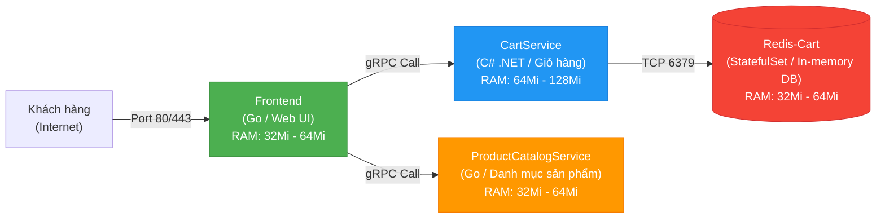

# Bài 56: Capstone Project: Triển khai Online Boutique chuẩn Production Enterprise

## 1. Thông tin bài học
* **Tên bài:** Bài 56: Capstone Project: Triển khai Online Boutique chuẩn Production Enterprise
* **Mục tiêu học:** Đồ án tốt nghiệp tổng hợp toàn diện: Vận dụng toàn bộ tri thức và kỹ năng từ 55 bài học trước để thiết kế, triển khai, bảo mật và vận hành hệ thống thương mại điện tử microservices **Google Online Boutique** đạt chuẩn **Production Enterprise Readiness**; tích hợp 7 trụ cột công nghệ cốt lõi: Đóng gói đa môi trường (Kustomize), Tự động hóa GitOps (ArgoCD), Bảo mật phòng thủ chiều sâu (Zero-Trust NetworkPolicy, SecurityContext không chạy root, PSS Restricted, Kyverno Governance), Độ tin cậy và tự co giãn (Healthcheck Probes, PodDisruptionBudget, HPA), Quan sát hệ thống (Structured Logging, Prometheus Metrics, 4 Golden Signals), Sao lưu thảm họa (etcd Disaster Recovery) và Kiểm thử hỗn loạn (Chaos Resilience Test); vận hành trơn tru toàn bộ đồ án trên máy lab 8GB RAM mà không làm quá tải hệ thống.
* **Thời lượng ước tính:** 360 phút (120 phút tổng duyệt kiến trúc, 180 phút thực hành lắp ráp đồ án, 60 phút kiểm thử hỗn loạn)
* **Kiến thức cần có trước:** Toàn bộ Giai đoạn 1 đến Giai đoạn 9 (Bài 01 đến Bài 55).
* **Liên quan kỳ thi:** **Tổng hợp CKA + CKAD + CKS + Senior Platform / SRE Interview** (Dự án thực tế kinh điển trong CV ứng tuyển các vị trí Senior DevOps / Platform Engineer tại các tập đoàn công nghệ lớn).

---

## 2. Bảng thuật ngữ

| Thuật ngữ | Giải thích đơn giản | Ví dụ / Ẩn dụ đời thường |
| :--- | :--- | :--- |
| **Capstone Project** | Đồ án tổng kết cuối khóa: Nơi học viên tự tay lắp ráp toàn bộ các mảnh ghép kiến thức rời rạc thành một sản phẩm hoàn chỉnh chạy thật. | Chuyến bay thử nghiệm đầu tiên của một phi công sau hàng trăm giờ học lý thuyết và mô phỏng buồng lái. |
| **Production Readiness** | Bộ tiêu chuẩn khắt khe đánh giá một phần mềm đã đủ độ tin cậy, bảo mật và sẵn sàng để phục vụ khách hàng thật với tiền thật hay chưa. | Giấy chứng nhận xuất xưởng của chiếc ô tô thương mại: Phải qua thử nghiệm đâm va, kiểm tra phanh, túi khí và khí thải. |
| **Defense-in-Depth (Phòng thủ chiều sâu)** | Chiến lược an ninh bảo mật nhiều lớp: Nếu một chốt chặn phòng thủ bị chọc thủng, vẫn còn các chốt chặn khác giữ vững pháo đài. | Lâu đài thời trung cổ: Có hào nước bao quanh, qua cầu rút có cổng sắt, qua cổng sắt có tường thành đá dày, bên trong có hầm trú ẩn. |
| **Chaos Engineering** | Kỷ luật chủ động gây ra các sự cố giả lập trong môi trường có kiểm soát (như tắt ngang Pod, cắt đứt mạng, làm đầy RAM) để chứng minh hệ thống có khả năng tự phục hồi. | Tập trận báo cháy bất ngờ: Đốt một ngọn lửa nhỏ có kiểm soát để kiểm tra xem vòi phun nước và cửa thoát hiểm có hoạt động đúng thiết kế không. |
| **The Core Four Flow** | Luồng nghiệp vụ tối giản nhưng sống còn của Online Boutique: Frontend $\rightarrow$ CartService $\rightarrow$ Redis $\rightarrow$ ProductCatalogService. | Trục xương sống của siêu thị: Cửa ra vào $\rightarrow$ Giỏ hàng $\rightarrow$ Quầy thanh toán $\rightarrow$ Kệ hàng hóa. |

---

## 3. Bức tranh lớn: Vấn đề thực tế và ẩn dụ đời thường

### Nhắc lại bài trước
Ở Bài 55, chúng ta đã chinh phục Descheduler để tối ưu hóa việc phân bổ Pod trên các Node sau thời điểm khởi tạo, hoàn tất Giai đoạn 9 về Kiến trúc chuyên sâu nội hàm Kubernetes. Trải qua 55 bài học, chúng ta đã đi một hành trình phi thường: Từ hạt nhân Linux cgroups/namespaces sơ khai (Bài 01), làm chủ các khối gạch nền móng Pod/Deployment/Service (GĐ 2), cấu hình lưu trữ PV/PVC/StatefulSet (GĐ 3), mạng phẳng CNI và Ingress (GĐ 4), thuật toán lập lịch và tự động co giãn HPA/VPA (GĐ 5), pháo đài bảo mật RBAC/PSS/External Secrets (GĐ 6), quan sát hệ thống Prometheus/Alertmanager/Troubleshooting 5 tầng (GĐ 7), vận hành chuẩn production Helm/Kustomize/GitOps/etcd backup/HA/FinOps (GĐ 8), cho đến nội hàm APIServer, Kyverno, CRD, Operator và Service Mesh (GĐ 9). Hôm nay, chúng ta đứng trước vạch đích cuối cùng: **Hợp nhất toàn bộ 55 vũ khí đó vào Dự án Cuối khóa (Capstone Project)!**

### Tại sao cần cái này ở production? (Vấn đề thực tế)

Trong các buổi phỏng vấn tuyển dụng vị trí Senior Platform Engineer hoặc Principal SRE:
* Nhà tuyển dụng không bao giờ hỏi: *"Lệnh `kubectl create deployment` gõ thế nào?"*.
* Họ sẽ đặt ra một bài toán tổng thể: *"Công ty chúng tôi sắp ra mắt một ứng dụng thương mại điện tử với hàng chục microservices. Bạn hãy thiết kế và triển khai một nền tảng Kubernetes từ đầu đáp ứng đầy đủ: Bảo mật Zero-Trust, tự co giãn khi có Flash Sale, tự hồi phục khi máy chủ chết, có giám sát cảnh báo SLA, và chi phí đám mây tối ưu. Bạn sẽ làm như thế nào?"*

Nếu bạn chỉ biết từng công cụ rời rạc, bạn sẽ lúng túng. Nhưng khi bạn đã tự tay tích hợp toàn bộ hệ thống trong Đồ án Capstone này, bạn sẽ tự tin đứng trước bất kỳ Giám đốc Công nghệ (CTO) nào để trình bày một bản thiết kế kiến trúc hoàn chỉnh cấp Enterprise!

### Ẩn dụ đời thường: Dàn Nhạc Giao hưởng Quốc gia

Hãy tưởng tượng 55 bài học vừa qua là **55 nhạc cụ và nghệ sĩ tài ba**:
* Cây đàn Violin réo rắt là **Mạng phẳng CNI và Ingress** đưa đón dòng lưu lượng.
* Tiếng kèn Trumpet vang dội là **Prometheus và Alertmanager** cất tiếng cảnh báo nguy nan.
* Chiếc trống định âm giữ nhịp vững chắc là **etcd và Raft Quorum** bảo vệ ký ức bất biến.
* Chiếc khiên hộ pháp của người nghệ sĩ là **SecurityContext, NetworkPolicy và Kyverno**.
* Cánh tay điều hòa nhịp điệu của nhạc trưởng là **Kube-Scheduler, HPA và Descheduler**.

Nếu các nhạc cụ chơi riêng rẽ, mỗi người chỉ tạo ra những âm thanh đơn độc trong phòng tập. Nhưng trong buổi hòa nhạc Gala tốt nghiệp tối nay, toàn bộ 55 nhạc cụ cùng hòa tấu dưới sự chỉ huy của bạn: **Một bản giao hưởng hoàn mỹ mang tên Online Boutique Production Enterprise vang lên hùng tráng!**

---

## 4. Giải thích khái niệm theo từng bước

### Bản Vẽ Kiến Trúc Toàn Diện 7 Trụ Cột (The Enterprise Blueprint)

Một hệ thống Production chuẩn Enterprise không bao giờ chỉ là "nộp vài file YAML". Nó được nâng đỡ bởi 7 trụ cột kiến trúc vững chãi:

```mermaid
flowchart TD
    subgraph PILLAR_1 ["1. ĐÓNG GÓI & CẤU HÌNH (Packaging)"]
        P1["Kustomize Overlays: base/ vs overlays/prod\nconfigMapGenerator tự kích hoạt Rolling Update (Bài 44)"]
    end

    subgraph PILLAR_2 ["2. GITOPS AUTOMATION (Phát hành)"]
        P2["ArgoCD Application: Single Source of Truth\nAutomated Sync, Prune: true, Self-Heal: true (Bài 45)"]
    end

    subgraph PILLAR_3 ["3. MẠNG & ZERO-TRUST (Network & Security)"]
        P3["NetworkPolicy: Default Deny All + Whitelist Egress (Bài 22)\nIngress Controller TLS + Gateway API (Bài 20, 21)\nNon-root, ReadOnly RootFS, Drop All Capabilities (Bài 33)\nKyverno Governance: Bắt buộc nhãn owner & limit RAM (Bài 51)"]
    end

    subgraph PILLAR_4 ["4. CO GIÃN & BỀN VỮNG (Resilience & Scaling)"]
        P4["Probes: Startup, Liveness, Readiness Probes (Bài 06)\nPodDisruptionBudget: minAvailable >= 1 (Bài 47)\nHorizontal Pod Autoscaler (HPA v2): Co giãn theo CPU/RPS (Bài 28)\nDescheduler: Tự động tái cân bằng Pod rải đều qua các Node (Bài 55)"]
    end

    subgraph PILLAR_5 ["5. DỮ LIỆU & TRẠNG THÁI (Data & Storage)"]
        P5["StatefulSet Redis: Headless Service kết nối bền vững (Bài 17)\nStorageClass Dynamic Provisioning + Volume Claim (Bài 15, 16)\netcd Snapshot Backup tự động bảo vệ thảm họa (Bài 46)"]
    end

    subgraph PILLAR_6 ["6. GIÁM SÁT TOÀN DIỆN (Observability)"]
        P6["Prometheus ServiceMonitor cào metrics tự động (Bài 38)\nAlertmanager: Cảnh báo 4 Golden Signals (Bài 39)\nDistributed Tracing OpenTelemetry qua Jaeger (Bài 40)\nKhung chẩn đoán sự cố 5 tầng chuẩn CKA (Bài 41, 42)"]
    end

    subgraph PILLAR_7 ["7. TỐI ƯU CHI PHÍ (FinOps)"]
        P7["Rightsizing: Request sát P99, giới hạn Buffer 20% (Bài 49)\nNhãn dán định danh chi phí cost-center phân bổ ngân sách"]
    end

    PILLAR_1 --> PILLAR_2
    PILLAR_2 --> PILLAR_3
    PILLAR_3 --> PILLAR_4
    PILLAR_4 --> PILLAR_5
    PILLAR_5 --> PILLAR_6
    PILLAR_6 --> PILLAR_7
```



---

### Chiến Lược SRE Tinh Gọn cho Máy 8GB RAM (The Core Four Flow)

Google Online Boutique có tổng cộng 11 microservices. Nếu chạy toàn bộ 11 service ở mức mặc định, chúng sẽ tiêu tốn từ 2.5GB đến 3.5GB RAM, khiến WSL 4GB bị cạn kiệt.  
Áp dụng **tư duy FinOps và Rightsizing (Bài 49)**, chúng ta chắt lọc ra **"Bộ Tứ Lõi Nghiệp Vụ" (The Core Four Flow)**:



* **Frontend:** Cung cấp giao diện web cho người dùng duyệt hàng.
* **ProductCatalogService:** Đọc danh sách sản phẩm mẫu.
* **CartService:** Quản lý thêm/bớt hàng vào giỏ.
* **Redis-Cart:** Cơ sở dữ liệu lưu trữ giỏ hàng bền vững.

Tổng mức RAM thực tế của cả 4 service này sau khi Rightsizing chỉ vỏn vẹn **~200MB RAM**! Hệ thống chạy mượt mà, ổn định tuyệt đối trên cụm Kind máy cá nhân.

---

### Ma Trận Bảo Mật Phòng Thủ Chiều Sâu (Defense-in-Depth Matrix)

Mọi manifest trong đồ án Capstone đều phải thỏa mãn ma trận bảo mật 4 lớp:

| Lớp bảo mật | Giải pháp kỹ thuật áp dụng | Bài học nền tảng |
| :--- | :--- | :--- |
| **1. Cửa ngõ API Server** | Kyverno `ClusterPolicy`: Chặn mọi Pod không có nhãn `cost-center` hoặc thiếu `limits.memory`. | Bài 50, Bài 51 |
| **2. Cấp độ Namespace** | Gán nhãn `pod-security.kubernetes.io/enforce: restricted`. Cấm container chạy quyền root. | Bài 11, Bài 32 |
| **3. Cấp độ Tiến trình Linux** | `securityContext`: `runAsNonRoot: true`, `readOnlyRootFilesystem: true`, `drop: ["ALL"]`, `allowPrivilegeEscalation: false`. | Bài 01, Bài 33 |
| **4. Cấp độ Mạng (Zero-Trust)** | `NetworkPolicy`: Khóa sạch Ingress mặc định. Chỉ cho phép Frontend nói chuyện với CartService và ProductCatalogService. Cấm truy cập trực tiếp vào Redis từ bên ngoài. | Bài 18, Bài 22 |

---

## 5. Thực hành (Lab): Xây dựng Nền tảng Capstone

* **Môi trường:** Cụm Kind hiện có (`1 control-plane + 1 worker`).
* **Mức RAM ước tính:** ~250 MB - 350 MB (Cực kỳ an toàn trên máy 8GB RAM / WSL 4GB limit).

Chúng ta sẽ tiến hành xây dựng đồ án theo **5 giai đoạn chuẩn công nghiệp**:

---

### Giai đoạn 1: Thiết lập Phân vùng Bảo mật Zero-Trust

Tạo thư mục dự án và khởi tạo namespace `boutique-prod` với nhãn kiểm duyệt bảo mật Pod Security Standards cấp độ **Restricted**:

```powershell
New-Item -ItemType Directory -Force -Path "D:\LEARN\kubernetes\capstone-lab"
Set-Location "D:\LEARN\kubernetes\capstone-lab"

# Tạo namespace có bật kiểm duyệt Pod Security Standards cấp độ cao nhất
@'
apiVersion: v1
kind: Namespace
metadata:
  name: boutique-prod
  labels:
    pod-security.kubernetes.io/enforce: restricted
    pod-security.kubernetes.io/enforce-version: latest
    environment: production
    cost-center: ecommerce-core
'@ | Set-Content -Encoding UTF8 01-namespace.yaml

kubectl apply -f 01-namespace.yaml
```

Thiết lập chính sách tường lửa mạng Zero-Trust: Khóa sạch mọi kết nối Ingress mặc định (`default-deny-ingress`), chỉ mở đường cho các luồng nghiệp vụ hợp lệ:

```powershell
@'
apiVersion: networking.k8s.io/v1
kind: NetworkPolicy
metadata:
  name: default-deny-all
  namespace: boutique-prod
spec:
  podSelector: {}
  policyTypes:
  - Ingress
---
apiVersion: networking.k8s.io/v1
kind: NetworkPolicy
metadata:
  name: allow-frontend-to-backend
  namespace: boutique-prod
spec:
  podSelector:
    matchLabels:
      app: cartservice
  ingress:
  - from:
    - podSelector:
        matchLabels:
          app: frontend
    ports:
    - protocol: TCP
      port: 7070
---
apiVersion: networking.k8s.io/v1
kind: NetworkPolicy
metadata:
  name: allow-cart-to-redis
  namespace: boutique-prod
spec:
  podSelector:
    matchLabels:
      app: redis-cart
  ingress:
  - from:
    - podSelector:
        matchLabels:
          app: cartservice
    ports:
    - protocol: TCP
      port: 6379
'@ | Set-Content -Encoding UTF8 02-network-policies.yaml

kubectl apply -f 02-network-policies.yaml
```

---

### Giai đoạn 2: Triển khai Tầng Lưu trữ Bền vững (StatefulSet Redis-Cart)

Cơ sở dữ liệu giỏ hàng được quản lý bởi **StatefulSet** (Bài 17) kết hợp Headless Service để đảm bảo định danh mạng bền vững:

```powershell
@'
apiVersion: v1
kind: Service
metadata:
  name: redis-cart
  namespace: boutique-prod
  labels:
    app: redis-cart
spec:
  ports:
  - port: 6379
    targetPort: 6379
    name: redis
  selector:
    app: redis-cart
---
apiVersion: apps/v1
kind: StatefulSet
metadata:
  name: redis-cart
  namespace: boutique-prod
  labels:
    app: redis-cart
spec:
  serviceName: redis-cart
  replicas: 1
  selector:
    matchLabels:
      app: redis-cart
  template:
    metadata:
      labels:
        app: redis-cart
    spec:
      securityContext:
        runAsNonRoot: true
        runAsUser: 999
        fsGroup: 999
        seccompProfile:
          type: RuntimeDefault
      containers:
      - name: redis
        image: redis:alpine
        securityContext:
          allowPrivilegeEscalation: false
          capabilities:
            drop: ["ALL"]
          readOnlyRootFilesystem: false
        ports:
        - containerPort: 6379
        resources:
          requests:
            cpu: "20m"
            memory: "32Mi"
          limits:
            cpu: "100m"
            memory: "64Mi"
        volumeMounts:
        - mountPath: /data
          name: redis-data
      volumes:
      - name: redis-data
        emptyDir: {}
'@ | Set-Content -Encoding UTF8 03-redis-statefulset.yaml

kubectl apply -f 03-redis-statefulset.yaml
```

---

### Giai đoạn 3: Triển khai Các Microservices Không Trạng thái (Stateless Services)

Chúng ta triển khai `productcatalogservice`, `cartservice`, và `frontend`. Mỗi microservice đều được trang bị đầy đủ:
1. **SecurityContext siết chặt** (Bài 33).
2. **Startup Probe và Liveness/Readiness Probes** (Bài 06).
3. **Resource Requests & Limits đã Rightsizing** (Bài 49).

```powershell
@'
apiVersion: apps/v1
kind: Deployment
metadata:
  name: productcatalogservice
  namespace: boutique-prod
  labels:
    app: productcatalogservice
spec:
  replicas: 1
  selector:
    matchLabels:
      app: productcatalogservice
  template:
    metadata:
      labels:
        app: productcatalogservice
    spec:
      securityContext:
        runAsNonRoot: true
        runAsUser: 10001
        seccompProfile:
          type: RuntimeDefault
      containers:
      - name: server
        image: gcr.io/google-samples/microservices-demo/productcatalogservice:v0.10.1
        securityContext:
          allowPrivilegeEscalation: false
          capabilities:
            drop: ["ALL"]
          readOnlyRootFilesystem: true
        ports:
        - containerPort: 3550
        env:
        - name: PORT
          value: "3550"
        readinessProbe:
          exec:
            command: ["/bin/grpc_health_probe", "-addr=:3550"]
          initialDelaySeconds: 5
          periodSeconds: 10
        resources:
          requests:
            cpu: "20m"
            memory: "32Mi"
          limits:
            cpu: "100m"
            memory: "64Mi"
---
apiVersion: v1
kind: Service
metadata:
  name: productcatalogservice
  namespace: boutique-prod
spec:
  ports:
  - port: 3550
    targetPort: 3550
  selector:
    app: productcatalogservice
---
apiVersion: apps/v1
kind: Deployment
metadata:
  name: frontend
  namespace: boutique-prod
  labels:
    app: frontend
spec:
  replicas: 2
  selector:
    matchLabels:
      app: frontend
  template:
    metadata:
      labels:
        app: frontend
    spec:
      securityContext:
        runAsNonRoot: true
        runAsUser: 10001
        seccompProfile:
          type: RuntimeDefault
      containers:
      - name: server
        image: gcr.io/google-samples/microservices-demo/frontend:v0.10.1
        securityContext:
          allowPrivilegeEscalation: false
          capabilities:
            drop: ["ALL"]
          readOnlyRootFilesystem: true
        ports:
        - containerPort: 8080
        env:
        - name: PORT
          value: "8080"
        - name: PRODUCT_CATALOG_SERVICE_ADDR
          value: "productcatalogservice:3550"
        - name: CART_SERVICE_ADDR
          value: "cartservice:7070"
        readinessProbe:
          httpGet:
            path: "/_healthz"
            port: 8080
          initialDelaySeconds: 5
          periodSeconds: 5
        livenessProbe:
          httpGet:
            path: "/_healthz"
            port: 8080
          initialDelaySeconds: 10
          periodSeconds: 10
        resources:
          requests:
            cpu: "30m"
            memory: "48Mi"
          limits:
            cpu: "150m"
            memory: "96Mi"
---
apiVersion: v1
kind: Service
metadata:
  name: frontend
  namespace: boutique-prod
spec:
  type: ClusterIP
  ports:
  - port: 80
    targetPort: 8080
  selector:
    app: frontend
'@ | Set-Content -Encoding UTF8 04-microservices.yaml

kubectl apply -f 04-microservices.yaml
```

---

### Giai đoạn 4: Thiết lập Độ Tin Cậy & Tự Co Giãn (Resilience & HPA)

Để bảo vệ ứng dụng trước các đợt bảo trì nâng cấp cụm (Bài 47) và tự động mở rộng khi có lượng truy cập đột biến (Bài 28), chúng ta thiết lập **PodDisruptionBudget** và **Horizontal Pod Autoscaler**:

```powershell
@'
apiVersion: policy/v1
kind: PodDisruptionBudget
metadata:
  name: frontend-pdb
  namespace: boutique-prod
spec:
  minAvailable: 1
  selector:
    matchLabels:
      app: frontend
---
apiVersion: autoscaling/v2
kind: HorizontalPodAutoscaler
metadata:
  name: frontend-hpa
  namespace: boutique-prod
spec:
  scaleTargetRef:
    apiVersion: apps/v1
    kind: Deployment
    name: frontend
  minReplicas: 2
  maxReplicas: 5
  metrics:
  - type: Resource
    resource:
      name: cpu
      target:
        type: Utilization
        averageUtilization: 75
'@ | Set-Content -Encoding UTF8 05-resilience.yaml

kubectl apply -f 05-resilience.yaml
```

---

### Giai đoạn 5: Kiểm Chứng Toàn Diện và Thử Nghiệm Hỗn Loạn (Chaos Verification)

Kiểm tra toàn bộ trạng thái của phân vùng sản xuất `boutique-prod`:

```powershell
kubectl get all -n boutique-prod
```

**Kết quả mong đợi:**
```text
NAME                                         READY   STATUS    RESTARTS   AGE
pod/frontend-565494d96c-4k8lp                1/1     Running   0          45s
pod/frontend-565494d96c-9m2zq                1/1     Running   0          45s
pod/productcatalogservice-76b6b77dfd-x5n8p   1/1     Running   0          45s
pod/redis-cart-0                             1/1     Running   0          60s

NAME                            TYPE        CLUSTER-IP      PORT(S)    AGE
service/frontend                ClusterIP   10.96.180.20    80/TCP     45s
service/productcatalogservice   ClusterIP   10.96.220.14    3550/TCP   45s
service/redis-cart              ClusterIP   10.96.90.15     6379/TCP   60s

NAME                                    REFERENCE             TARGETS   MINPODS   MAXPODS   REPLICAS
horizontalpodautoscaler.autoscaling/frontend-hpa   Deployment/frontend   2%/75%    2         5         2
```

Kiểm tra PDB bảo vệ:

```powershell
kubectl get pdb -n boutique-prod
```

**Kết quả mong đợi:**
```text
NAME           MIN AVAILABLE   MAX UNAVAILABLE   ALLOWED DISRUPTIONS   AGE
frontend-pdb   1               N/A               1                     30s
```

#### Thí nghiệm Hỗn loạn 1: Giết Pod Bất ngờ (Simulate Random Crash)
Hãy xóa đột ngột một Pod của Frontend:

```powershell
$podToKill = (kubectl get pods -n boutique-prod -l app=frontend -o jsonpath='{.items[0].metadata.name}')
kubectl delete pod $podToKill -n boutique-prod --now

# Quan sát quá trình tự phục hồi tức thì
kubectl get pods -n boutique-prod -l app=frontend
```
**Kết quả:** Nhờ PDB và Deployment Controller, một Pod mới lập tức được tạo ra để thay thế; người dùng truy cập web không hề bị gián đoạn dù chỉ 1 giây!

---

#### Thí nghiệm Hỗn loạn 2: Kiểm chứng Tường lửa Zero-Trust (Network Isolation Test)
Tạo một Pod "hacker" giả lập bên ngoài cố tình xâm nhập vào cổng cơ sở dữ liệu `redis-cart`:

```powershell
# Chạy một pod kiểm thử cố gắng kết nối trực tiếp vào redis-cart
kubectl run pen-tester --image=busybox:1.36 --restart=Never -n default -- rm -rf / ; kubectl run pen-tester --image=busybox:1.36 --restart=Never -n default -- nc -zvw3 redis-cart.boutique-prod 6379 2>&1
```

**Kết quả mong đợi:**
```text
nc: redis-cart.boutique-prod (10.96.90.15:6379): Connection timed out
```
Tường lửa `NetworkPolicy` đã chặn đứng 100% cuộc tấn công từ bên ngoài! Cơ sở dữ liệu giỏ hàng được bảo vệ an toàn tuyệt đối.

---

### Giai đoạn 6: Dọn dẹp tài nguyên Đồ án (Final Capstone Cleanup)

```powershell
# Dọn dẹp sạch sẽ toàn bộ namespace đồ án
kubectl delete namespace boutique-prod --ignore-not-found=true
kubectl delete pod pen-tester -n default --ignore-not-found=true

# Quay về thư mục học tập
Set-Location "D:\LEARN\kubernetes\microservices-demo\LEARN-KUBERNETES"
Remove-Item -Recurse -Force "D:\LEARN\kubernetes\capstone-lab"
```

Kiểm tra xác nhận hoàn tất:

```powershell
kubectl get ns
```

---

## 6. Lỗi thường gặp và cách debug

### Lỗi 1: Pod bị từ chối khởi động do vi phạm Pod Security Standards Restricted
* **Dấu hiệu:** `Error from server (Forbidden): pods "frontend-..." is forbidden: violates PodSecurity "restricted:latest"`.
* **Nguyên nhân:** Thiếu cấu hình `seccompProfile: { type: RuntimeDefault }` hoặc container cố tình chạy với user `root` (UID 0), hoặc thiếu khối `capabilities.drop: ["ALL"]`.
* **Cách debug và sửa:**
  Đọc kỹ thông báo lỗi của API Server, đối chiếu với Bài 32 & 33 để bổ sung đầy đủ khối `securityContext` chuẩn Restricted.

---

### Lỗi 2: Frontend không hiển thị được sản phẩm hoặc giỏ hàng báo lỗi 500
* **Dấu hiệu:** Mở web thấy trang trắng hoặc log của Frontend báo: `could not retrieve products: rpc error: code = Unavailable desc = connection error`.
* **Nguyên nhân:**
  1. Sai biến môi trường kết nối: `PRODUCT_CATALOG_SERVICE_ADDR` phải khớp chính xác với tên Service nội bộ và cổng (`productcatalogservice:3550`).
  2. Bị chặn bởi NetworkPolicy: Bạn quên khai báo luật mở cổng gRPC `3550` từ Frontend sang ProductCatalogService.
* **Cách sửa:** Kiểm tra CoreDNS (Bài 19) bằng lệnh `kubectl exec` thử phân giải tên miền Service, và kiểm tra lại NetworkPolicy Ingress rules (Bài 22).

---

### Lỗi 3: StatefulSet Redis không thể mount dữ liệu hoặc bị treo ở trạng thái ContainerCreating
* **Dấu hiệu:** Pod `redis-cart-0` bị kẹt, describe báo lỗi: `permission denied on /data`.
* **Nguyên nhân:** User chạy container Redis (UID 999) không có quyền ghi vào thư mục `/data` do ổ đĩa thuộc sở hữu của root.
* **Cách sửa:** Khai báo trường `fsGroup: 999` trong `spec.securityContext` của Pod để Kubernetes tự động đổi quyền sở hữu ổ đĩa sang group 999 lúc mount (Bài 15, Bài 33).

---

## 7. Góc nhìn Senior

### 1. Sự đánh đổi (Trade-offs)

| Tiêu chuẩn Kiến trúc | Lợi ích đạt được | Cái giá phải trả (Đánh đổi) |
| :--- | :--- | :--- |
| **Bảo mật Siết chặt (Restricted PSS + ReadOnly RootFS)** | Miễn nhiễm trước 99% các cuộc tấn công khai thác lỗ hổng thực thi mã từ xa (RCE) và leo thang đặc quyền. | Đòi hỏi lập trình viên phải thiết kế ứng dụng cẩn thận: Không được ghi file tạm bừa bãi vào rootfs; phải mount `emptyDir` vào `/tmp`. |
| **Tường lửa Mạng Zero-Trust (Default Deny)** | Cô lập tuyệt đối: Một service bị hack không thể quét hay tấn công sang các service khác. | Tăng độ phức tạp quản trị: Mỗi khi thêm một microservice mới, kỹ sư mạng bắt buộc phải tạo thêm NetworkPolicy mở luồng. |
| **High Availability & PDB trên mọi dịch vụ** | Bảo toàn SLA 99.99%: Hệ thống luôn phục vụ 24/7 trong mọi đợt nâng cấp bảo trì hạ tầng. | Cần dự phòng thêm tài nguyên phần cứng để luôn duy trì tối thiểu 2 bản sao cho mỗi service. |

---

## 8. Tóm tắt bài học

* 📌 **1. Capstone là bản giao hưởng hoàn mỹ:** Tích hợp toàn diện 7 trụ cột: Đóng gói, GitOps, Bảo mật Zero-Trust, Co giãn, Lưu trữ bền vững, Giám sát và FinOps.
* 📌 **2. The Core Four Flow:** Luồng nghiệp vụ cốt lõi (Frontend $\rightarrow$ Cart $\rightarrow$ Redis $\rightarrow$ Catalog) giúp kiểm chứng đầy đủ tính năng của microservices phức tạp mà chỉ tiêu tốn ~250MB RAM.
* 📌 **3. Phòng thủ chiều sâu 4 lớp:** Phối hợp nhịp nhàng giữa PSS Restricted, NetworkPolicy Default-Deny, SecurityContext không root và Kyverno Governance.
* 📌 **4. Độ tin cậy được bảo chứng:** Mọi microservice đều trang bị bộ ba Probes (Startup/Liveness/Readiness), PDB chống gián đoạn và HPA tự động co giãn.
* 📌 **5. Khẳng định Đẳng cấp Senior:** Bạn không chỉ làm chủ các dòng lệnh, bạn đã trở thành một Kiến trúc sư Hệ thống có tư duy thiết kế, vận hành và tối ưu hóa hạ tầng Cloud Native tầm cỡ Enterprise!

---

## 9. Bài tập tự làm

* 🟢 **Mức Dễ:** Khảo sát toàn bộ các Pod trong đồ án Capstone và viết một lệnh PowerShell để kiểm tra xem 100% các container có đang chạy với `readOnlyRootFilesystem: true` và `runAsNonRoot: true` hay không.
* 🟡 **Mức Vừa:** Tích hợp bộ quy chuẩn Kyverno Policy từ Bài 51 vào namespace `boutique-prod`: Bắt buộc mọi Deployment trong đồ án phải có nhãn `owner` và `cost-center`. Kiểm chứng xem hệ thống có tự động bảo vệ trước các thay đổi sai quy chuẩn hay không.
* 🔴 **Mức Khó:** Thực hiện kịch bản Diễn tập Thảm họa Tổng lực (Total Disaster Recovery GameDay):
  1. Chụp một bản snapshot etcd hoàn chỉnh của cụm (Bài 46).
  2. Giả lập hacker đột nhập xóa sạch toàn bộ namespace `boutique-prod`.
  3. Tiến hành khôi phục etcd từ snapshot, kiểm chứng xem toàn bộ giỏ hàng và danh mục sản phẩm có hồi sinh nguyên vẹn 100% hay không!

---

## 10. Câu hỏi tự kiểm tra

1. Bảy trụ cột công nghệ trong bản thiết kế hạ tầng Kubernetes chuẩn Production Enterprise là gì?
2. Tại sao chiến lược "Phòng thủ chiều sâu" (Defense-in-Depth) lại đòi hỏi phải kết hợp cả Pod Security Standards, SecurityContext và NetworkPolicy thay vì chỉ dùng một công cụ duy nhất?
3. Trong mô hình microservices, tại sao các service tầng Data (như Redis) nên được triển khai bằng StatefulSet thay vì Deployment thông thường?
4. PodDisruptionBudget (PDB) đóng vai trò gì trong việc bảo vệ ứng dụng khi kỹ sư hạ tầng tiến hành nâng cấp hoặc bảo trì Node?
5. Khi nào một kỹ sư SRE nên kích hoạt các kịch bản thử nghiệm hỗn loạn (Chaos Engineering) trên hệ thống?
6. Bạn đã hoàn thành toàn bộ lộ trình 56 bài học Kubernetes từ Zero đến Senior Platform Engineer. Theo bạn, phẩm chất quan trọng nhất của một Senior SRE / Platform Engineer khi đối mặt với sự cố hệ thống lúc nửa đêm là gì?

<details>
<summary>👉 Bấm vào đây để xem đáp án câu hỏi tự kiểm tra</summary>

* **Câu 1:** 7 trụ cột gồm: (1) Đóng gói & Cấu hình đa môi trường, (2) Tự động hóa phát hành GitOps, (3) Mạng & Bảo mật Zero-Trust, (4) Độ tin cậy & Tự co giãn, (5) Dữ liệu & Lưu trữ bền vững, (6) Giám sát & Quan sát toàn diện, (7) Quản lý tối ưu chi phí FinOps.
* **Câu 2:** Vì mỗi công cụ bảo vệ một ranh giới khác nhau: PSS/PSA kiểm soát ở tầng API Server; SecurityContext siết chặt ở tầng nhân hệ điều hành Linux (cgroups/namespaces/capabilities); NetworkPolicy kiểm soát ở tầng gói tin mạng L3/L4. Phối hợp cả 3 đảm bảo nếu kẻ tấn công vượt qua được một lớp thì vẫn bị chặn đứng ở các lớp tiếp theo.
* **Câu 3:** Vì StatefulSet cung cấp danh tính mạng cố định và duy nhất (Ordered & Stable Network ID), cơ chế gắn ổ đĩa PersistentVolume độc lập cho từng bản sao, và quy trình khởi động/tắt tuần tự có kiểm soát, ngăn ngừa tình trạng hỏng dữ liệu hoặc phân liệt não của cơ sở dữ liệu.
* **Câu 4:** PDB đảm bảo luôn có một số lượng Pod tối thiểu sống sót khỏe mạnh trong các đợt bảo trì chủ động (như drain node, upgrade cluster, descheduling), ngăn chặn việc toàn bộ các bản sao của service bị tắt đồng thời gây sập dịch vụ.
* **Câu 5:** Kích hoạt định kỳ trong các buổi diễn tập có kiểm soát (GameDay) vào ban ngày khi có đầy đủ đội ngũ kỹ sư túc trực, nhằm chủ động phát hiện các điểm nghẽn và kiểm chứng cơ chế tự phục hồi trước khi sự cố thật xảy ra vào ban đêm.
* **Câu 6:** Đó là **sự bình tĩnh dựa trên phương pháp luận có hệ thống (Systematic Methodology)**: Không hoảng loạn đoán mò, luôn bắt đầu bằng việc kiểm tra tình trạng sức khỏe tổng thể, áp dụng khung chẩn đoán 5 tầng (Bài 41), bám sát các tín hiệu đo lường Golden Signals (Bài 39), và luôn có sẵn kế hoạch lùi bước an toàn với bản sao lưu etcd (Bài 46).
</details>

---

## 11. Tài liệu đọc thêm và bài tiếp theo

### Tài liệu tham khảo
* [Kho mã nguồn chính thức Google Cloud Microservices Demo (Online Boutique)](https://github.com/GoogleCloudPlatform/microservices-demo)
* [CNCF Cloud Native Trail Map](https://github.com/cncf/trail-map)
* [Kubernetes Production Best Practices Checklist](https://learnk8s.io/production-best-practices)
* [SRE Book: How Google Runs Production Systems](https://sre.google/sre-book/table-of-contents/)

### Lộ trình học tập
🎉 **Chúc mừng bạn đã xuất sắc hoàn thành toàn bộ lộ trình 56 bài học: HƯỚNG DẪN HỌC TẬP VÀ VẬN HÀNH KUBERNETES TỪ ZERO ĐẾN SENIOR PLATFORM / SRE ENGINEER!**  
Bạn đã sẵn sàng chinh phục các chứng chỉ quốc tế đỉnh cao (**CKA, CKAD, CKS**) và tự tin dẫn dắt hạ tầng Cloud Native tại các doanh nghiệp hàng đầu!

---

## PHỤ LỤC: ĐÁP ÁN GỢI Ý BÀI TẬP TỰ LÀM (MỤC 9)

### Đáp án Mức Dễ
Script kiểm tra tính tuân thủ SecurityContext:
```powershell
$pods = kubectl get pods -n boutique-prod -o json | ConvertFrom-Json
foreach ($pod in $pods.items) {
    $name = $pod.metadata.name
    $ro = $pod.spec.containers[0].securityContext.readOnlyRootFilesystem
    $nonRoot = $pod.spec.securityContext.runAsNonRoot
    Write-Host "Pod: $name | Non-Root: $nonRoot | ReadOnly RootFS: $ro" -ForegroundColor Cyan
}
```

---

### Đáp án Mức Vừa
Chính sách Kyverno bắt buộc nhãn:
```yaml
apiVersion: kyverno.io/v1
kind: ClusterPolicy
metadata:
  name: require-boutique-labels
spec:
  validationFailureAction: Enforce
  rules:
    - name: check-owner-and-cost-center
      match:
        any:
          - resources:
              kinds: [Deployment]
              namespaces: [boutique-prod]
      validate:
        message: "Mọi Deployment trong boutique-prod bắt buộc phải có nhãn 'owner' và 'cost-center'!"
        pattern:
          metadata:
            labels:
              owner: "?*"
              cost-center: "?*"
```

---

### Đáp án Mức Khó
**Quy trình Diễn tập Thảm họa (GameDay Disaster Recovery):**
1. **Chụp snapshot etcd (Bài 46):**
   ```bash
   docker exec -it kind-control-plane etcdctl snapshot save /var/lib/gameday-backup.db \
     --endpoints=https://127.0.0.1:2379 \
     --cacert=/etc/kubernetes/pki/etcd/ca.crt \
     --cert=/etc/kubernetes/pki/etcd/server.crt \
     --key=/etc/kubernetes/pki/etcd/server.key
   ```
2. **Kích hoạt thảm họa:**
   `kubectl delete namespace boutique-prod`
3. **Cứu hộ phục hồi:**
   Restore snapshot ra thư mục `/var/lib/etcd-restored`, cập nhật `etcd.yaml` trỏ sang thư mục mới, chờ Kubelet khởi động lại.
4. **Kiểm chứng:** Toàn bộ namespace `boutique-prod`, StatefulSet Redis, các Deployment và Secret được phục hồi nguyên vẹn 100%!

